# Infrastructure Visualization Guide

This document contains Mermaid diagrams that explain the repository's infrastructure and workflows. You can view these diagrams on GitHub or using any Mermaid-compatible viewer.

## Table of Contents
1. [Repository Structure](#repository-structure)
2. [Terraform Workflow](#terraform-workflow)
3. [Checkov Security Scan](#checkov-security-scan)
4. [SonarCloud Code Quality Scan](#sonarcloud-code-quality-scan)
5. [AWS Infrastructure Architecture](#aws-infrastructure-architecture)
6. [GitHub Actions OIDC Authentication](#github-actions-oidc-authentication)
7. [Complete CI/CD Pipeline](#complete-cicd-pipeline)

---

## Repository Structure

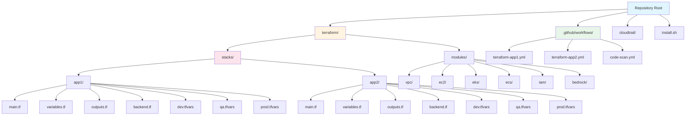

---

## Terraform Workflow

### High-Level Flow

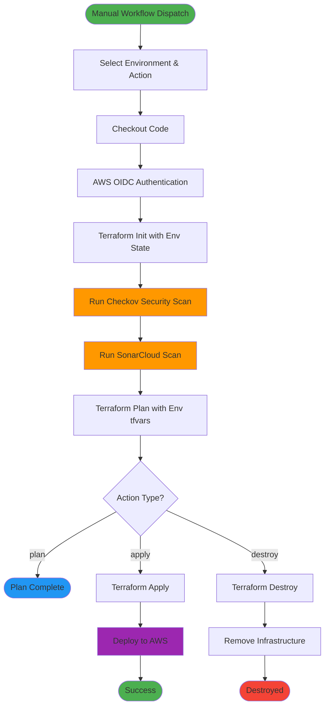

### Detailed Terraform Workflow Steps

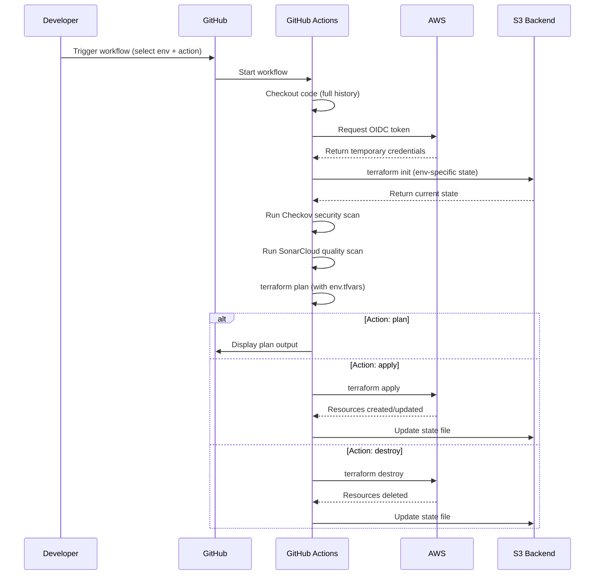

---

## Checkov Security Scan

### Checkov Workflow

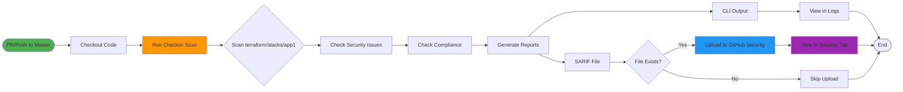

### Security Checks Performed

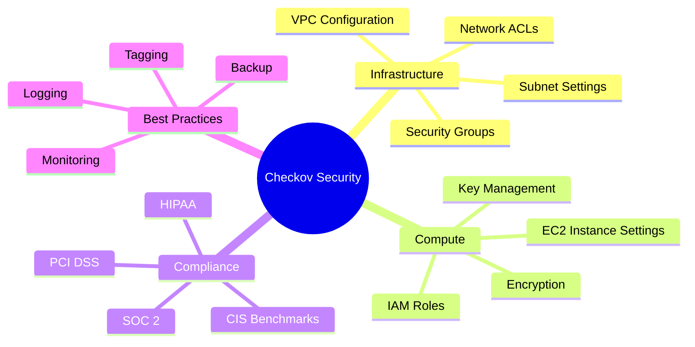

---

## SonarCloud Code Quality Scan

### SonarCloud Workflow

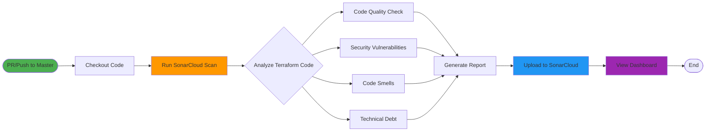

### Code Quality Metrics

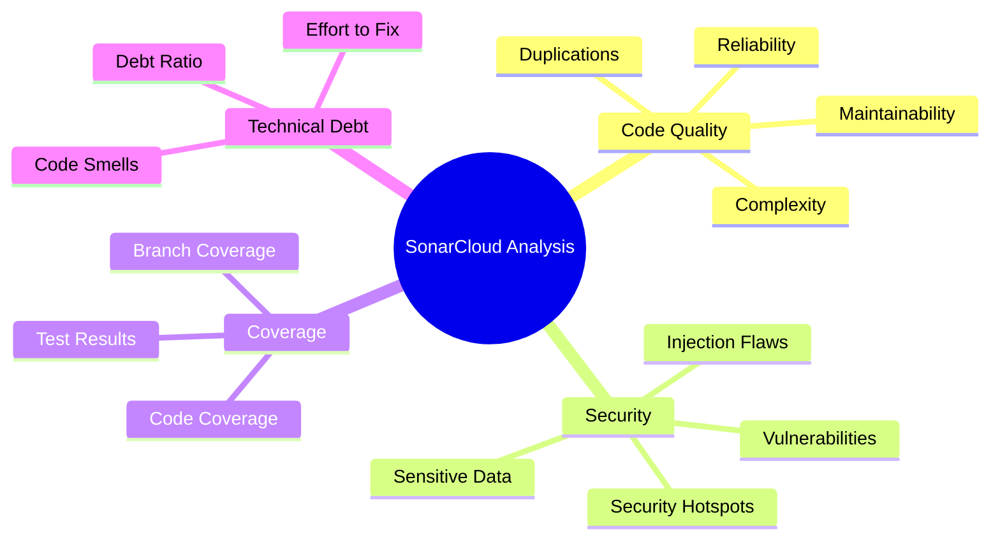

---

## AWS Infrastructure Architecture

### App1 Module Architecture

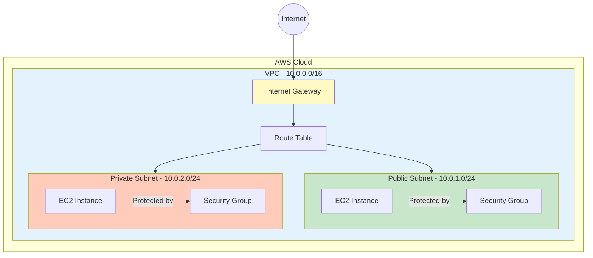

### Multi-Module Infrastructure

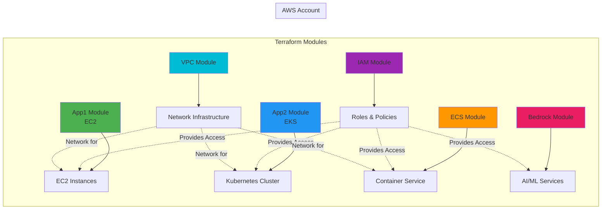

### App2 EKS Architecture

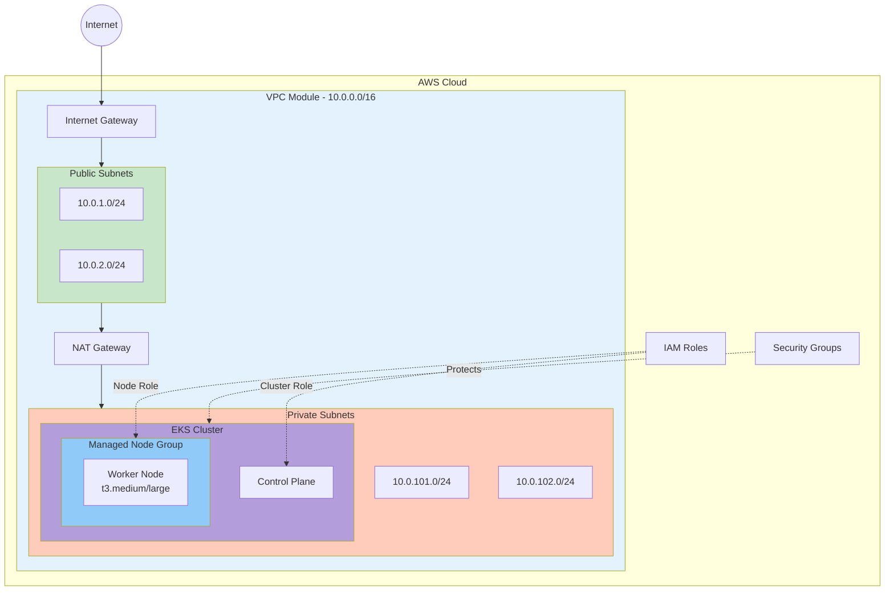

---

## GitHub Actions OIDC Authentication

### OIDC Authentication Flow

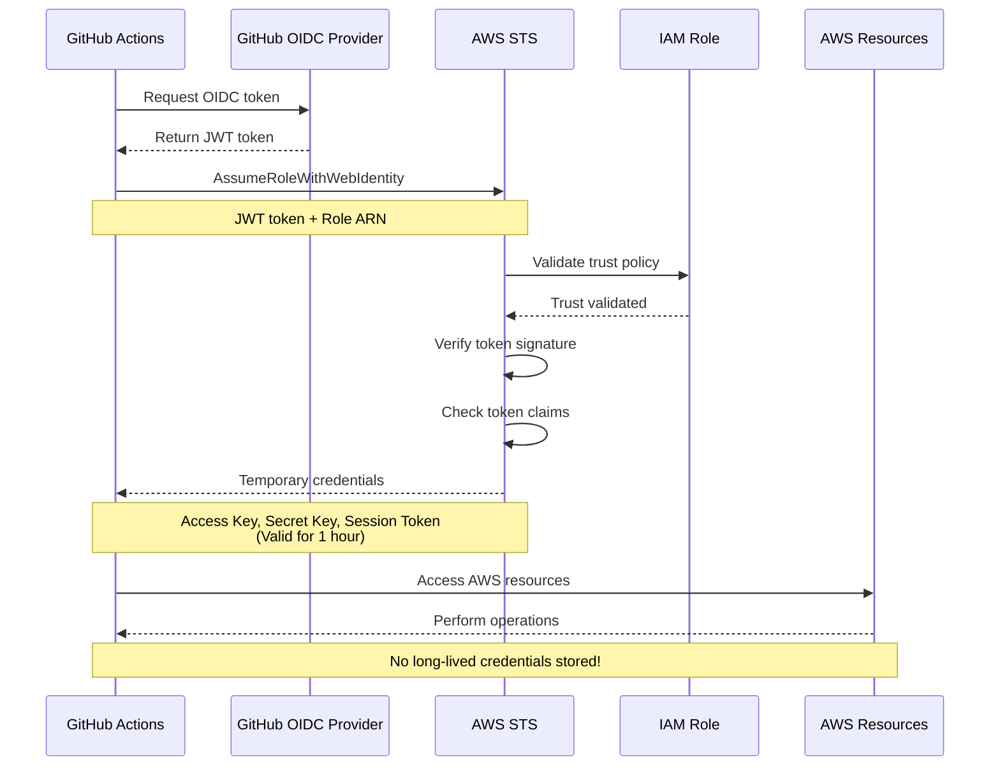

### OIDC Trust Relationship

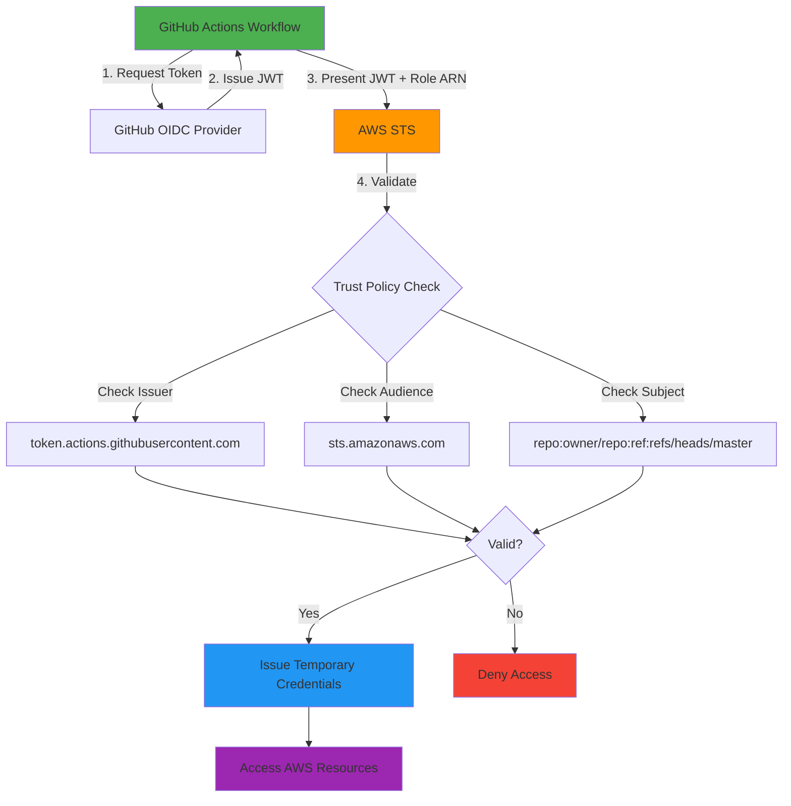

---

## Complete CI/CD Pipeline

### End-to-End Pipeline

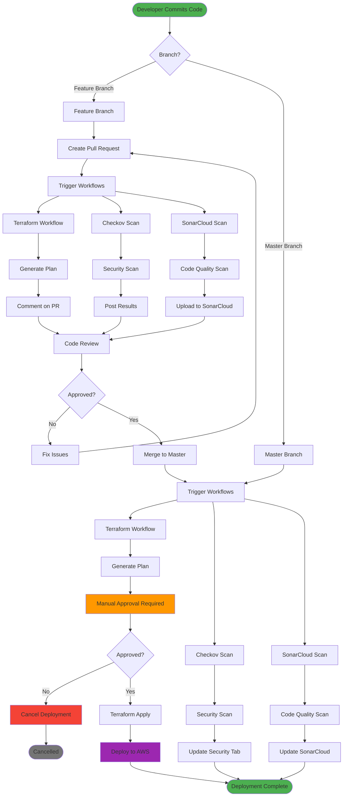

---

## Workflow Permissions Model

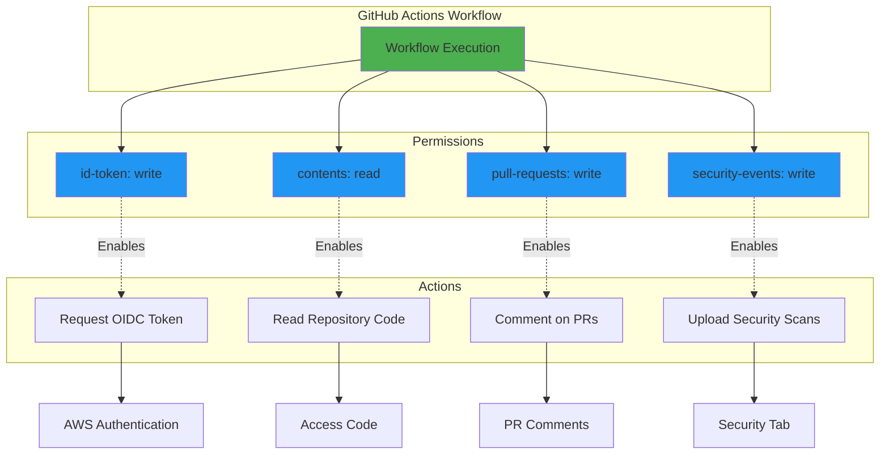

---

## State Management

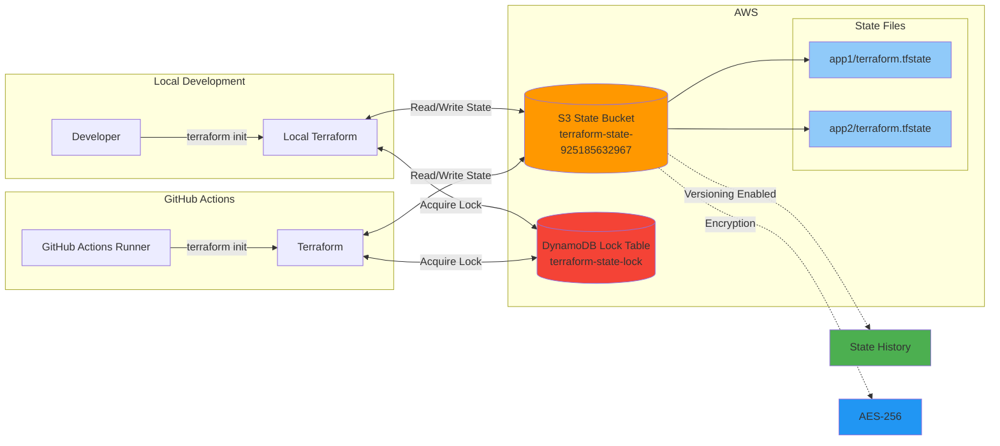

---

## How to View These Diagrams

### On GitHub
Simply view this file on GitHub - Mermaid diagrams render automatically in markdown files.

### Using Mermaid Live Editor
1. Visit https://mermaid.live/
2. Copy any diagram code block
3. Paste into the editor
4. Export as PNG or SVG

### Using VS Code
1. Install "Markdown Preview Mermaid Support" extension
2. Open this file
3. Use Ctrl+Shift+V (Cmd+Shift+V on Mac) for preview

### Using CLI
```bash
# Install mermaid-cli
npm install -g @mermaid-js/mermaid-cli

# Generate PNG from markdown
mmdc -i DIAGRAMS.md -o diagrams.pdf
```

---

## Diagram Legend

- 🟢 **Green**: Start/Success states
- 🔵 **Blue**: Process steps
- 🟠 **Orange**: Warning/Approval required
- 🔴 **Red**: Error/Failure states
- 🟣 **Purple**: Deployment/Critical actions
- ⬜ **Gray**: End/Cancelled states

---

## Additional Resources

- [Mermaid Documentation](https://mermaid.js.org/)
- [Terraform Documentation](https://www.terraform.io/docs)
- [GitHub Actions Documentation](https://docs.github.com/en/actions)
- [AWS OIDC Documentation](https://docs.aws.amazon.com/IAM/latest/UserGuide/id_roles_providers_create_oidc.html)
