# Cloud Infrastructure — Terraform DevOps

Production-grade Terraform infrastructure across AWS and Azure, covering application stacks, AI/ML pipelines, multi-cloud networking, governance, and migration planning. Fully automated CI/CD via GitHub Actions.

---

## Repository Structure

```
repo1/
├── terraform/
│   ├── live/                          # All deployed infrastructure
│   │   ├── aws/
│   │   │   ├── stacks/                # AWS application stacks
│   │   │   │   ├── app1/              #   ALB + EC2, Lambda scheduler, ACM/TLS
│   │   │   │   ├── app2/              #   EKS + Linkerd mesh, NGINX Ingress, Helm
│   │   │   │   ├── app3/              #   Multi-region, Global Accelerator, DynamoDB
│   │   │   │   ├── app4/              #   ECS Fargate cluster
│   │   │   │   ├── app5/              #   S3 static website + CloudFront
│   │   │   │   ├── app6/              #   EKS + ArgoCD GitOps
│   │   │   │   ├── app7/              #   Site-to-Site VPN + Jenkins CI/CD
│   │   │   │   └── app8/              #   Lambda container (Node.js)
│   │   │   ├── ai/
│   │   │   │   ├── app-bedrock/       #   Bedrock agent (Amazon Nova)
│   │   │   │   ├── app-sagemaker/     #   SageMaker MLOps pipeline
│   │   │   │   └── crew/              #   CrewAI multi-agent framework
│   │   │   ├── network/
│   │   │   │   └── tgw/               #   Transit Gateway, 2 VPCs
│   │   │   ├── global/
│   │   │   │   └── control-tower/     #   Control Tower plan (multi-region)
│   │   │   └── security/
│   │   │       └── cloudtrail/        #   Real-time CloudTrail monitoring
│   │   └── azure/
│   │       ├── region-failover/       #   Multi-region VMs + Traffic Manager
│   │       ├── global/
│   │       │   └── landing-zone/      #   Azure Landing Zone plan
│   │       ├── aws-azure-migrate/     #   AWS EC2 + RDS → Azure migration plan
│   │       └── onprem-to-azure/       #   VMware + SQL Server → Azure plan
│   └── modules/
│       ├── aws/
│       │   ├── network/vpc/           #   VPC, subnets, IGW, NAT, flow logs
│       │   ├── network/transit-gateway/  # Transit Gateway attachments
│       │   ├── compute/ec2/           #   EC2, IAM, security groups, KMS
│       │   ├── containers/eks/        #   EKS cluster, node groups, IRSA
│       │   ├── containers/ecs/        #   Fargate cluster, task definitions
│       │   ├── database/dynamodb/     #   Global tables, streams, PITR
│       │   ├── ai/bedrock/            #   Bedrock agent, IAM, alias
│       │   └── iam/                   #   Roles, managed policies
│       └── azure/
│           └── compute/vm/            #   Linux VM, NIC, optional public IP + data disk
├── .github/workflows/                 # CI/CD pipelines
│   ├── terraform-sagemaker.yml        #   SageMaker deploy pipeline
│   ├── terraform-audit.yml            #   Security & AI audit pipeline
│   └── code-scan.yml                  #   Code quality & security scan
└── scripts/
    ├── create-stack.sh                # Scaffold new stacks
    ├── check-workflow.sh              # Validate workflow status
    └── cleanup-old-state.sh           # Remove stale S3 state files
```

---

## AWS Stacks

### App1 — EC2 with ALB & Lambda Scheduler

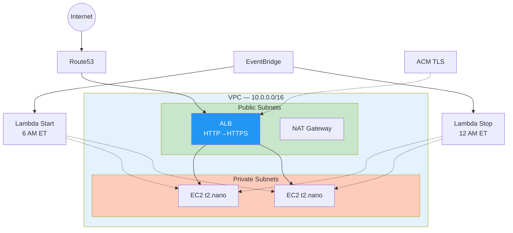

- ALB + ACM HTTPS, HTTP redirect, private EC2 subnets
- Lambda scheduler: start 6 AM / stop midnight ET via EventBridge
- IMDSv2 enforced, KMS-encrypted EBS

### App2 — EKS + Linkerd Service Mesh

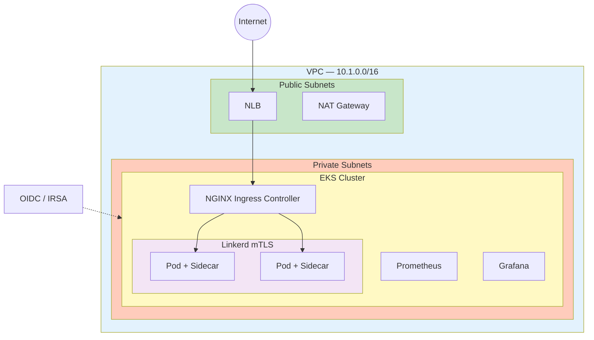

- EKS in private subnets, NGINX Ingress on NLB
- Linkerd mTLS between all pods, IRSA via OIDC
- Production Helm chart: HPA, PDB, NetworkPolicy, non-root containers
- Prometheus + Grafana monitoring stack

### App3 — Multi-Region Active-Active

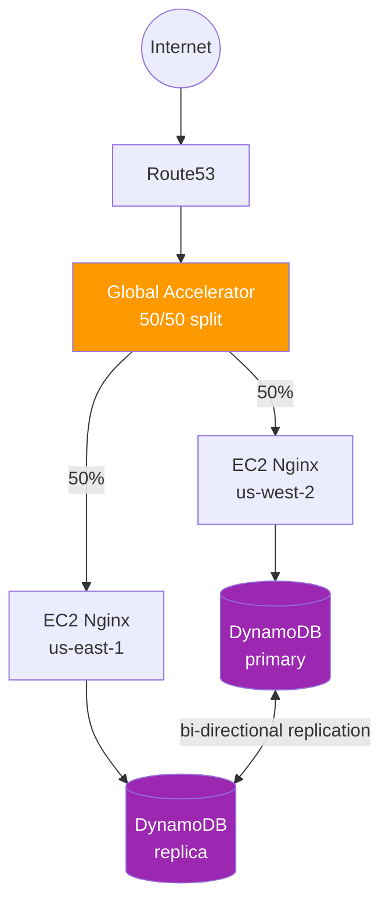

- Global Accelerator 50/50 traffic split across us-east-1 / us-west-2
- DynamoDB global tables with cross-region stream replication
- Route53 → Global Accelerator → regional EC2 fleets

### App4 — ECS Fargate

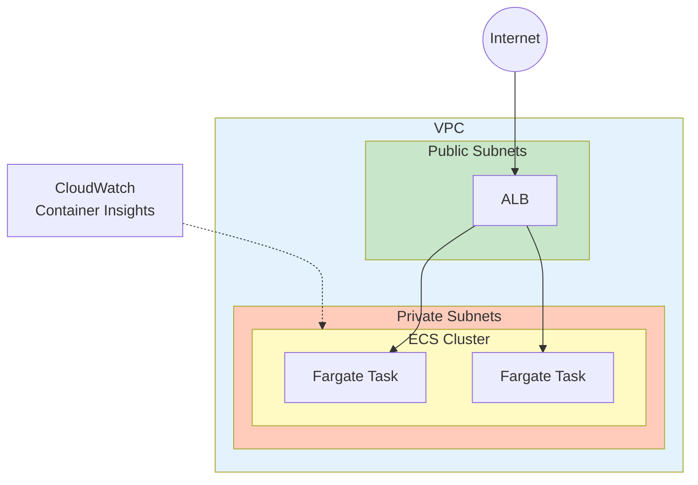

- Serverless containers, Container Insights, CloudWatch logging

### App5 — S3 Static Website + CloudFront

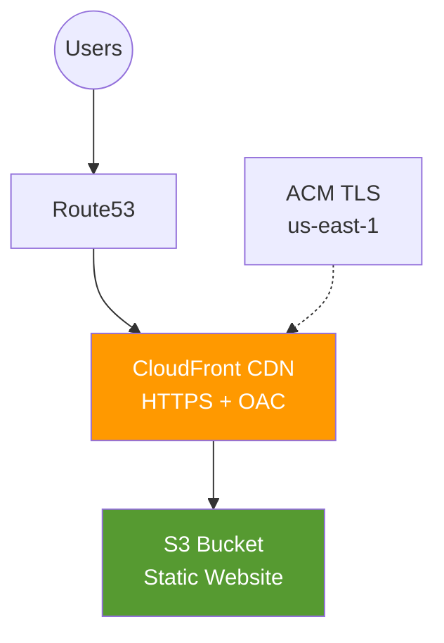

- CloudFront + ACM TLS, Origin Access Control, HTTP→HTTPS redirect

### App6 — EKS + ArgoCD GitOps

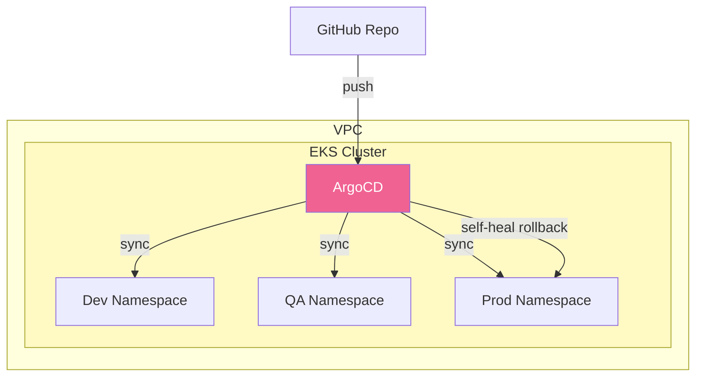

- ArgoCD declarative sync, multi-env (dev/qa/prod), self-healing rollbacks

### App7 — Site-to-Site VPN + Jenkins

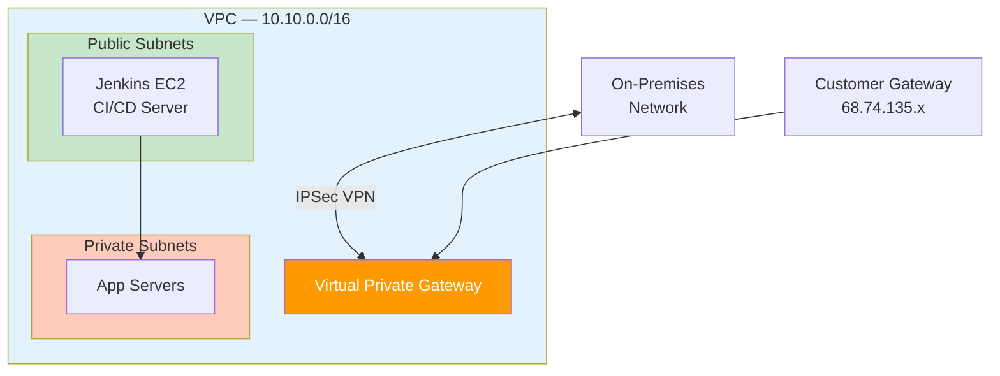

- AWS Site-to-Site VPN to on-premises network
- Jenkins CI/CD server on EC2 with pipeline automation

### App8 — Lambda Container

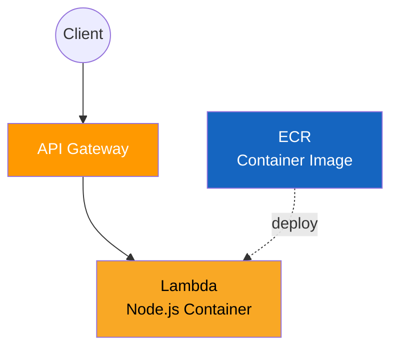

- Containerized Node.js Lambda via ECR, API Gateway trigger

---

## AI / ML

### Bedrock Agent (app-bedrock)

- Amazon Bedrock agent using Nova micro model
- VPC with private subnets, VPC endpoints (no internet)
- IAM roles for secure API access, agent alias for versioning

### SageMaker MLOps Pipeline (app-sagemaker)

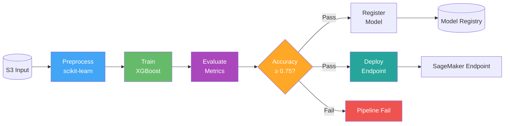

- Full MLOps: preprocess → XGBoost train → evaluate → conditional register + deploy
- Accuracy threshold gate (default 0.75) — pipeline fails if not met
- Model Registry for versioned artifacts, real-time inference endpoint
- VPC with 2 AZs, all traffic via VPC endpoints (no NAT)
- [diagram.md](terraform/live/aws/ai/app-sagemaker/diagram.md)

### CrewAI Agents (crew)

- Multi-agent AI framework using CrewAI
- Automated infrastructure audit and reporting

---

## Network Infrastructure

### Transit Gateway

- Hub-and-spoke topology connecting 2 VPCs (10.1.0.0/16, 10.2.0.0/16)
- ICMP cross-VPC connectivity verified, SSM access

---

## Global / Governance

### AWS Control Tower (plan)

- Multi-region governance: us-east-1 (home), us-west-2, eu-west-1
- OU hierarchy: Platform, Landing Zones (Dev/QA/Prod), Sandbox
- Guardrail strategy: preventive SCPs + detective Config rules per OU
- Account vending via AFT (Account Factory for Terraform)
- [plan.md](terraform/live/aws/global/control-tower/plan.md)

---

## Azure Infrastructure

### Region Failover

- Multi-region VMs (East US 2 + West US 2) with Traffic Manager priority routing
- Azure SQL with geo-replication, ZRS managed disks, NAT Gateway

### Azure Landing Zone (plan)

- Management Group hierarchy: Platform, Landing Zones (Corp/Online), Sandbox
- Hub-and-spoke: Azure Firewall Premium, DNS Resolver, VPN/ER Gateway
- Policy strategy: built-in initiatives (Azure Security Benchmark, NIST 800-53) + custom policies
- Subscription vending flow with auto-applied policies and monitoring
- [plan.md](terraform/live/azure/global/landing-zone/plan.md)

---

## Migration Plans

### AWS EC2 + RDS → Azure

- EC2 → Azure VM via Azure Migrate (agentless, near-zero downtime)
- RDS SQL Server → Azure SQL MI via Azure DMS (online CDC migration)
- Resource mapping, sizing tables, cutover sequence, rollback plan
- [plan.md](terraform/live/azure/aws-azure-migrate/plan.md)

### On-Premises VMware + SQL Server → Azure

- VMware VMs → Azure VMs via Azure Migrate appliance (OVA on ESXi)
- SQL Server → Azure SQL MI / SQL DB via Azure DMS
- SQL target selection guide, DMS online migration flow
- Hub-and-spoke network with ExpressRoute/VPN during migration
- [plan.md](terraform/live/azure/onprem-to-azure/plan.md)

---

## CI/CD Pipeline

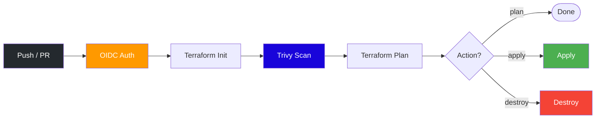

| Feature | Details |
|---------|---------|
| Auth | AWS OIDC — no static credentials |
| Security | Trivy infrastructure scanning, SARIF reports |
| Quality | SonarCloud code analysis |
| State | S3 backend with native S3 locking (`use_lockfile = true`), AES-256 |
| Environments | dev, qa, prod via tfvars |
| Terraform | >= 1.10 required |
| Trigger | Manual dispatch, PR, or push to master |

---

## Terraform Modules

| Module | Resources | Purpose |
|--------|-----------|---------|
| `aws/network/vpc` | VPC, Subnets, IGW, NAT, Route Tables, Flow Logs | Network foundation |
| `aws/network/transit-gateway` | Transit Gateway, VPC Attachments | Hub-and-spoke VPC connectivity |
| `aws/compute/ec2` | EC2, IAM Role, Security Group, KMS | Compute with IMDSv2, encrypted EBS |
| `aws/containers/eks` | EKS Cluster, Node Group, OIDC/IRSA, Access Entry | Managed Kubernetes |
| `aws/containers/ecs` | ECS Cluster, Fargate Task Def, Service, CloudWatch | Serverless containers |
| `aws/database/dynamodb` | Global Table, Replicas, Streams | Cross-region replication with PITR |
| `aws/ai/bedrock` | Bedrock Agent, IAM, Alias | AI agent (Amazon Nova) |
| `aws/iam` | 15+ IAM Roles | EKS, SageMaker, CodeBuild, SSM, etc. |

---

## Security Posture

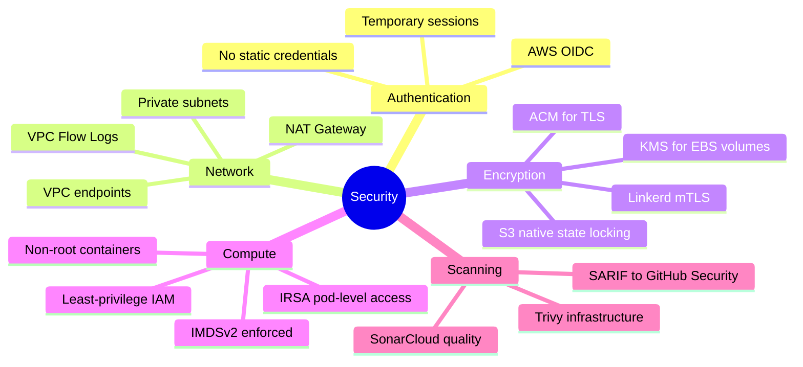

---

## State Management

| Component | Value |
|-----------|-------|
| S3 Bucket | `terraform-state-925185632967` |
| Locking | S3 native (`use_lockfile = true`) — DynamoDB decommissioned |
| Versioning | Enabled |
| Encryption | AES-256 |
| Key Pattern | `{stack}/{environment}/terraform.tfstate` |

---

## Quick Start

```bash
# Navigate to any stack
cd terraform/live/aws/stacks/app1

# Initialize (migrates backend if needed)
terraform init

# Plan
terraform plan -var-file="vars/dev.tfvars"

# Apply
terraform apply -var-file="vars/dev.tfvars"

# Destroy
terraform destroy -var-file="vars/dev.tfvars"
```

### Required GitHub Secrets

| Secret | Purpose |
|--------|---------|
| `AWS_ROLE_ARN` | IAM role ARN for OIDC authentication |
| `SONAR_TOKEN` | SonarCloud authentication token |

---

## Contributing

1. Create a feature branch from `master`
2. Make changes and test with `terraform plan`
3. Open a pull request — CI runs Trivy + SonarCloud automatically
4. Address any security or quality findings
5. Merge after review
