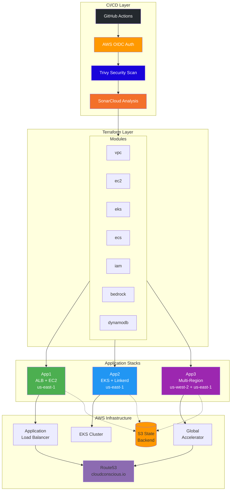
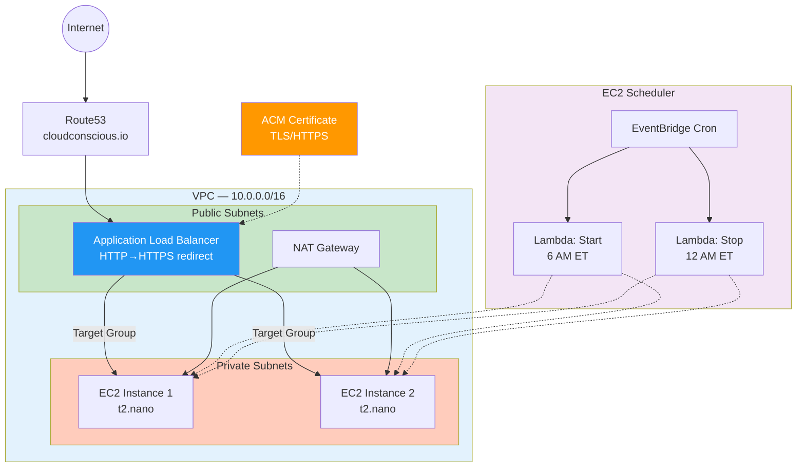
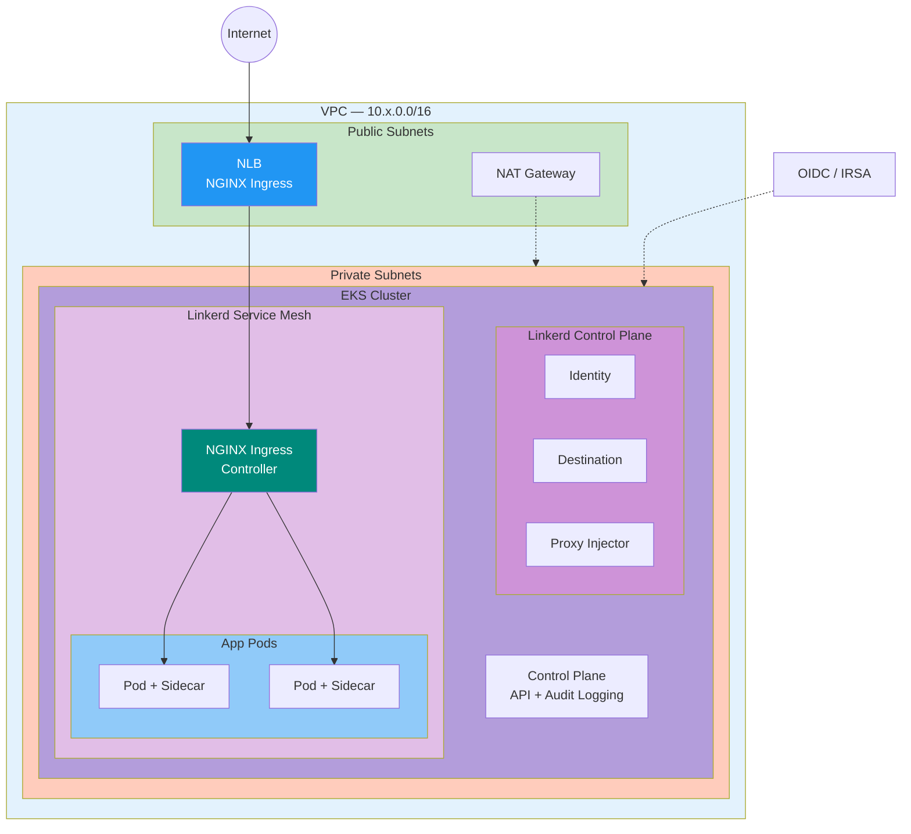
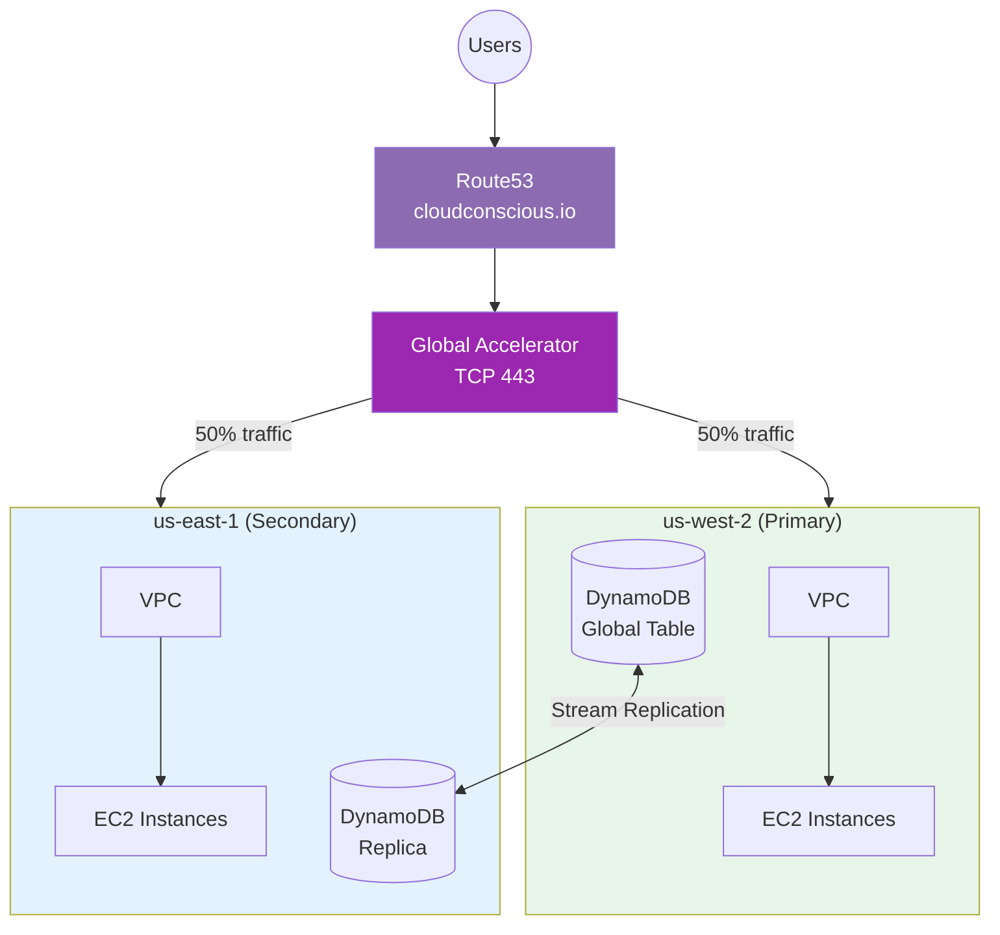
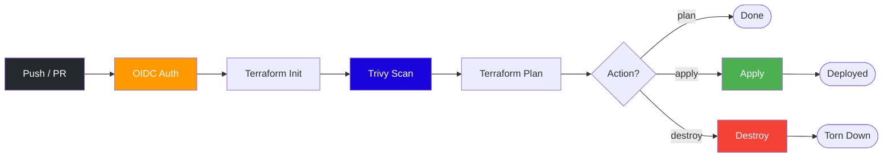
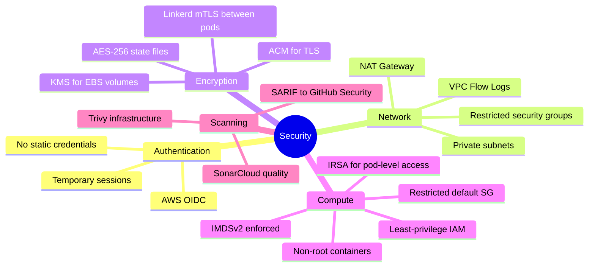

# AWS Terraform DevOps Examples

Production-grade Terraform infrastructure managing EC2, EKS, and multi-region active-active deployments on AWS, with fully automated CI/CD via GitHub Actions.

---

## Architecture at a Glance



---

## Repository Structure

```
repo1/
├── terraform/
│   ├── modules/                   # Reusable infrastructure components
│   │   ├── network/               # Network infrastructure
│   │   │   ├── vpc/               #   VPC, subnets, IGW, NAT, flow logs
│   │   │   └── transit-gateway/   #   Transit Gateway for VPC connectivity
│   │   ├── compute/               # Compute resources
│   │   │   └── ec2/               #   EC2 instances, IAM, security groups
│   │   ├── containers/            # Container orchestration
│   │   │   ├── eks/               #   EKS cluster, node groups, IAM, IRSA
│   │   │   └── ecs/               #   Fargate cluster, task definitions
│   │   ├── database/              # Database services
│   │   │   └── dynamodb/          #   Global tables, cross-region replication
│   │   ├── ai/                    # AI/ML services
│   │   │   └── bedrock/           #   Bedrock agent (Amazon Titan)
│   │   ├── iam/                   #   Centralized roles & policies
│   │   └── backend/               #   S3 + DynamoDB state backend
│   └── stacks/                    # Deployment targets
│       ├── builds/                # Application stacks (dev/qa/prod)
│       │   ├── app1/              #   ALB + EC2, Lambda scheduler, ACM/TLS
│       │   ├── app2/              #   EKS + Linkerd mesh, NGINX Ingress, Helm
│       │   ├── app3/              #   Multi-region, Global Accelerator, DynamoDB
│       │   ├── app4/              #   ECS Fargate cluster
│       │   ├── app5/              #   Bedrock AI agent
│       │   ├── app6/              #   S3 static website + CloudFront
│       │   └── app7/              #   EKS + ArgoCD GitOps
│       └── network/               # Network infrastructure
│           └── tgw/               #   Transit Gateway with 2 VPCs
├── .github/workflows/             # CI/CD pipelines
│   ├── terraform-app1.yml         #   App1 plan/apply/destroy
│   ├── terraform-app2.yml         #   App2 plan/apply/destroy
│   ├── terraform-app3.yml         #   App3 plan/apply/destroy + SARIF
│   └── code-scan.yml              #   SonarCloud code quality
├── scripts/                       # Utility scripts
│   ├── create-stack.sh            #   Scaffold new stacks from template
│   ├── check-workflow.sh          #   Validate workflow status
│   ├── cleanup-old-state.sh       #   Remove stale S3 state files
│   └── cloudtrail/                #   Real-time AWS event monitoring
├── policies/                      # AWS policy definitions
└── DIAGRAMS.md                    # Full Mermaid diagram collection
```

---

## Application Stacks

### App1 — EC2 with ALB & Lambda Instance Scheduler 



**Key features:**
- EC2 instances in private subnets with NAT Gateway for outbound
- ALB with ACM certificate for HTTPS, auto HTTP redirect
- Lambda-based scheduler: auto-start at 6 AM ET, auto-stop at midnight
- IMDSv2 enforced, KMS-encrypted EBS volumes

### App2 — EKS with Linkerd Service Mesh



**Key features:**
- EKS cluster in private subnets with NAT Gateway
- **Linkerd service mesh** with automatic mTLS between all pods
- **NGINX Ingress Controller** on AWS NLB (single entry point)
- **IRSA** (IAM Roles for Service Accounts) via OIDC provider
- EKS control plane logging (api, audit, authenticator)
- Production-grade Helm chart with:
  - ServiceAccount, Ingress, ConfigMap, HPA, PDB, NetworkPolicy
  - Liveness/readiness probes, security context (non-root)
  - Environment-specific values (dev, qa, prod)
- All infrastructure deployed via Terraform Helm provider

### App3 — Multi-Region Active-Active



**Key features:**
- Global Accelerator with 50/50 traffic split
- DynamoDB global tables with cross-region stream replication
- Active-active architecture across us-west-2 and us-east-1
- Route53 DNS pointing to Global Accelerator

### App4 — ECS Fargate Cluster

**Key features:**
- Serverless container orchestration with AWS Fargate
- ECS cluster with Container Insights enabled
- Task definitions with CloudWatch logging
- No EC2 instance management required

### App5 — Bedrock AI Agent

**Key features:**
- Amazon Bedrock agent using Titan text model
- IAM roles for secure API access
- Agent alias for version management
- Foundation model integration

### App6 — S3 Static Website + CloudFront

**Key features:**
- S3 bucket configured for static website hosting
- CloudFront distribution with custom domain
- ACM certificate for HTTPS (TLS 1.2+)
- Route53 DNS with apex and www subdomain
- Origin Access Control (OAC) for secure S3 access
- HTTP to HTTPS redirect
- Custom error pages

### App7 — EKS + ArgoCD GitOps

**Key features:**
- EKS cluster with ArgoCD for GitOps deployments
- Declarative application management
- Automated sync from Git repository
- Multi-environment support (dev, qa, prod)
- Kubernetes manifests and Helm charts
- Self-healing and automated rollbacks

---

## Network Infrastructure

### Transit Gateway (TGW)

**Key features:**
- Connects multiple VPCs in hub-and-spoke topology
- 2 VPCs with private subnets (10.1.0.0/16, 10.2.0.0/16)
- EC2 instances in each VPC for connectivity testing
- Security groups allowing ICMP between VPCs
- SSM access for remote management
- Verified cross-VPC communication via Transit Gateway

---

## CI/CD Pipeline



Each stack has its own workflow with:

| Feature | Details |
|---------|---------|
| **Auth** | AWS OIDC — no static credentials |
| **Security** | Trivy infrastructure scanning, SARIF reports |
| **Quality** | SonarCloud code analysis |
| **State** | S3 backend with DynamoDB locking, AES-256 encryption |
| **Environments** | dev, qa, prod via tfvars |
| **Timeout** | 15-minute max per run |
| **Trigger** | Manual dispatch, PR, or push to master |

---

## Terraform Modules

| Module | Resources | Purpose |
|--------|-----------|---------|
| **network/vpc** | VPC, Subnets, IGW, NAT, Route Tables, Flow Logs | Network foundation with public/private subnet pattern |
| **network/transit-gateway** | Transit Gateway, VPC Attachments | Hub-and-spoke VPC connectivity |
| **compute/ec2** | EC2, IAM Role, Security Group, KMS | Compute with Route53 + DynamoDB access, IMDSv2 |
| **containers/eks** | EKS Cluster, Node Group, IAM Roles, OIDC/IRSA, Access Entry | Managed Kubernetes with IRSA, logging, admin access |
| **containers/ecs** | ECS Cluster, Fargate Task Def, Service, CloudWatch | Container orchestration with Container Insights |
| **database/dynamodb** | Global Table, Replicas, Streams | Cross-region replication with PITR |
| **ai/bedrock** | Bedrock Agent, IAM, Alias | AI agent using Amazon Titan text model |
| **iam** | 15+ pre-defined IAM Roles | Roles for EKS, SageMaker, CodeBuild, SSM, etc. |

---

## Security Posture



---

## Quick Start

### Prerequisites
- AWS CLI configured with appropriate permissions
- Terraform >= 1.0
- GitHub repo with Actions enabled + OIDC provider configured

### Deploy locally

```bash
# Navigate to a stack
cd terraform/stacks/builds/app1

# Initialize and deploy
terraform init
terraform plan -var-file="vars/dev.tfvars"
terraform apply -var-file="vars/dev.tfvars"

# Tear down
terraform destroy -var-file="vars/dev.tfvars"
```

### Create a new stack

```bash
./scripts/create-stack.sh <stack-name>
```

### Required GitHub Secrets

| Secret | Purpose |
|--------|---------|
| `AWS_ROLE_ARN` | IAM role ARN for OIDC authentication |
| `SONAR_TOKEN` | SonarCloud authentication token |

---

## State Management

| Component | Value |
|-----------|-------|
| **S3 Bucket** | `terraform-state-925185632967` |
| **DynamoDB Table** | `terraform-state-lock` (us-east-1) |
| **Versioning** | Enabled |
| **Encryption** | AES-256 |
| **Key Pattern** | `{stack}/{environment}/terraform.tfstate` |

---

## Additional Documentation

- [DIAGRAMS.md](DIAGRAMS.md) — Full collection of Mermaid architecture and workflow diagrams

---

## Contributing

1. Create a feature branch from `master`
2. Make changes and test with `terraform plan`
3. Create a pull request — CI runs Trivy + SonarCloud automatically
4. Address any security or quality findings
5. Merge after review and approval
