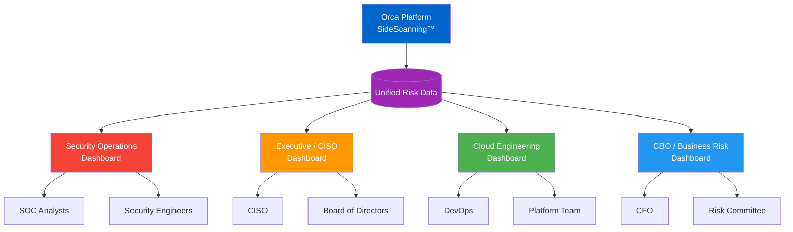
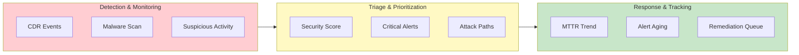
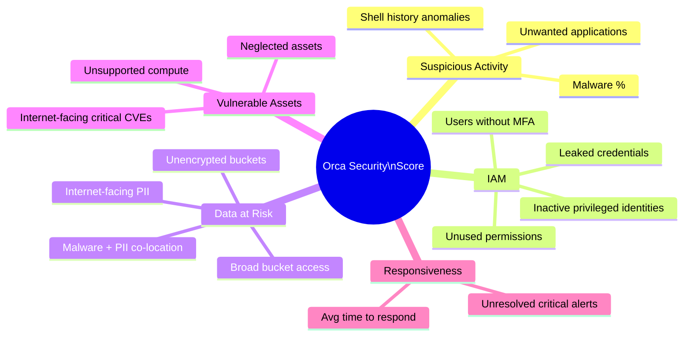
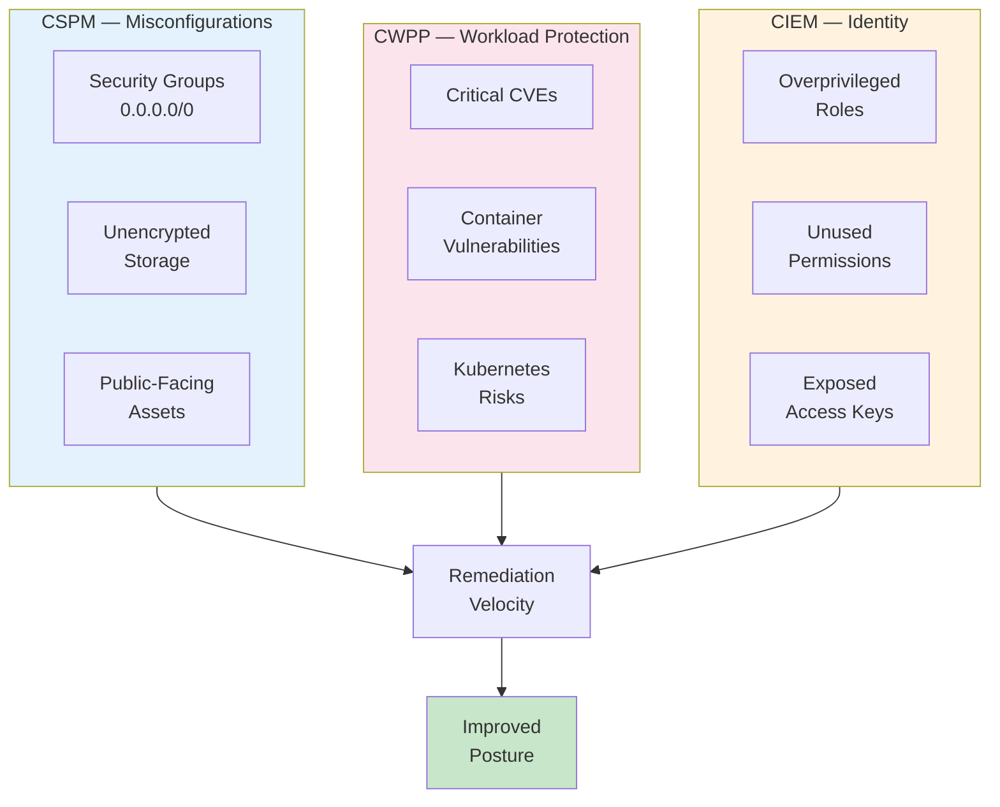
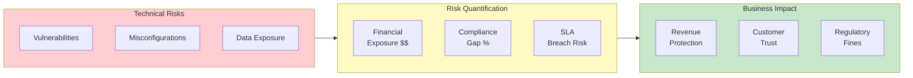
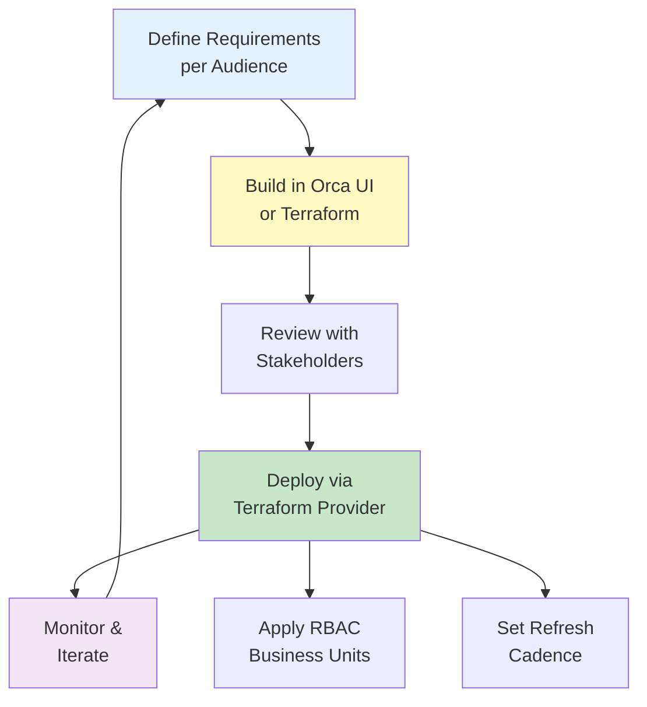

# Orca Security — Recommended Dashboards & Widget Layouts

Recommended custom dashboard configurations for Security Teams, Executives/CISO, Cloud Engineering, and CBO (Chief Business Officer). Each dashboard is tailored to the audience's priorities using Orca's built-in and custom widget capabilities.

---

## Dashboard Audience & Data Flow



---

## 1. Security Operations Dashboard

**Audience:** Security Analysts, SOC Team, Security Engineers  
**Purpose:** Day-to-day threat monitoring, vulnerability triage, and incident response  
**Refresh:** Real-time / hourly

### Widget Flow



### Layout (3-column grid)

| Row | Left | Center | Right |
|-----|------|--------|-------|
| 1 | Orca Security Score (gauge) | Critical Alerts — Last 24h (counter) | Open Alerts by Severity (bar chart) |
| 2 | Top 10 Attack Paths (table) | Alerts by Category (pie chart) | Mean Time to Resolve — Trend (line chart) |
| 3 | Internet-Facing Assets with Critical CVEs (table) | Malware Detections — Last 7 Days (counter + list) | Suspicious Activity Feed (event list) |
| 4 | Unresolved Imminent Compromise Alerts (table) | IAM Risk — Users Without MFA (counter) | Lateral Movement Risks (table) |
| 5 | Assets with Leaked Credentials (table) | CDR — Active Threats (event timeline) | Neglected Assets — No Patches 90+ Days (table) |

### Key Widgets

- **Orca Security Score** — Overall score gauge with 5-category breakdown (Suspicious Activity, IAM, Data at Risk, Vulnerable Assets, Responsiveness)
- **Critical Alerts Counter** — Filtered to risk score ≥ 9.0, last 24 hours
- **Top 10 Attack Paths** — Sorted by risk score, showing source → target chain
- **Malware Detections** — Assets with confirmed malware, grouped by type
- **CDR Active Threats** — Real-time cloud detection and response events
- **MTTR Trend** — Line chart showing mean time to resolve over 30/60/90 days

---

## 2. Executive / CISO Dashboard

**Audience:** CISO, VP Security, Board Reporting  
**Purpose:** High-level risk posture, trends, compliance status, and benchmarking  
**Refresh:** Daily

### Security Score Breakdown



### Layout (2-column grid, emphasis on large visuals)

| Row | Left | Right |
|-----|------|-------|
| 1 | Orca Security Score (large gauge + trend) | Security Score vs. Industry Benchmark (comparison) |
| 2 | Risk Trend — 90 Day (area chart) | Alert Volume Trend — 30 Day (line chart) |
| 3 | Compliance Status Summary (multi-bar) | Top 5 Risks Requiring Action (table) |
| 4 | Score Breakdown by Category (radar chart) | Score by Business Unit (horizontal bar) |
| 5 | Open Critical/High Alerts — Aging (stacked bar) | Cloud Coverage — Accounts Connected (counter) |

### Key Widgets

- **Security Score + Trend** — Large gauge with 90-day sparkline showing improvement/regression
- **Industry Benchmark** — Score compared to peer organizations (Orca provides this natively)
- **Risk Trend** — Area chart showing critical + high alerts over time (demonstrates ROI of remediation)
- **Compliance Summary** — Status bars for CIS, SOC 2, NIST 800-53, PCI-DSS, HIPAA (pass/fail/partial)
- **Score by Business Unit** — Compare security posture across teams/accounts
- **Alert Aging** — Stacked bar showing how long critical alerts remain open (SLA tracking)

---

## 3. Cloud Engineering Dashboard

**Audience:** Cloud Engineers, DevOps, Platform Team  
**Purpose:** Misconfigurations, vulnerability remediation, infrastructure hygiene  
**Refresh:** Real-time / hourly

### Infrastructure Risk Categories



### Layout (3-column grid)

| Row | Left | Center | Right |
|-----|------|--------|-------|
| 1 | CSPM — Misconfigurations by Severity (bar chart) | Vulnerable Images in Registry (counter) | Assets by Cloud Provider (donut chart) |
| 2 | Top 10 Misconfigured Resources (table) | Container Vulnerabilities — Critical (table) | Kubernetes Clusters — Risk Summary (table) |
| 3 | Public-Facing Assets (counter + list) | Unencrypted Storage (table) | Overprivileged IAM Roles (table) |
| 4 | Failed Compliance Checks by Framework (grouped bar) | Drift Detection — Config Changes (event list) | API Security — Exposed Endpoints (table) |
| 5 | Remediation Velocity — 30 Day (line chart) | Assets Without Encryption at Rest (counter) | Security Groups — Unrestricted Access (table) |

### Key Widgets

- **CSPM Misconfigurations** — Grouped by severity (critical/high/medium/low) with drill-down
- **Top 10 Misconfigured Resources** — Resource type, account, region, specific finding
- **Container Vulnerabilities** — Critical CVEs in running containers and registry images
- **Public-Facing Assets** — Internet-exposed compute, storage, databases
- **Overprivileged IAM Roles** — Roles with unused permissions (CIEM data)
- **Remediation Velocity** — Line chart showing how quickly issues are being fixed
- **Unrestricted Security Groups** — SGs with 0.0.0.0/0 on sensitive ports

---

## 4. CBO / Business Risk Dashboard

**Audience:** Chief Business Officer, CFO, Risk Committee  
**Purpose:** Business impact of security risks, data protection, compliance for revenue  
**Refresh:** Weekly

### Business Risk Translation



### Layout (2-column grid, large tiles)

| Row | Left | Right |
|-----|------|-------|
| 1 | Overall Risk Posture (traffic light — Red/Yellow/Green) | Sensitive Data Exposure Summary (counter) |
| 2 | Financial Risk Exposure — Estimated (metric card) | Compliance Status — Revenue-Critical Frameworks (status bars) |
| 3 | Data at Risk Score — Trend (line chart) | Assets with PII Exposed to Internet (counter + trend) |
| 4 | Business Unit Risk Comparison (horizontal bar) | Third-Party / Supply Chain Risk (table) |
| 5 | Regulatory Audit Readiness (checklist) | Security Investment ROI — Score Improvement (before/after) |

### Key Widgets

- **Risk Posture Traffic Light** — Simple Red/Yellow/Green based on Orca Security Score thresholds (Red < 50, Yellow 50-75, Green > 75)
- **Sensitive Data Exposure** — Count of assets with PII/PHI/PCI data that are internet-facing or have lateral movement paths
- **Financial Risk Exposure** — Estimated breach cost based on data at risk and industry benchmarks
- **Compliance Status** — Focus on frameworks tied to revenue (SOC 2 for SaaS sales, PCI for payments, HIPAA for healthcare contracts)
- **Business Unit Comparison** — Which teams/products carry the most risk
- **Security ROI** — Score improvement over time correlated with security investments

---

## Dashboard Lifecycle & Governance



---

## Implementation Notes

### Terraform Deployment (Dashboards-as-Code)

Orca's [enhanced Terraform provider](https://registry.terraform.io/providers/orcasecurity/orcasecurity/latest/docs) supports managing dashboards, widgets, discovery views, and business units as code.

```hcl
# Example: Executive Dashboard
resource "orcasecurity_custom_dashboard" "executive" {
  name        = "Executive / CISO Dashboard"
  description = "High-level risk posture and compliance for leadership"
  
  widget_ids = [
    orcasecurity_custom_widget.security_score.id,
    orcasecurity_custom_widget.risk_trend.id,
    orcasecurity_custom_widget.compliance_summary.id,
    orcasecurity_custom_widget.score_by_bu.id,
  ]
}

resource "orcasecurity_custom_widget" "security_score" {
  name         = "Orca Security Score"
  widget_type  = "gauge"
  query        = "SecurityScore"
  description  = "Overall security posture score with industry benchmark"
}
```

### Access Control (Business Units)

| Dashboard | Business Unit / RBAC |
|-----------|---------------------|
| Security Operations | Security Team (full access) |
| Executive / CISO | Leadership (read-only) |
| Cloud Engineering | Platform Team (full access) |
| CBO / Business Risk | Business Leadership (read-only) |

### Recommended Review Cadence

| Dashboard | Review Frequency | Audience |
|-----------|-----------------|----------|
| Security Operations | Continuous / Daily standup | SOC, Security Engineers |
| Executive / CISO | Weekly + Monthly board prep | CISO, VP Security |
| Cloud Engineering | Daily / Sprint reviews | DevOps, Cloud Engineers |
| CBO / Business Risk | Monthly / Quarterly | CBO, CFO, Risk Committee |

---

## References

- [Orca Security Score](https://orca.security/resources/blog/orca-cloud-security-score/) — 5-category scoring methodology
- [Dashboards-as-Code with Terraform](https://orca.security/resources/blog/dashboards-as-code-orcas-enhanced-terraform-provider/) — Terraform provider for custom dashboards
- [Orca Terraform Provider Registry](https://registry.terraform.io/providers/orcasecurity/orcasecurity/latest/docs)
