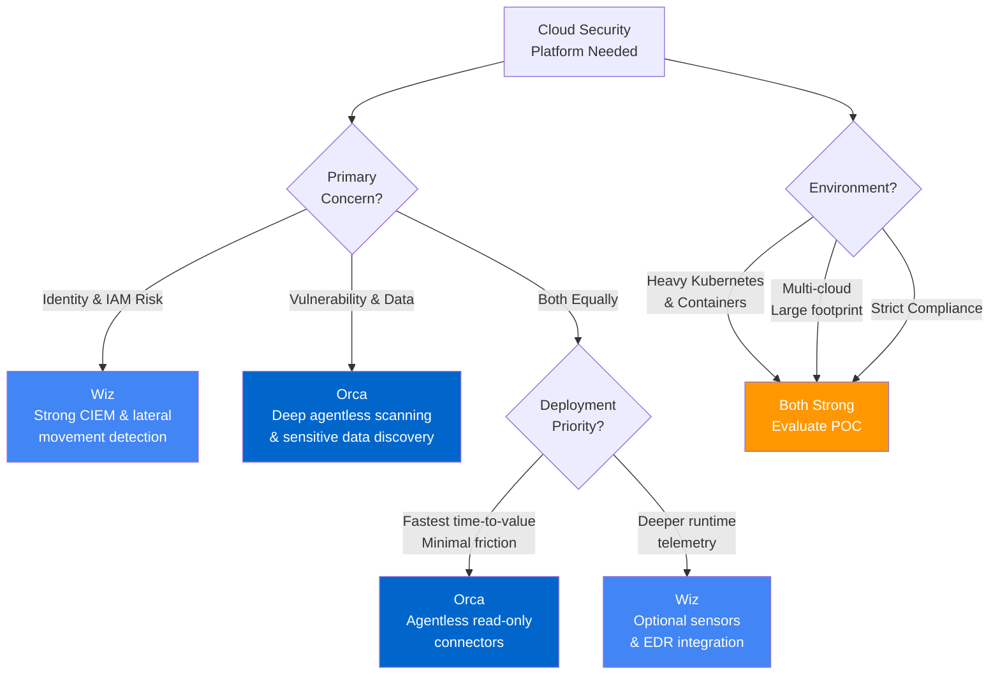
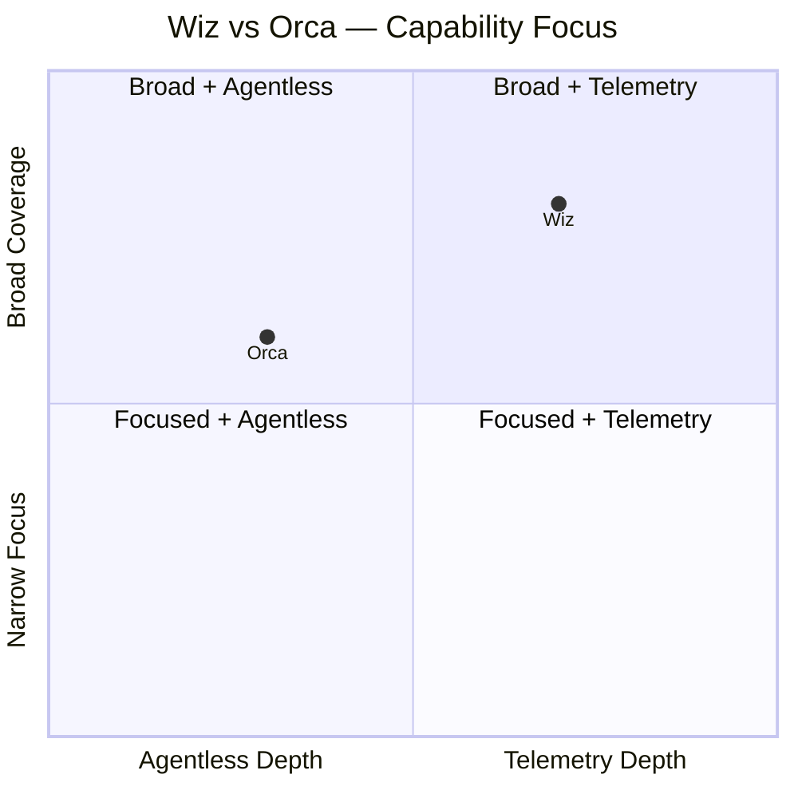

# Orca Security vs Wiz — Comparison

A side-by-side comparison of Orca Security and Wiz cloud security platforms across key capabilities, deployment models, and use cases.

---

## Summary

Both Wiz and Orca Security are cloud-native security platforms focused on discovering and prioritizing risks across cloud environments (IaaS/PaaS). Both are agentless-first, integrate with AWS/Azure/GCP, and target security teams and DevOps. They differ in product focus, detection breadth, and workflow integrations.

- **Wiz** — Comprehensive cloud security platform covering CSPM, vulnerability management, CIEM-like identity risk, container & runtime security, IaC scanning, and exploitability-based risk scoring.
- **Orca Security** — Agentless cloud security platform emphasizing deep workload/image vulnerability management, misconfiguration detection, sensitive data/secret discovery, and prioritized risk scoring with deep contextualization.

---

## Side-by-Side Comparison

| Category | Wiz | Orca Security | Stronger |
|----------|-----|---------------|----------|
| **Primary focus** | Comprehensive cloud security: CSPM, VM, CIEM-like identity risk, container & runtime risk, IaC scanning | Agentless cloud security: vulnerability & misconfiguration detection, sensitive-data/secret discovery, prioritized remediation | Depends (Wiz for identity & broad modules; Orca for agentless workload depth) |
| **Deployment model** | SaaS via cloud-account connectors; optional sensors/connectors for extra telemetry | SaaS, agentless read-only connectors to cloud provider APIs; connectors for registries/CI/CD | **Orca** |
| **Coverage** | VMs, containers, registries, IaC, identity/permissions, runtime context, threat intel | Cloud assets, workloads/images, registries, IaC, secrets/sensitive data, misconfigurations, cloud metadata | **Wiz** (broader scope) |
| **Data collection** | API connectors + optional telemetry (EDR, registries, CI/CD) | Agentless via cloud APIs and registry/CI integrations; reconstructs artifact context without agents | **Orca** (agentless depth/ease) |
| **Vulnerability scanning** | Image & workload scanning, CVE correlation, exploitability and reachability context | Deep image/workload scanning, CVE mapping, contextual prioritization based on asset exposure | Tie (Wiz for exploitability; Orca for agentless depth) |
| **Identity & permissions** | Strong IAM/identity risk analysis, lateral movement and risky principal detection | Permissions/misconfiguration findings with context; less emphasis on identity path analytics | **Wiz** |
| **Risk prioritization** | Exploitability-first, threat-context and business impact prioritization | Contextual prioritization by asset context, exposure, and severity; clear remediation guidance | **Wiz** (exploitability-first advantage) |
| **Runtime protection** | Runtime risk scoring; integrates runtime telemetry for exploitability context | Agentless runtime context; runtime protections via integrations | **Wiz** (stronger with telemetry) |
| **Secrets & sensitive data** | Detection capabilities (depends on connectors) | Strong sensitive-data and secret discovery across cloud storage and images | **Orca** |
| **Compliance & reporting** | Built-in compliance frameworks, audit reporting, dashboards | Built-in compliance checks (CIS, PCI, GDPR), audit evidence and reporting | Tie |
| **Integrations & workflows** | Cloud providers, CI/CD, registries, SIEM/SOAR, ticketing, some endpoint integrations | Cloud providers, registries, CI/CD, SIEM/SOAR, ticketing; automation for remediation workflows | Tie |
| **Time-to-value** | Fast with connectors; extra telemetry increases depth | Very fast (agentless) — minimal friction to deploy across accounts | **Orca** |
| **Scalability** | Enterprise-ready; scales across large cloud footprints | Enterprise-ready; designed for large, multi-account cloud environments | Tie |
| **Pricing model** | Enterprise subscription, quote-based (tiered features) | Enterprise subscription, quote-based (typically by footprint/assets) | Tie |

---

## Strengths & Limitations

### Wiz Strengths
- Strong identity risk analysis and lateral movement detection
- Exploitability-first prioritization (reachability context)
- Broad product modules (CSPM, CWPP, CIEM-like capabilities)
- Runtime telemetry integration for deeper context

### Wiz Limitations
- May require additional connectors/telemetry for certain runtime signals
- Enterprise pricing

### Orca Strengths
- Deep agentless discovery and context without any agents
- Strong image/workload vulnerability detection
- Excellent sensitive-data and secrets discovery
- Fastest time-to-value — minimal deployment friction

### Orca Limitations
- Historically less focused on identity path analysis and CIEM capabilities
- Enterprise pricing

---

## Decision Guide

---

## When to Choose Which

| Choose Wiz If... | Choose Orca If... |
|------------------|-------------------|
| You need comprehensive cloud risk coverage with strong identity/permission risk analysis | You want fast, agentless deployment with deep workload/image context |
| Exploitability-based prioritization is critical to your workflow | Sensitive data and secrets detection is a top priority |
| You want a single platform covering CSPM + VM + identity risks | You need minimal-friction visibility across multi-account environments |
| Runtime telemetry integration with EDR/endpoint tools is important | You prefer fully agentless with no sensors or agents to manage |
| Your org has complex IAM with lateral movement concerns | Your org prioritizes vulnerability/misconfiguration discovery speed |

---

## Capability Matrix (Scored)

---

## Summary Scorecard

| Category | Wiz | Orca |
|----------|:---:|:----:|
| CSPM | ★★★★★ | ★★★★ |
| Vulnerability Management | ★★★★★ | ★★★★★ |
| CIEM / Identity Risk | ★★★★★ | ★★★ |
| DSPM / Secrets | ★★★ | ★★★★★ |
| Runtime / CDR | ★★★★ | ★★★ |
| Compliance | ★★★★ | ★★★★ |
| Ease of Deployment | ★★★★ | ★★★★★ |
| Time-to-Value | ★★★★ | ★★★★★ |
| Container/K8s Security | ★★★★★ | ★★★★ |
| Risk Prioritization | ★★★★★ | ★★★★ |
