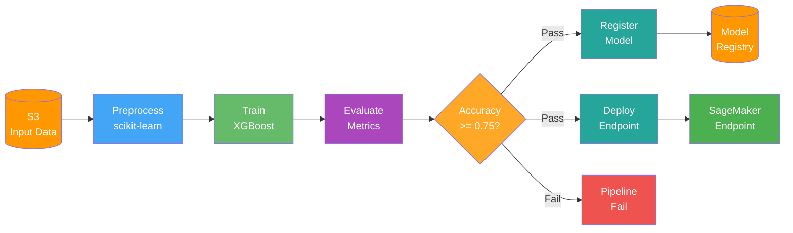
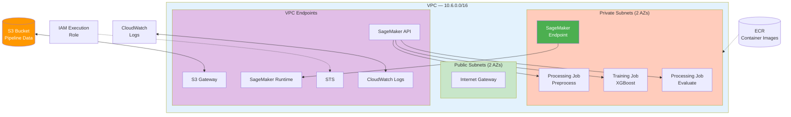
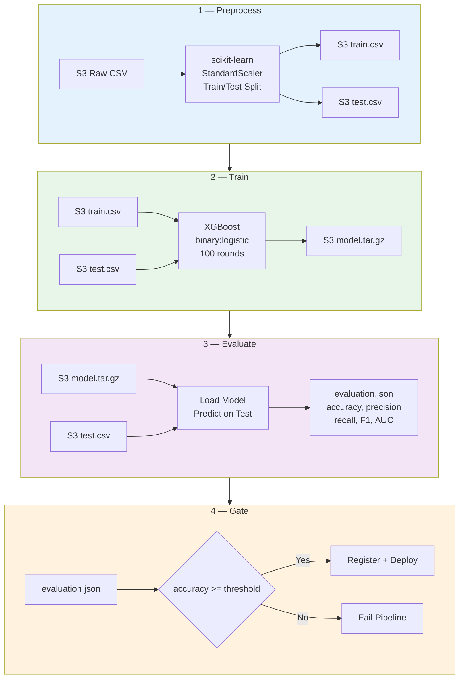
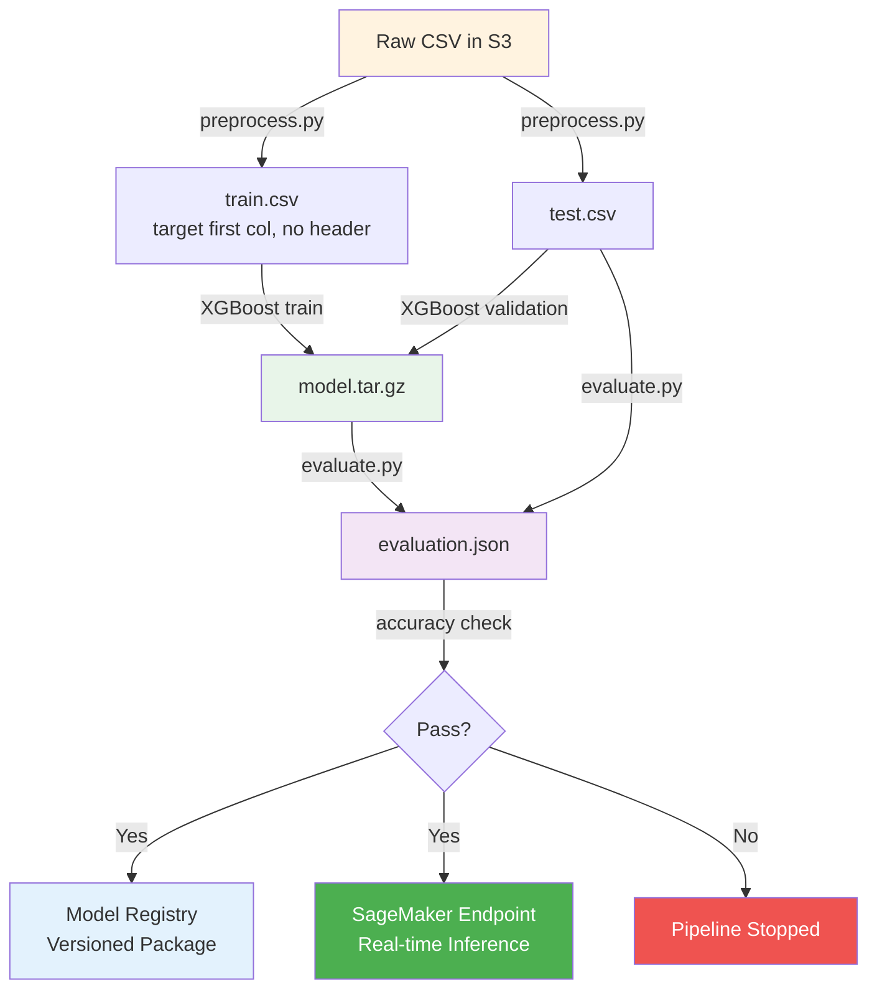
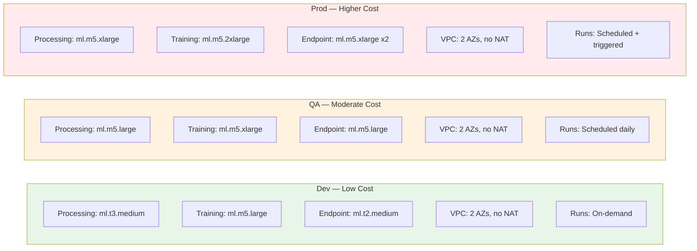
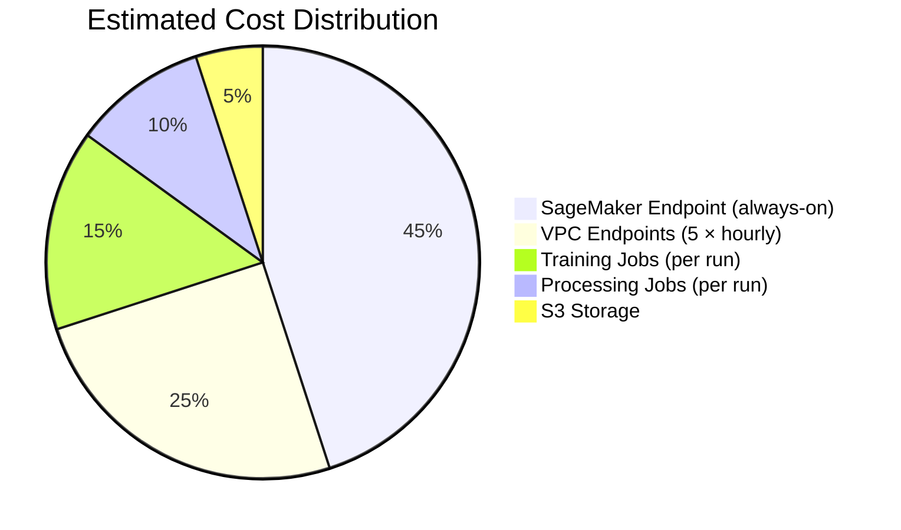

# App SageMaker — MLOps Pipeline Architecture

Full MLOps pipeline on SageMaker: preprocess → train → evaluate → conditional model registration and endpoint deployment.

---

## Pipeline Architecture



---

## Infrastructure Architecture



---

## Pipeline Steps Detail



---

## Data Flow



---

## Resources

| Resource | Type | Purpose |
|----------|------|---------|
| VPC | 2 AZs, public + private subnets | Network isolation |
| VPC Endpoints | S3, SageMaker API/Runtime, STS, Logs | Private connectivity, no NAT needed |
| S3 Bucket | KMS encrypted, versioned | Pipeline data, models, scripts |
| SageMaker Pipeline | 6-step MLOps workflow | Orchestrates full ML lifecycle |
| Model Package Group | Model Registry | Versioned model artifacts |
| SageMaker Endpoint | Real-time inference | Serves predictions |
| IAM Role | Least-privilege execution role | SageMaker, S3, ECR, CloudWatch access |

---

## Usage

```bash
cd terraform/stacks/aws/builds/app-sagemaker

# Deploy infrastructure
terraform plan -var-file="vars/dev.tfvars"
terraform apply -var-file="vars/dev.tfvars"

# Upload scripts and data
aws s3 cp scripts/preprocess.py s3://$(terraform output -raw s3_bucket)/scripts/
aws s3 cp scripts/evaluate.py s3://$(terraform output -raw s3_bucket)/scripts/
aws s3 cp scripts/deploy.py s3://$(terraform output -raw s3_bucket)/scripts/
aws s3 cp your-data.csv s3://$(terraform output -raw s3_bucket)/input/

# Execute pipeline
aws sagemaker start-pipeline-execution \
  --pipeline-name sagemaker-pipeline-pipeline \
  --region us-east-1
```

---

## Environment Sizing & Cost Estimate



### Resource Comparison by Environment

| Resource | Dev | QA | Prod |
|----------|-----|-----|------|
| **Processing Instance** | ml.t3.medium (2 vCPU, 4 GB) | ml.m5.large (2 vCPU, 8 GB) | ml.m5.xlarge (4 vCPU, 16 GB) |
| **Training Instance** | ml.m5.large (2 vCPU, 8 GB) | ml.m5.xlarge (4 vCPU, 16 GB) | ml.m5.2xlarge (8 vCPU, 32 GB) |
| **Endpoint Instance** | ml.t2.medium × 1 | ml.m5.large × 1 | ml.m5.xlarge × 2 |
| **Endpoint Availability** | Single instance | Single instance | Multi-AZ (2 instances) |
| **VPC Endpoints** | 5 (S3, SM API, SM Runtime, STS, Logs) | 5 | 5 |
| **S3 Storage** | ~1 GB | ~10 GB | ~100 GB+ |
| **Pipeline Frequency** | On-demand / manual | Daily scheduled | Scheduled + event-triggered |
| **Flow Logs Retention** | 7 days | 14 days | 30 days |

### Cost Drivers



**Key cost notes:**
- **Biggest cost:** The SageMaker endpoint runs 24/7 — this dominates the bill in all environments
- **VPC Endpoints:** 5 interface endpoints each billed hourly (~$0.01/hr each) — fixed cost regardless of usage
- **Training/Processing:** Only billed while jobs run — cost scales with frequency and instance size
- **Dev savings tip:** Tear down the endpoint when not testing; use serverless inference for intermittent workloads
- **S3 Gateway endpoint:** Free (no hourly charge, unlike interface endpoints)

> **For accurate pricing:** Use the [AWS Pricing Calculator](https://calculator.aws.amazon.com/) with the instance types above for your region. Prices vary by region and change over time.
