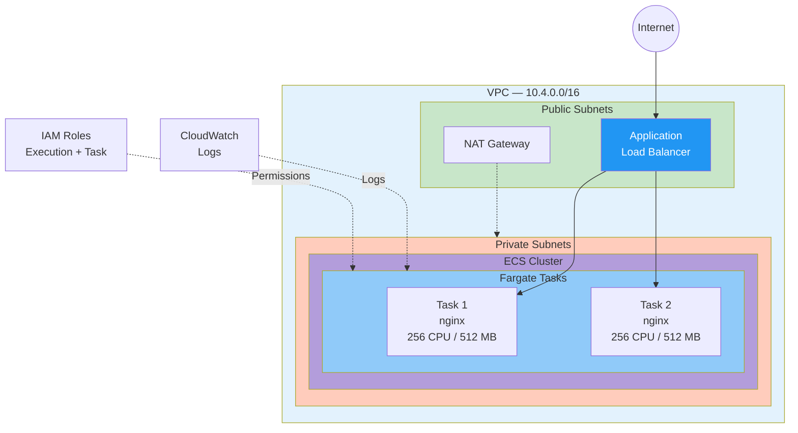

# App4 — ECS Fargate Deployment

Production-grade ECS Fargate cluster with Application Load Balancer and auto-scaling capabilities.

---

## Architecture



---

## Features

- ✅ **ECS Fargate** - Serverless container orchestration
- ✅ **Application Load Balancer** - HTTP/HTTPS traffic distribution
- ✅ **Private Subnets** - Tasks run in private subnets with NAT
- ✅ **CloudWatch Logs** - Centralized logging
- ✅ **IAM Roles** - Separate execution and task roles
- ✅ **Health Checks** - ALB health monitoring
- ✅ **Multi-AZ** - High availability across availability zones

---

## Quick Start

```bash
# Initialize
cd terraform/stacks/app4
terraform init

# Plan
terraform plan -var-file="vars/dev.tfvars"

# Deploy
terraform apply -var-file="vars/dev.tfvars"

# Get application URL
terraform output alb_url
```

---

## Variables

| Variable | Description | Default |
|----------|-------------|---------|
| `project_name` | Project name | - |
| `environment` | Environment (dev/qa/prod) | - |
| `vpc_cidr` | VPC CIDR block | 10.4.0.0/16 |
| `container_image` | Docker image | nginx:latest |
| `container_port` | Container port | 80 |
| `desired_count` | Number of tasks | 2 |
| `cpu` | Task CPU units | 256 |
| `memory` | Task memory (MB) | 512 |

---

## Outputs

| Output | Description |
|--------|-------------|
| `alb_url` | Application URL |
| `alb_dns_name` | ALB DNS name |
| `cluster_name` | ECS cluster name |
| `service_name` | ECS service name |

---

## Environments

- **dev**: 2 tasks, 256 CPU / 512 MB
- **qa**: 2 tasks, 512 CPU / 1024 MB
- **prod**: 3 tasks, 512 CPU / 1024 MB

---

## Management

### View Tasks
```bash
aws ecs list-tasks --cluster myapp4-dev --region us-east-1
```

### View Logs
```bash
aws logs tail /ecs/myapp4-dev --follow --region us-east-1
```

### Update Service
```bash
terraform apply -var-file="vars/dev.tfvars"
```

---

## Cleanup

```bash
terraform destroy -var-file="vars/dev.tfvars"
```
