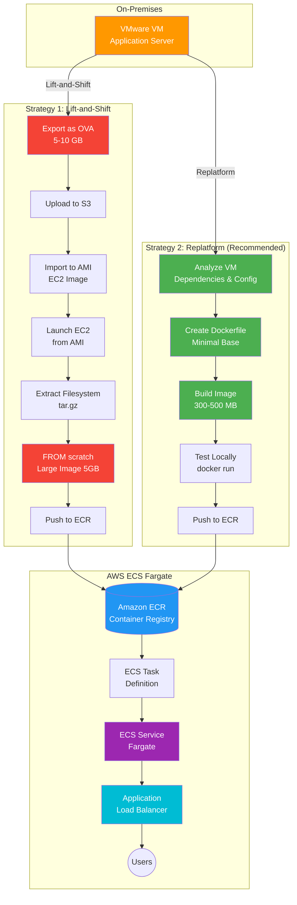

# VMware to AWS Container Migration Plan

## Executive Summary

This document outlines the recommended approach for migrating VMware VMs to AWS container images for deployment on ECS Fargate (app4).

---

## Migration Flow Diagram



### Migration Comparison

| Aspect | Lift-and-Shift | Replatform |
|--------|----------------|------------|
| **Timeline** | 1-2 weeks | 2-4 weeks |
| **Image Size** | 5-10 GB | 300-500 MB |
| **Security** | ❌ Poor | ✅ Excellent |
| **Maintenance** | ❌ High | ✅ Low |
| **Cost** | ❌ Higher | ✅ Lower |
| **Cloud-Native** | ❌ No | ✅ Yes |

---

## Migration Strategies

### Strategy 1: Lift-and-Shift (Quick Migration)
**Timeline:** 1-2 weeks  
**Effort:** Low  
**Maintenance:** High  

#### Process
1. **Export VMware VM**
   - Export as OVA format from VMware vCenter
   - Typical size: 2-10 GB compressed

2. **Upload to S3**
   ```bash
   aws s3 cp vm-export.ova s3://terraform-state-925185632967/vm-imports/
   ```

3. **Import to EC2 AMI**
   ```bash
   aws ec2 import-image \
     --description "VMware VM Import" \
     --disk-containers Format=ova,UserBucket="{S3Bucket=terraform-state-925185632967,S3Key=vm-imports/vm-export.ova}"
   ```

4. **Convert AMI to Container**
   - Launch EC2 instance from imported AMI
   - Extract filesystem as tarball
   - Build container image from scratch base
   - Push to Amazon ECR

#### Pros
- Fast migration path
- Minimal application changes
- Preserves exact VM state

#### Cons
- Large container images (GBs)
- Includes unnecessary OS components
- Poor security posture
- Difficult to maintain and update
- Not cloud-native

---

### Strategy 2: Replatform (Recommended)
**Timeline:** 2-4 weeks  
**Effort:** Medium  
**Maintenance:** Low  

#### Process
1. **Analyze VM workload**
   - Identify application dependencies
   - Document configuration files
   - List required packages

2. **Create Dockerfile**
   ```dockerfile
   FROM amazonlinux:2023
   
   # Install only required packages
   RUN yum install -y \
       nginx \
       python3 \
       && yum clean all
   
   # Copy application files
   COPY app/ /app/
   COPY config/ /etc/app/
   
   # Set up user
   RUN useradd -r -s /bin/false appuser
   USER appuser
   
   # Health check
   HEALTHCHECK --interval=30s --timeout=3s \
     CMD curl -f http://localhost/ || exit 1
   
   EXPOSE 80
   CMD ["nginx", "-g", "daemon off;"]
   ```

3. **Build and test locally**
   ```bash
   docker build -t app4-container .
   docker run -p 8080:80 app4-container
   ```

4. **Push to ECR**
   ```bash
   aws ecr get-login-password --region us-east-1 | \
     docker login --username AWS --password-stdin 925185632967.dkr.ecr.us-east-1.amazonaws.com
   
   docker tag app4-container:latest 925185632967.dkr.ecr.us-east-1.amazonaws.com/app4:latest
   docker push 925185632967.dkr.ecr.us-east-1.amazonaws.com/app4:latest
   ```

5. **Deploy to ECS Fargate**
   - Update Terraform task definition
   - Reference ECR image
   - Configure environment variables
   - Set resource limits (CPU/memory)

#### Pros
- Small, optimized images (100-500 MB)
- Better security (minimal attack surface)
- Cloud-native architecture
- Easy to update and maintain
- Faster deployments
- Lower costs (smaller images = faster pulls)

#### Cons
- Requires application analysis
- May need code modifications
- Testing required

---

## Recommended Approach

### Phase 1: Assessment (Week 1)
- [ ] Document current VM configuration
- [ ] Identify application dependencies
- [ ] List required packages and libraries
- [ ] Review security requirements
- [ ] Determine data persistence needs

### Phase 2: Containerization (Week 2-3)
- [ ] Create Dockerfile using minimal base image
- [ ] Build and test container locally
- [ ] Implement health checks
- [ ] Configure logging (CloudWatch)
- [ ] Set up secrets management (AWS Secrets Manager)
- [ ] Create ECR repository

### Phase 3: Infrastructure (Week 3)
- [ ] Update Terraform ECS task definition
- [ ] Configure service discovery
- [ ] Set up Application Load Balancer
- [ ] Configure auto-scaling policies
- [ ] Implement monitoring and alerts

### Phase 4: Testing (Week 4)
- [ ] Deploy to dev environment
- [ ] Run integration tests
- [ ] Performance testing
- [ ] Security scanning (Trivy, ECR scanning)
- [ ] Disaster recovery testing

### Phase 5: Production Deployment
- [ ] Blue/green deployment strategy
- [ ] Gradual traffic shift
- [ ] Monitor metrics and logs
- [ ] Rollback plan ready

---

## Technical Specifications

### Container Image Requirements
- **Base Image:** amazonlinux:2023 or alpine:3.19
- **Size Target:** < 500 MB
- **Security:** Non-root user, no unnecessary packages
- **Logging:** stdout/stderr to CloudWatch
- **Health Check:** HTTP endpoint or command

### ECS Fargate Configuration
```hcl
resource "aws_ecs_task_definition" "app4" {
  family                   = "app4"
  network_mode             = "awsvpc"
  requires_compatibilities = ["FARGATE"]
  cpu                      = "256"
  memory                   = "512"
  
  container_definitions = jsonencode([{
    name  = "app4-container"
    image = "925185632967.dkr.ecr.us-east-1.amazonaws.com/app4:latest"
    
    portMappings = [{
      containerPort = 80
      protocol      = "tcp"
    }]
    
    logConfiguration = {
      logDriver = "awslogs"
      options = {
        "awslogs-group"         = "/ecs/app4"
        "awslogs-region"        = "us-east-1"
        "awslogs-stream-prefix" = "ecs"
      }
    }
    
    healthCheck = {
      command     = ["CMD-SHELL", "curl -f http://localhost/ || exit 1"]
      interval    = 30
      timeout     = 5
      retries     = 3
      startPeriod = 60
    }
  }])
}
```

---

## Cost Comparison

### Lift-and-Shift
- **Image Size:** 5 GB
- **Pull Time:** 2-3 minutes
- **Storage Cost:** $0.50/month per image
- **Data Transfer:** Higher costs

### Replatform
- **Image Size:** 300 MB
- **Pull Time:** 10-20 seconds
- **Storage Cost:** $0.03/month per image
- **Data Transfer:** Lower costs

**Estimated Savings:** 60-70% on container-related costs

---

## Security Considerations

### Lift-and-Shift Risks
- Full OS in container (large attack surface)
- Outdated packages from VM
- Root user execution
- Unnecessary services running

### Replatform Benefits
- Minimal base image
- Latest security patches
- Non-root user
- Only required packages
- Regular automated scanning

---

## Success Metrics

- [ ] Container image < 500 MB
- [ ] Startup time < 30 seconds
- [ ] Zero critical vulnerabilities
- [ ] 99.9% uptime
- [ ] Auto-scaling working correctly
- [ ] Logs flowing to CloudWatch
- [ ] Monitoring and alerts configured

---

## Rollback Plan

1. Keep VM running during migration
2. Maintain previous ECS task definition
3. Use blue/green deployment
4. Monitor error rates and latency
5. Automated rollback on threshold breach

---

## Conclusion

**Recommendation:** Proceed with Strategy 2 (Replatform)

While lift-and-shift is faster, replatforming provides:
- Better long-term maintainability
- Improved security posture
- Lower operational costs
- Cloud-native architecture
- Easier scaling and updates

The additional 1-2 weeks of effort will pay dividends in reduced maintenance burden and improved system reliability.

---

## Next Steps

1. Schedule kickoff meeting with stakeholders
2. Begin Phase 1 assessment
3. Set up development environment
4. Create proof-of-concept Dockerfile
5. Review and approve migration timeline
