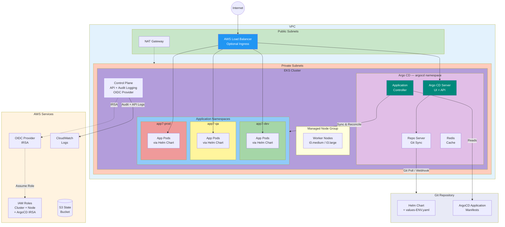
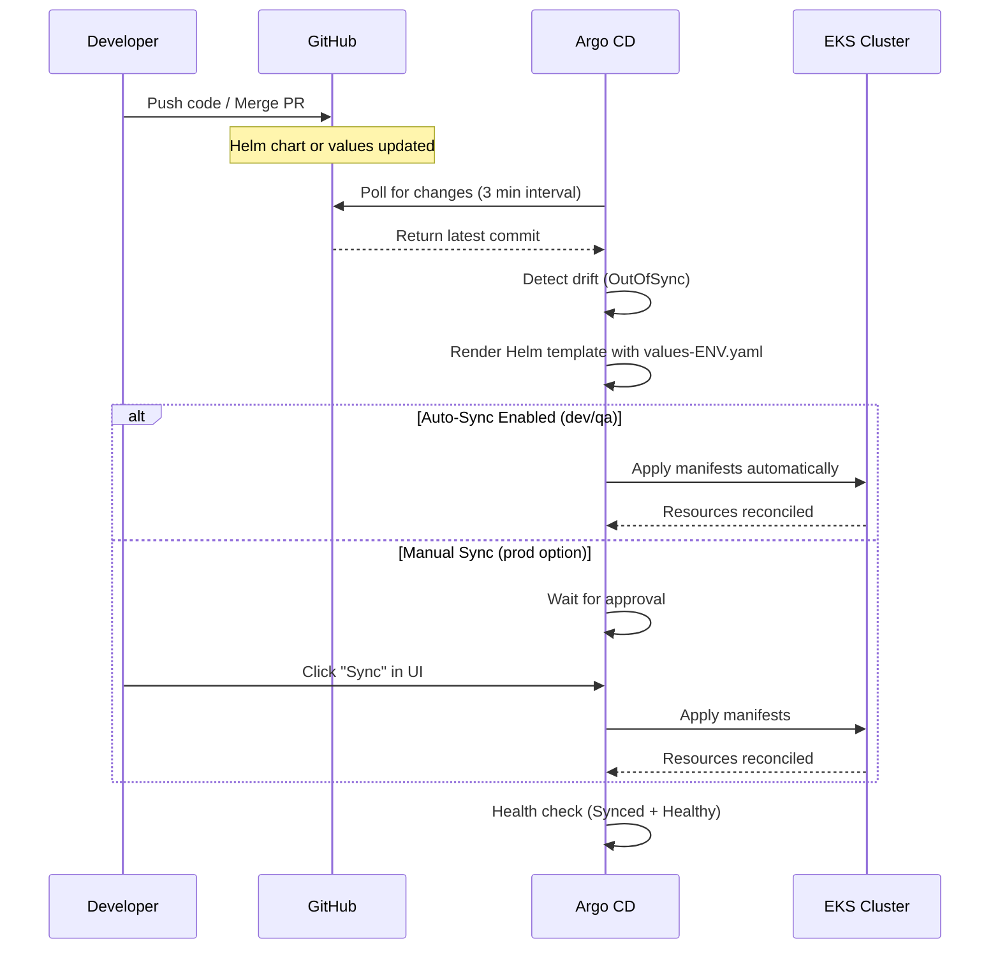
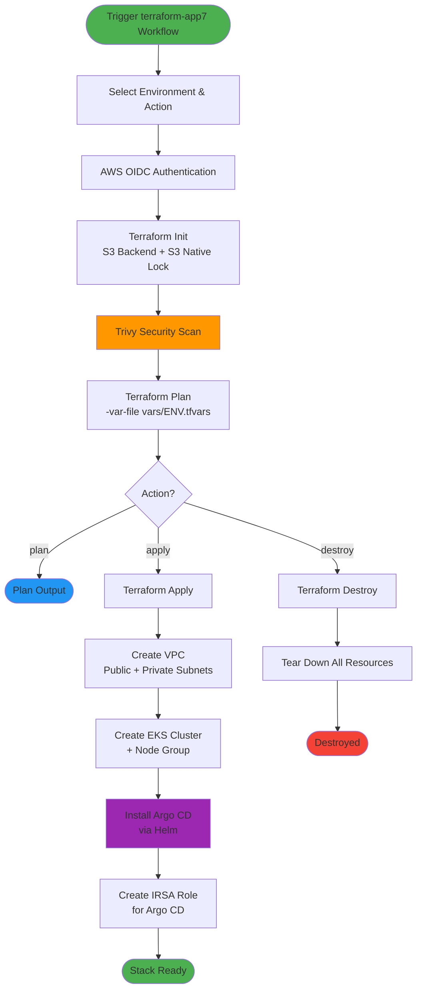

# App7 — EKS with Argo CD (GitOps)

This stack deploys an EKS cluster with [Argo CD](https://argo-cd.readthedocs.io/) for GitOps-based continuous delivery. Application deployments are defined as Argo CD `Application` CRDs that sync Helm charts from this repository to the cluster.

---

## Architecture Diagram



---

## GitOps Workflow



---

## Infrastructure Provisioning Flow



---

## Directory Structure

```
terraform/stacks/app7/
├── main.tf                  # VPC + EKS module composition
├── argocd.tf                # Argo CD Helm release + IRSA role
├── variables.tf             # Input variables
├── outputs.tf               # Stack outputs
├── versions.tf              # Provider requirements
├── backend.tf               # S3 state backend
├── providers.tf             # Kubernetes + Helm provider config
├── vars/
│   ├── dev.tfvars           # Dev environment (10.7.0.0/16)
│   ├── qa.tfvars            # QA environment  (10.8.0.0/16)
│   └── prod.tfvars          # Prod environment (10.9.0.0/16)
├── argocd/
│   ├── application-dev.yaml   # ArgoCD Application CRD — dev
│   ├── application-qa.yaml    # ArgoCD Application CRD — qa
│   └── application-prod.yaml  # ArgoCD Application CRD — prod
└── helm/app-chart/
    ├── Chart.yaml
    ├── values.yaml            # Default values
    ├── values-dev.yaml        # Dev overrides
    ├── values-qa.yaml         # QA overrides
    ├── values-prod.yaml       # Prod overrides
    └── templates/
        ├── _helpers.tpl
        ├── deployment.yaml
        ├── service.yaml
        ├── ingress.yaml
        ├── serviceaccount.yaml
        ├── hpa.yaml
        ├── pdb.yaml
        ├── networkpolicy.yaml
        └── configmap.yaml
```

---

## Environment Configuration

| Parameter | Dev | QA | Prod |
|-----------|-----|-----|------|
| VPC CIDR | 10.7.0.0/16 | 10.8.0.0/16 | 10.9.0.0/16 |
| Instance Type | t3.medium | t3.medium | t3.large |
| Node Count | 1 | 1–3 | 2–5 |
| ArgoCD Replicas | 1 | 1 | 2 (HA) |
| Redis HA | No | No | Yes |
| Auto-Prune | Yes | Yes | No |
| Auto Self-Heal | Yes | Yes | Yes |
| HPA | Disabled | Disabled | Enabled (3–10) |
| PDB | Disabled | Enabled (min 1) | Enabled (min 2) |
| Network Policy | Disabled | Disabled | Enabled |

---

## Usage

### Deploy Infrastructure

```bash
# Initialize
cd terraform/stacks/app7
terraform init -reconfigure

# Plan
terraform plan -var-file="vars/dev.tfvars"

# Apply
terraform apply -var-file="vars/dev.tfvars"
```

### Configure kubectl

```bash
aws eks update-kubeconfig --name myapp7-dev --region us-east-1
```

### Access Argo CD UI

```bash
# Get initial admin password
kubectl -n argocd get secret argocd-initial-admin-secret -o jsonpath="{.data.password}" | base64 -d

# Port-forward the server
kubectl port-forward svc/argocd-server -n argocd 8080:443

# Open https://localhost:8080 (user: admin)
```

### Deploy Applications via Argo CD

```bash
# Apply the ArgoCD Application manifest
kubectl apply -f argocd/application-dev.yaml
```

### Destroy Infrastructure

```bash
terraform destroy -var-file="vars/dev.tfvars"
```

---

## Prerequisites

- AWS CLI configured with appropriate permissions
- Terraform >= 1.0
- kubectl
- Helm (for local chart testing)
- S3 backend bucket (shared across stacks, using S3 native locking)
