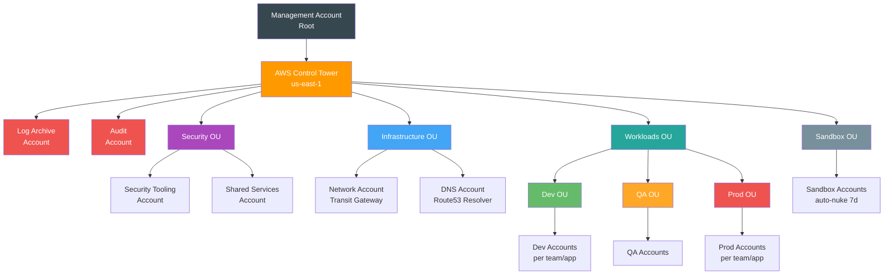
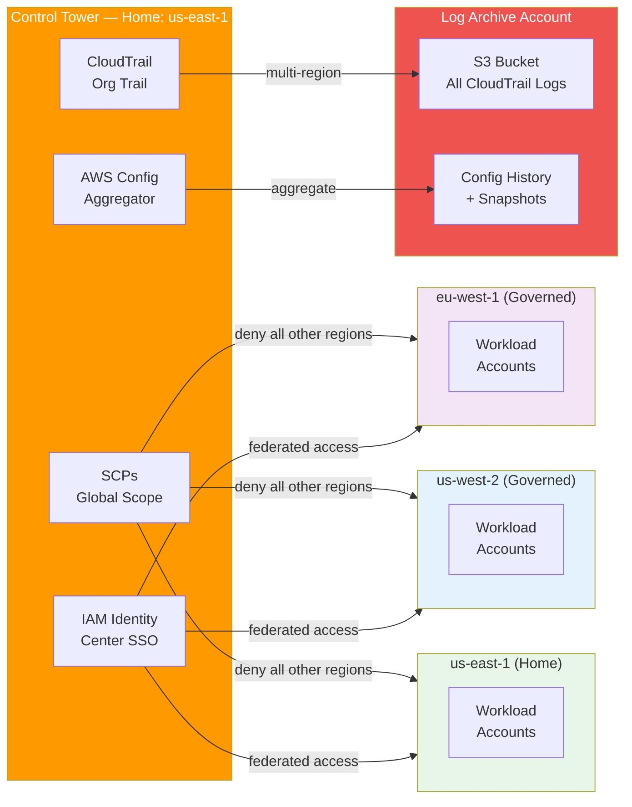
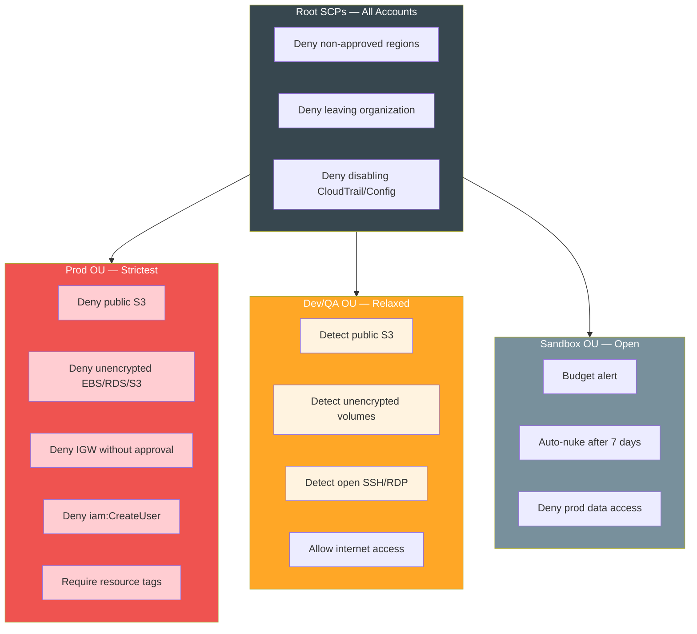
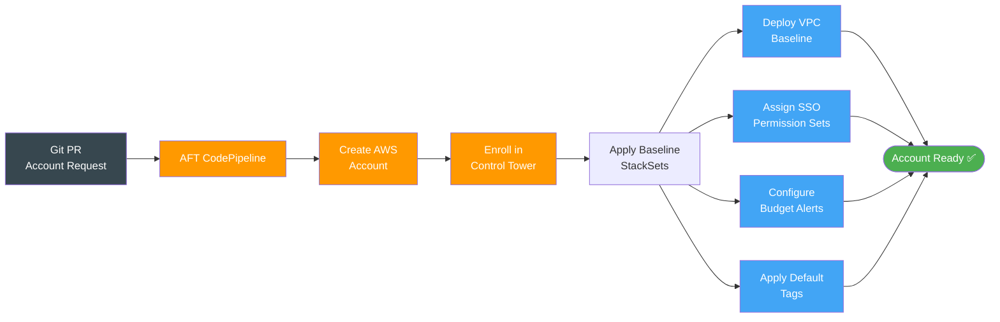

# AWS Control Tower — Multi-Region Architecture & Guardrail Strategy

---

## OU & Account Structure

```
  Management Account (Root)
  └── AWS Control Tower (Home Region: us-east-1)
      ├── Log Archive Account
      ├── Audit Account
      └── Organization Units (OUs)
          ├── Security OU
          │   ├── Security Tooling Account
          │   └── Shared Services Account
          ├── Infrastructure OU
          │   ├── Network Account (Transit Gateway hub)
          │   └── DNS Account (Route53 Resolver)
          ├── Workloads OU
          │   ├── Dev OU
          │   │   └── Dev Accounts (per team/app)
          │   ├── QA OU
          │   │   └── QA Accounts
          │   └── Prod OU
          │       └── Prod Accounts (per team/app)
          └── Sandbox OU
              └── Sandbox Accounts (unrestricted experimentation)
```

---

## Multi-Region Design

Control Tower has a **home region** (where it's deployed) but governance is extended to additional regions via **Region Deny SCPs** and **StackSets**.

```
  Home Region: us-east-1
  ├── Control Tower baseline (CloudTrail, Config, SSO)
  ├── All guardrails enforced here natively
  └── Account Factory provisions here by default

  Governed Regions: us-west-2, eu-west-1 (configurable)
  ├── CloudTrail multi-region enabled → centralized to Log Archive
  ├── AWS Config aggregated → Audit account
  ├── SCPs apply globally (not region-scoped)
  └── Region Deny SCP blocks all other regions
```

**Region Deny SCP** — whitelist only approved regions:

```json
{
  "Effect": "Deny",
  "Action": "*",
  "Resource": "*",
  "Condition": {
    "StringNotEquals": {
      "aws:RequestedRegion": ["us-east-1", "us-west-2", "eu-west-1"]
    },
    "ArnNotLike": {
      "aws:PrincipalArn": "arn:aws:iam::*:role/AWSControlTowerExecution"
    }
  }
}
```

---

## Guardrail Strategy

| Type | Mechanism | Behavior |
|------|-----------|----------|
| **Preventive** | SCP | Blocks the action — hard stop |
| **Detective** | AWS Config Rule | Detects and alerts — does not block |

---

### Mandatory Guardrails (auto-enabled by Control Tower)

- Disallow changes to CloudTrail in enrolled accounts
- Disallow deletion of Log Archive S3 bucket
- Disallow changes to AWS Config in enrolled accounts
- Disallow changes to IAM roles created by Control Tower
- Enable CloudTrail in all accounts

---

### Strongly Recommended Guardrails

**Preventive (SCPs):**

| Guardrail | OU Scope | Why |
|-----------|----------|-----|
| Disallow root account access | All OUs | Enforce IAM/SSO usage |
| Require MFA for root | All OUs | Baseline security |
| Disallow access keys for root | All OUs | No root programmatic access |
| Deny leaving the organization | All OUs | Prevent account escape |
| Restrict allowed regions | All OUs | Cost + compliance control |
| Disallow public S3 buckets | Workloads OU | Data exfiltration prevention |
| Require S3 encryption | Workloads OU | Data at rest compliance |
| Disallow IGW without approval | Prod OU | Network security |
| Deny `iam:CreateUser` | Prod OU | SSO only, no IAM users |

**Detective (Config Rules):**

| Guardrail | OU Scope | Why |
|-----------|----------|-----|
| Detect public S3 buckets | All OUs | Catch misconfigurations |
| Detect unencrypted EBS volumes | Workloads OU | Compliance |
| Detect unrestricted SSH (port 22) | All OUs | Security posture |
| Detect unrestricted RDP (port 3389) | All OUs | Security posture |
| Detect MFA not enabled on IAM users | All OUs | Identity security |
| Detect root account usage | All OUs | Alert on root activity |
| Detect CloudTrail disabled | All OUs | Audit continuity |

---

### Guardrail Layering by OU

```
  Root SCPs (apply everywhere)
  ├── Deny region usage outside approved list
  ├── Deny leaving organization
  └── Deny disabling CloudTrail/Config

  Security OU
  ├── Deny modification of security tooling accounts
  └── Restrict cross-account role assumption

  Prod OU (strictest)
  ├── Deny public S3 buckets
  ├── Deny unencrypted resources (EBS, RDS, S3)
  ├── Deny direct internet access (no IGW without approval)
  ├── Require tagging on all resources
  └── Deny IAM user creation (SSO only)

  Dev/QA OU (relaxed)
  ├── Allow broader instance types
  ├── Allow internet access
  └── Detect (not prevent) misconfigurations

  Sandbox OU (most relaxed)
  ├── Budget alert at $X/month
  ├── Auto-nuke resources after 7 days (Lambda)
  └── Deny production data access
```

---

## Account Vending — Account Factory for Terraform (AFT)

```
  Git PR → AFT Pipeline → New AWS Account
  ├── Baseline VPC (via StackSet)
  ├── SSO permission sets assigned
  ├── Default tags applied
  ├── Budget alerts configured
  └── Enrolled in Control Tower (guardrails applied)
```

AFT enables IaC-driven account provisioning — no manual console clicks.

**Terraform structure for AFT:**

```
  terraform/live/aws/global/control-tower/
  ├── plan.md                  ← this file
  ├── aft/
  │   ├── main.tf              # AFT module deployment
  │   ├── account-requests/    # One .tf file per account
  │   └── customizations/      # Per-account baseline Terraform
  ├── scps/
  │   ├── region-deny.json
  │   ├── root-guardrails.json
  │   ├── prod-guardrails.json
  │   └── sandbox-guardrails.json
  └── stacksets/
      └── baseline-vpc.tf      # VPC deployed to all accounts
```

---

## Recommendations

1. **Start with 3 OUs minimum** — Security, Workloads (Dev/QA/Prod sub-OUs), Sandbox
2. **Use AFT** for account vending — avoid manual Account Factory console
3. **Region Deny SCP first** — prevents accidental resource sprawl before anything else
4. **Layer guardrails by OU** — Prod gets preventive, Dev/QA gets detective
5. **Centralize logs** — all CloudTrail + Config → Log Archive account only
6. **SSO over IAM users** — enforce via `Deny iam:CreateUser` SCP in Prod OU
7. **Tag policy enforcement** — use AWS Organizations Tag Policies alongside SCPs
8. **Drift detection** — enable Control Tower drift alerts → SNS → Slack/email

---

## Mermaid Diagrams

### OU Hierarchy



---

### Multi-Region Governance



---

### Guardrail Layering



---

### Account Vending via AFT


