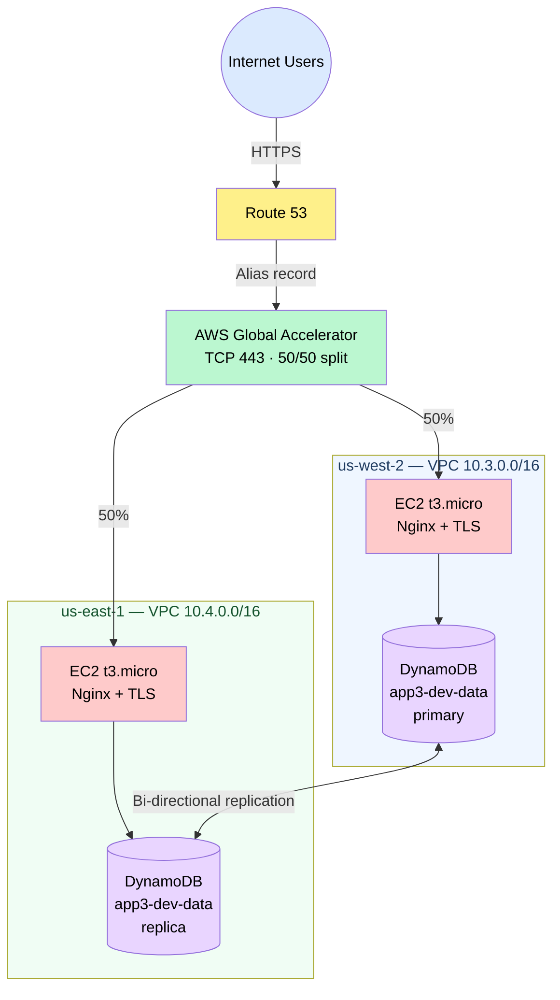

# App3 — Multi-Region Architecture

```mermaid
graph TB
    Users((Internet Users)) -->|HTTPS| R53[Route 53]
    R53 -->|Alias record| GA[AWS Global Accelerator\nTCP 443 · 50/50 split]

    GA -->|50%| EC2W
    GA -->|50%| EC2E

    subgraph West ["us-west-2 — VPC 10.3.0.0/16"]
        EC2W[EC2 t3.micro\nNginx + TLS]
        EC2W --> DDBW[(DynamoDB\napp3-dev-data\nprimary)]
    end

    subgraph East ["us-east-1 — VPC 10.4.0.0/16"]
        EC2E[EC2 t3.micro\nNginx + TLS]
        EC2E --> DDBE[(DynamoDB\napp3-dev-data\nreplica)]
    end

    DDBW <-->|Bi-directional replication| DDBE

    style Users fill:#dbeafe,color:#000
    style R53 fill:#fef08a,color:#000
    style GA fill:#bbf7d0,color:#000
    style EC2W fill:#fecaca,color:#000
    style EC2E fill:#fecaca,color:#000
    style DDBW fill:#e9d5ff,color:#000
    style DDBE fill:#e9d5ff,color:#000
    style West fill:#eff6ff,color:#1e3a5f
    style East fill:#f0fdf4,color:#14532d
```
