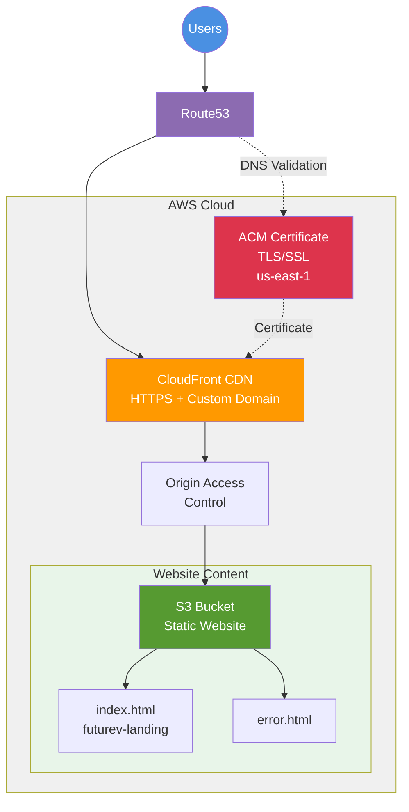

# App6 — Serverless S3 Static Website

Serverless static website hosted on S3 with CloudFront CDN and custom domain.

## Architecture



## Features

- HTTPS by default via CloudFront
- Custom domain: futurev.io + www
- Global CDN distribution
- Custom error pages
- Gzip compression
- Low latency content delivery
- Free SSL/TLS certificate from ACM

## Deploy

```bash
cd terraform/stacks/app6
terraform init
terraform plan -var-file="vars/dev.tfvars"
terraform apply -var-file="vars/dev.tfvars"
```

## Destroy

```bash
terraform destroy -var-file="vars/dev.tfvars"
```

## Outputs

- `bucket_name`: S3 bucket name
- `bucket_website_endpoint`: S3 website endpoint
- `cloudfront_domain_name`: CloudFront domain
- `website_url`: https://futurev.io
- `acm_certificate_arn`: SSL certificate ARN

## Upload Content

```bash
aws s3 cp index.html s3://app6-static-website-dev-925185632967/
aws s3 sync ./website s3://app6-static-website-dev-925185632967/
```

## Invalidate CloudFront Cache

```bash
aws cloudfront create-invalidation \
  --distribution-id <DISTRIBUTION_ID> \
  --paths "/*"
```

## DNS Configuration

The domain uses Route53 hosted zone `Z3LLP0B81D4CRA` with:
- A record: futurev.io → CloudFront
- A record: www.futurev.io → CloudFront
- CNAME: ACM validation record (auto-created)
