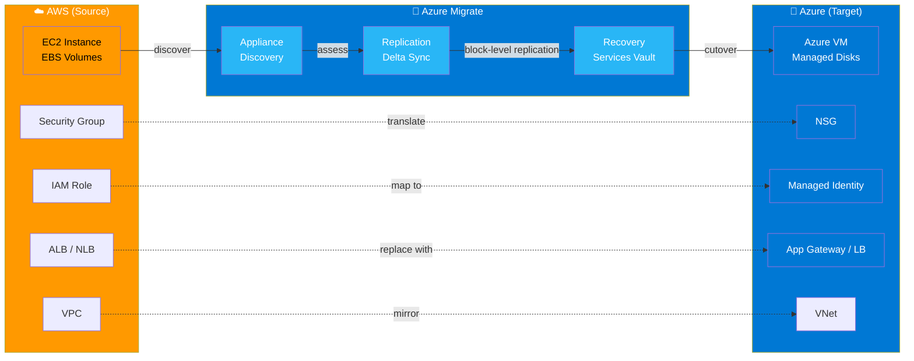
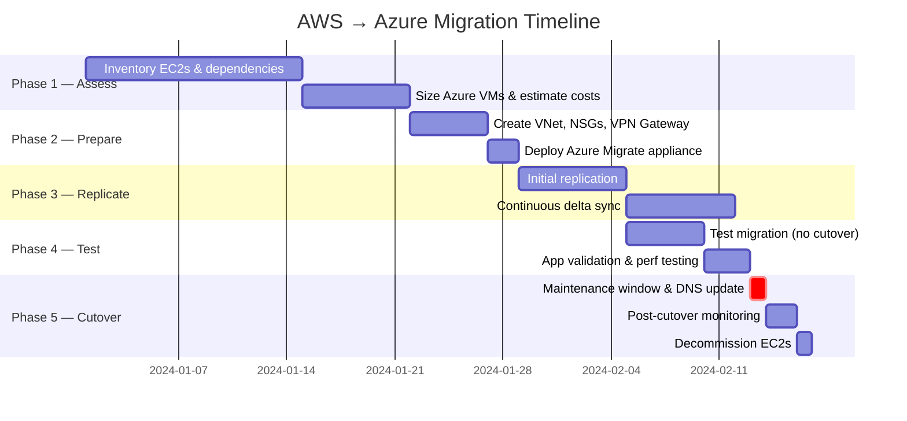
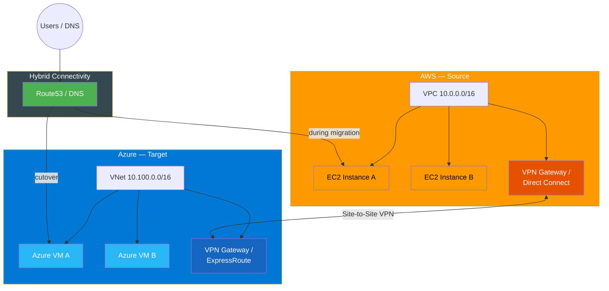
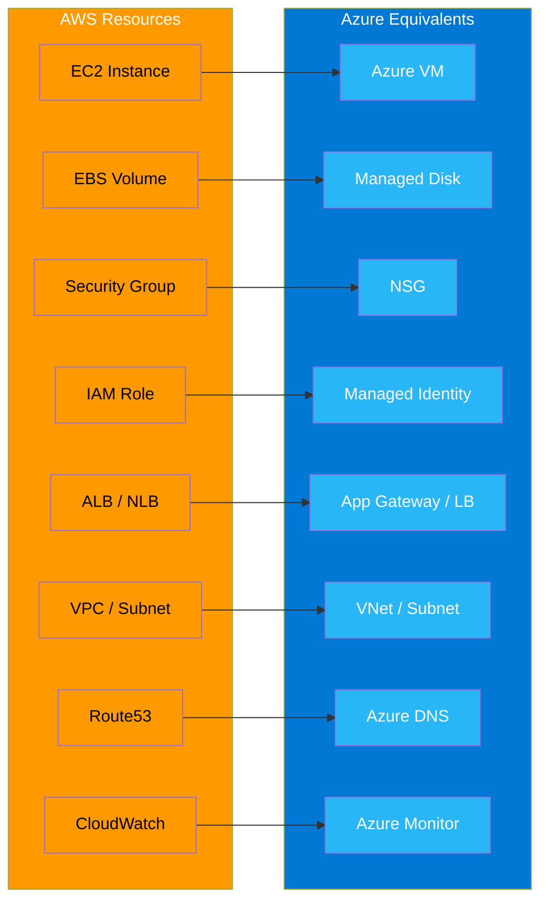
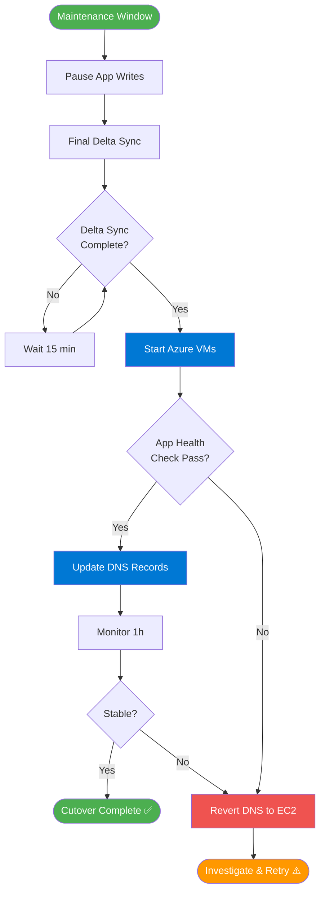
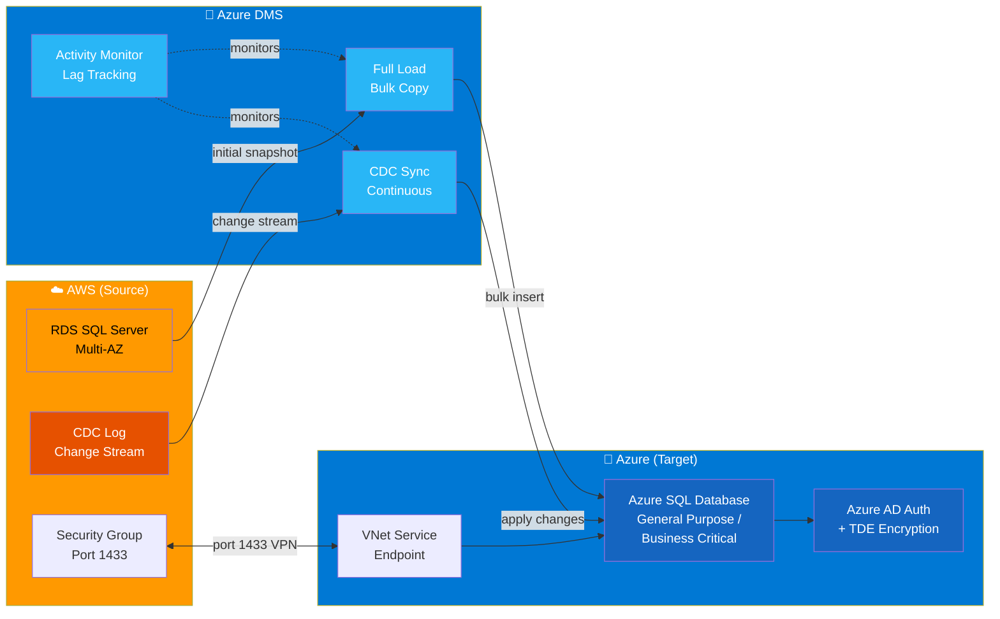
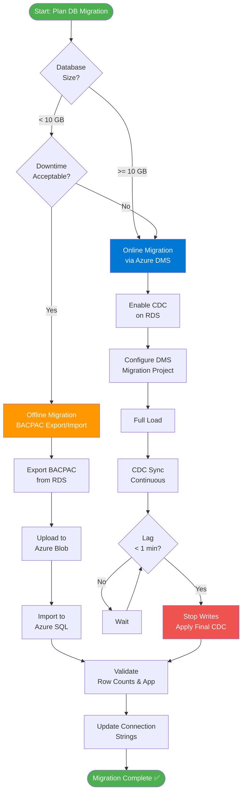
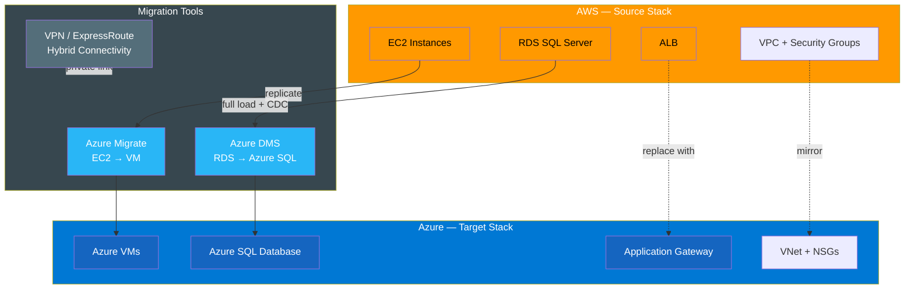

# AWS → Azure Migration Plan

End-to-end migration plan covering:
- **EC2 → Azure VM** via Azure Migrate (lift-and-shift, near-zero downtime)
- **RDS SQL Server → Azure SQL Database** via Azure Database Migration Service (DMS)

---

## Architecture Overview

```
  ┌─────────────────────────────────────────────────────────────────────────┐
  │                          MIGRATION FLOW                                  │
  └─────────────────────────────────────────────────────────────────────────┘

  AWS (Source)                                          Azure (Target)
  ─────────────────────────────────────────────────────────────────────────

  ┌──────────────────────┐                    ┌──────────────────────────┐
  │        VPC           │                    │         VNet             │
  │   10.0.0.0/16        │                    │     10.100.0.0/16        │
  │                      │                    │                          │
  │  ┌────────────────┐  │                    │  ┌────────────────────┐  │
  │  │  EC2 Instance  │  │  ─── Replicate ──► │  │    Azure VM        │  │
  │  │  (any OS)      │  │                    │  │    (same OS)       │  │
  │  │  EBS Volumes   │  │                    │  │    Managed Disks   │  │
  │  └────────────────┘  │                    │  └────────────────────┘  │
  │                      │                    │                          │
  │  ┌────────────────┐  │                    │  ┌────────────────────┐  │
  │  │ Security Group │  │  ─── Translate ──► │  │  Network Security  │  │
  │  │  (inbound/out) │  │                    │  │  Group (NSG)       │  │
  │  └────────────────┘  │                    │  └────────────────────┘  │
  │                      │                    │                          │
  │  ┌────────────────┐  │                    │  ┌────────────────────┐  │
  │  │   IAM Role     │  │  ─── Map to ─────► │  │  Managed Identity  │  │
  │  └────────────────┘  │                    │  └────────────────────┘  │
  │                      │                    │                          │
  │  ┌────────────────┐  │                    │  ┌────────────────────┐  │
  │  │  ALB / NLB     │  │  ─── Replace ───► │  │  App Gateway / LB  │  │
  │  └────────────────┘  │                    │  └────────────────────┘  │
  └──────────────────────┘                    └──────────────────────────┘
            │                                              │
            └──────────── VPN / ExpressRoute ─────────────┘
                         (active during migration)
```

---

## Migration Phases

```
  Phase 1          Phase 2          Phase 3          Phase 4          Phase 5
  ──────────       ──────────       ──────────       ──────────       ──────────
  ASSESS      ──►  PREPARE     ──►  REPLICATE   ──►  TEST        ──►  CUTOVER
  2–4 weeks        1–2 weeks        1–2 weeks        1 week           Hours

  • Inventory      • Azure          • Deploy         • Spin up        • Stop
    EC2s             Migrate          appliance        test VMs         replication
  • Map             setup          • Initial        • Validate       • Update DNS
    dependencies   • VNet/NSG        replication      app/data       • Decommission
  • Size VMs         creation       • Delta sync     • Perf test       EC2s
  • Estimate       • VPN/ER          (continuous)   • Rollback
    costs            setup                            test
```

---

## Detailed Architecture

```
  ┌─────────────────────────────────────────────────────────────────────────┐
  │                     AZURE MIGRATE REPLICATION FLOW                       │
  └─────────────────────────────────────────────────────────────────────────┘

  AWS Account                          Azure Subscription
  ──────────────────────────────────────────────────────────────────────────

  ┌─────────────────────┐              ┌──────────────────────────────────┐
  │  Azure Migrate      │              │  Azure Migrate Project           │
  │  Appliance (EC2)    │──────────────►  (Discovery + Assessment)        │
  │  - Discovers VMs    │  HTTPS 443   └──────────────────────────────────┘
  │  - Sends metadata   │
  └─────────────────────┘              ┌──────────────────────────────────┐
                                       │  Replication Storage Account     │
  ┌─────────────────────┐              │  (staging area for disk data)    │
  │  Source EC2         │──────────────►                                  │
  │  - OS disk          │  Block-level │  ┌──────────────────────────┐    │
  │  - Data disks       │  replication │  │  Managed Disks (target)  │    │
  │  - Running apps     │              │  │  Premium SSD / Standard  │    │
  └─────────────────────┘              │  └──────────────────────────┘    │
                                       └──────────────────────────────────┘
                                                      │
                                                      ▼
                                       ┌──────────────────────────────────┐
                                       │  Target Azure VM                 │
                                       │  ┌────────────────────────────┐  │
                                       │  │  Resource Group            │  │
                                       │  │  ├─ Virtual Machine        │  │
                                       │  │  ├─ NIC                    │  │
                                       │  │  ├─ OS Managed Disk        │  │
                                       │  │  ├─ Data Managed Disk(s)   │  │
                                       │  │  └─ NSG                    │  │
                                       │  └────────────────────────────┘  │
                                       └──────────────────────────────────┘
```

---

## AWS → Azure Resource Mapping

| AWS Resource | Azure Equivalent | Notes |
|---|---|---|
| EC2 Instance | Azure VM | Match vCPU/RAM; see sizing table below |
| EBS gp3 Volume | Premium SSD Managed Disk | Match IOPS/throughput |
| EBS gp2 Volume | Standard SSD Managed Disk | |
| EBS io2 Volume | Ultra Disk | High-perf workloads |
| VPC | Virtual Network (VNet) | |
| Subnet | Subnet | |
| Security Group | Network Security Group (NSG) | Rules translate 1:1 |
| Internet Gateway | Default outbound / NAT Gateway | |
| NAT Gateway | NAT Gateway | |
| Route Table | Route Table (UDR) | |
| ALB | Azure Application Gateway | Layer 7 |
| NLB | Azure Load Balancer | Layer 4 |
| Route53 | Azure DNS / Traffic Manager | |
| IAM Role | Managed Identity | |
| IAM Policy | Azure RBAC Role Assignment | |
| CloudWatch | Azure Monitor + Log Analytics | |
| S3 | Azure Blob Storage | |
| RDS | Azure Database (MySQL/PostgreSQL/SQL) | Separate migration path |

---

## EC2 → Azure VM Sizing

```
  AWS Instance    vCPU  RAM     Azure Equivalent    Series
  ─────────────────────────────────────────────────────────
  t3.micro          2    1 GB   B1s                 B-series (burstable)
  t3.small          2    2 GB   B1ms                B-series
  t3.medium         2    4 GB   B2s                 B-series
  t3.large          2    8 GB   B2ms                B-series
  m5.large          2    8 GB   D2s_v3              D-series (general)
  m5.xlarge         4   16 GB   D4s_v3              D-series
  m5.2xlarge        8   32 GB   D8s_v3              D-series
  m5.4xlarge       16   64 GB   D16s_v3             D-series
  c5.large          2    4 GB   F2s_v2              F-series (compute)
  c5.xlarge         4    8 GB   F4s_v2              F-series
  r5.large          2   16 GB   E2s_v3              E-series (memory)
  r5.xlarge         4   32 GB   E4s_v3              E-series
```

---

## Network Architecture During Migration

```
  ┌──────────────────────────────────────────────────────────────────────┐
  │                    HYBRID CONNECTIVITY                                │
  └──────────────────────────────────────────────────────────────────────┘

  AWS                                              Azure
  ─────────────────────────────────────────────────────────────────────

  ┌──────────────────┐                        ┌──────────────────────┐
  │  VPC             │                        │  VNet                │
  │  10.0.0.0/16     │                        │  10.100.0.0/16       │
  │                  │                        │                      │
  │  ┌────────────┐  │                        │  ┌────────────────┐  │
  │  │ EC2 (src)  │  │                        │  │ Azure VM (tgt) │  │
  │  └────────────┘  │                        │  └────────────────┘  │
  │                  │                        │                      │
  │  ┌────────────┐  │   Site-to-Site VPN     │  ┌────────────────┐  │
  │  │ VPN GW /   │◄─┼────────────────────────┼─►│ VPN Gateway /  │  │
  │  │ Direct     │  │   or ExpressRoute       │  │ ExpressRoute   │  │
  │  │ Connect    │  │   (during migration)    │  │ Circuit        │  │
  │  └────────────┘  │                        │  └────────────────┘  │
  └──────────────────┘                        └──────────────────────┘

  Options:
  ├─ Site-to-Site VPN   : Quick setup, ~1.25 Gbps, sufficient for most migrations
  └─ ExpressRoute       : Private, up to 100 Gbps, for large data volumes
```

---

## Cutover Sequence

```
  T-24h                T-1h                 T=0 (Cutover)         T+1h
  ──────────────────────────────────────────────────────────────────────
  • Final delta        • Pause app          • Stop replication    • Monitor
    sync check           writes (maint        on all VMs            Azure VMs
  • Validate             window)            • Final delta sync    • Validate
    Azure VMs          • Verify delta       • Start Azure VMs       app health
  • Pre-warm             sync complete      • Update DNS TTL      • Keep EC2s
    Azure VMs          • Notify users         (60s → live)          stopped
  • Update DNS                              • Smoke test            (48h hold)
    TTL to 60s                              • Confirm health      • Decommission
                                                                    EC2s
```

---

## Rollback Plan

```
  If issues detected within 48h of cutover:

  1. Revert DNS → point back to EC2 Elastic IPs / ALB
  2. Restart EC2 instances (kept stopped, not terminated)
  3. Notify stakeholders
  4. Investigate Azure VM issues
  5. Re-attempt migration after root cause resolved

  ⚠️  Do NOT terminate EC2s until Azure VMs are validated stable for 48h
```

---

## Terraform Implementation Plan

```
  terraform/stacks/azure/aws-azure-migrate/
  ├── main.tf              # Resource group, providers
  ├── network.tf           # VNet, subnets, NSGs, VPN Gateway
  ├── migrate.tf           # Azure Migrate project + replication vault
  ├── vm.tf                # Target Azure VMs (post-migration)
  ├── variables.tf
  ├── outputs.tf
  └── vars/
      ├── dev.tfvars
      └── prod.tfvars
```

**Deployment order:**
1. `network.tf` — VNet, subnets, NSGs, VPN Gateway
2. `migrate.tf` — Azure Migrate project, Recovery Services Vault
3. Run Azure Migrate discovery + replication (console/CLI)
4. `vm.tf` — finalize VM config post-cutover

---

## Checklist

### Pre-Migration
- [ ] Inventory all EC2 instances, EBS volumes, security groups, IAM roles
- [ ] Identify inter-service dependencies (RDS, ElastiCache, SQS, etc.)
- [ ] Create Azure subscription and resource groups
- [ ] Set up VNet with matching CIDR ranges (non-overlapping with AWS)
- [ ] Establish VPN or ExpressRoute connectivity
- [ ] Deploy Azure Migrate appliance in AWS
- [ ] Run discovery and assessment (review sizing recommendations)
- [ ] Translate security groups → NSGs
- [ ] Create Managed Identities to replace IAM roles

### During Replication
- [ ] Verify initial replication completes without errors
- [ ] Monitor delta sync lag (should be < 1 min)
- [ ] Test VM boot in Azure (test migration — no cutover)
- [ ] Validate application functionality on test VMs
- [ ] Performance test against baseline

### Cutover
- [ ] Schedule maintenance window
- [ ] Reduce DNS TTL to 60s (24h before cutover)
- [ ] Stop application writes / enable maintenance mode
- [ ] Confirm final delta sync
- [ ] Start Azure VMs and validate
- [ ] Update DNS records
- [ ] Monitor for 1h post-cutover

### Post-Migration
- [ ] Validate all services operational for 48h
- [ ] Set up Azure Monitor alerts (equivalent to CloudWatch alarms)
- [ ] Configure Azure Backup
- [ ] Decommission EC2 instances
- [ ] Remove VPN/ExpressRoute (if no longer needed)
- [ ] Update documentation and runbooks

---

## RDS SQL Server → Azure SQL Database Migration

### Overview

```
  AWS (Source)                                        Azure (Target)
  ──────────────────────────────────────────────────────────────────────

  ┌──────────────────────┐                  ┌──────────────────────────┐
  │  RDS SQL Server      │                  │  Azure SQL Database      │
  │  (Multi-AZ optional) │                  │  (General Purpose /      │
  │                      │                  │   Business Critical)     │
  │  ┌────────────────┐  │                  │                          │
  │  │  Databases     │  │  ─── DMS ──────► │  ┌────────────────────┐  │
  │  │  Tables        │  │  Online / Offline│  │  Databases         │  │
  │  │  Stored Procs  │  │                  │  │  Tables            │  │
  │  │  Views         │  │                  │  │  Stored Procs      │  │
  │  │  Indexes       │  │                  │  │  Views / Indexes   │  │
  │  └────────────────┘  │                  │  └────────────────────┘  │
  │                      │                  │                          │
  │  Security Groups     │                  │  Firewall Rules / VNet   │
  │  IAM Auth (optional) │                  │  Azure AD Auth           │
  └──────────────────────┘                  └──────────────────────────┘
            │                                             │
            └──────────── VPN / ExpressRoute ─────────────┘
                         (required for online migration)
```

### RDS → Azure SQL Mapping

| RDS SQL Server | Azure SQL Database | Notes |
|---|---|---|
| db.t3.medium (2 vCPU, 4 GB) | General Purpose, 2 vCores | Burstable workloads |
| db.m5.large (2 vCPU, 8 GB) | General Purpose, 4 vCores | Standard workloads |
| db.m5.xlarge (4 vCPU, 16 GB) | General Purpose, 8 vCores | |
| db.m5.2xlarge (8 vCPU, 32 GB) | Business Critical, 8 vCores | High availability |
| db.r5.large (2 vCPU, 16 GB) | Business Critical, 4 vCores | Memory-optimized |
| Multi-AZ deployment | Business Critical tier | Built-in HA replicas |
| Read Replica | Geo-replication / Readable secondary | |
| RDS Automated Backups | Azure SQL PITR (1–35 days) | |
| RDS Snapshots | Long-term retention backups | |
| Parameter Groups | Azure SQL configuration | |
| Option Groups | N/A (managed service) | |
| Security Groups | Firewall rules + VNet service endpoint | |
| IAM DB Auth | Azure AD authentication | |
| SSL/TLS in-transit | TLS enforced by default | |
| Encryption at rest (KMS) | TDE (Transparent Data Encryption) | Enabled by default |

### Migration Approach: Online vs Offline

```
  OFFLINE (Simpler, requires downtime)
  ─────────────────────────────────────────────────────────────────────
  1. Stop application writes
  2. Export RDS → BACPAC file (SQL Server Management Studio or sqlpackage)
  3. Upload BACPAC to Azure Blob Storage
  4. Import BACPAC into Azure SQL Database
  5. Validate data integrity
  6. Update connection strings → Azure SQL endpoint
  7. Resume application

  Best for: Dev/QA, small databases (<10 GB), acceptable downtime window

  ONLINE (Near-zero downtime via DMS)
  ─────────────────────────────────────────────────────────────────────
  1. Enable CDC (Change Data Capture) on RDS SQL Server
  2. Create Azure DMS instance (Premium tier for online migration)
  3. Configure DMS migration project (source: RDS, target: Azure SQL)
  4. Full load — initial bulk copy of all tables
  5. CDC sync — continuous replication of changes
  6. Monitor lag (target: < 1 min)
  7. Cutover — stop writes, apply final changes, update connection strings

  Best for: Production, large databases, minimal downtime requirement
```

### DMS Migration Flow

```
  ┌─────────────────────────────────────────────────────────────────────┐
  │                  AZURE DMS ONLINE MIGRATION                          │
  └─────────────────────────────────────────────────────────────────────┘

  RDS SQL Server                  Azure DMS                Azure SQL DB
  ──────────────────────────────────────────────────────────────────────

  ┌──────────────┐   Full Load    ┌─────────────┐  Bulk Insert  ┌──────────┐
  │  All Tables  │ ─────────────► │             │ ────────────► │  Tables  │
  └──────────────┘                │  Migration  │               └──────────┘
                                  │  Service    │
  ┌──────────────┐   CDC Stream   │  (Premium)  │  Apply CDC    ┌──────────┐
  │  CDC Log     │ ─────────────► │             │ ────────────► │  Changes │
  │  (changes)   │                └─────────────┘               └──────────┘
  └──────────────┘
         │                              │
         │         VPN / ER             │
         └──────────────────────────────┘
              (private connectivity)

  Monitoring:
  ├─ DMS Activity Monitor → lag, rows migrated, errors
  └─ Azure Portal → migration status per table
```

### Pre-Migration Requirements

| Requirement | RDS Setting | Action |
|---|---|---|
| CDC enabled | `rds.replication_task_enable_cdc = 1` | Enable in parameter group |
| Backup retention | ≥ 1 day | Already default on RDS |
| SQL Server version | 2012+ | Verify compatibility level |
| `sysadmin` or `db_owner` | Source credentials | Required by DMS |
| Network access | Port 1433 open to DMS | Update security group |
| Azure SQL firewall | Allow DMS subnet | Configure in Azure |

### Connection String Update

```
  Before (RDS):
  Server=mydb.xxxx.us-east-1.rds.amazonaws.com,1433;
  Database=myapp;User Id=admin;Password=xxx;Encrypt=True;

  After (Azure SQL):
  Server=myserver.database.windows.net,1433;
  Database=myapp;User Id=admin@myserver;Password=xxx;
  Encrypt=True;TrustServerCertificate=False;
```

### Database Checklist

#### Pre-Migration
- [ ] Audit all RDS instances, databases, sizes, and SQL Server versions
- [ ] Check for unsupported features (linked servers, SQL Agent jobs, CLR, etc.)
- [ ] Enable CDC on source RDS instance
- [ ] Create Azure SQL Database (match vCores to RDS instance size)
- [ ] Configure VNet service endpoint or private endpoint for Azure SQL
- [ ] Create Azure DMS instance (Premium tier for online)
- [ ] Verify network connectivity: DMS → RDS (port 1433) and DMS → Azure SQL
- [ ] Run DMS Schema Assessment to catch compatibility issues

#### During Migration
- [ ] Monitor full load progress per table
- [ ] Verify CDC lag stays under 1 minute
- [ ] Validate row counts match between source and target
- [ ] Test application queries against Azure SQL (read-only test)

#### Cutover
- [ ] Stop application writes to RDS
- [ ] Wait for CDC lag to reach 0
- [ ] Update application connection strings to Azure SQL endpoint
- [ ] Validate application functionality
- [ ] Stop DMS replication task

#### Post-Migration
- [ ] Enable Azure SQL Threat Detection
- [ ] Configure Azure AD authentication
- [ ] Set up geo-replication (if required)
- [ ] Configure PITR retention policy
- [ ] Decommission RDS instance (after 48h validation hold)

---

## Mermaid Diagrams

### End-to-End Migration Flow



---

### Migration Phases Timeline



---

### Network Architecture



---

### Resource Mapping



---

### Cutover Decision Flow



---

### RDS SQL Server → Azure SQL Migration Flow



---

### Online vs Offline Decision



---

### Full Stack Migration Overview


