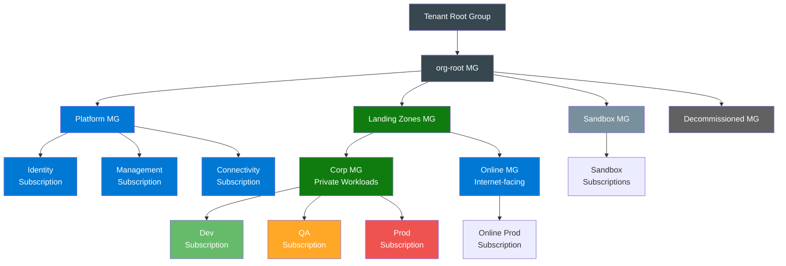
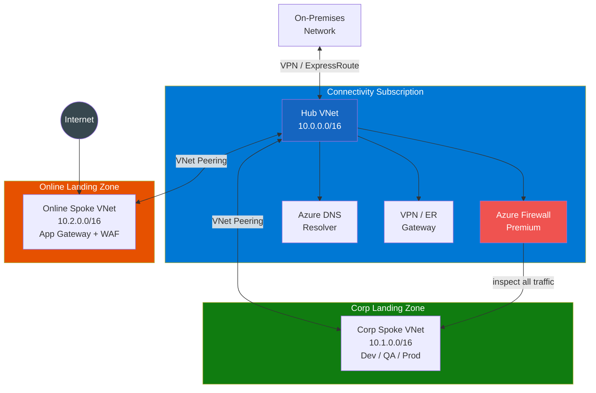
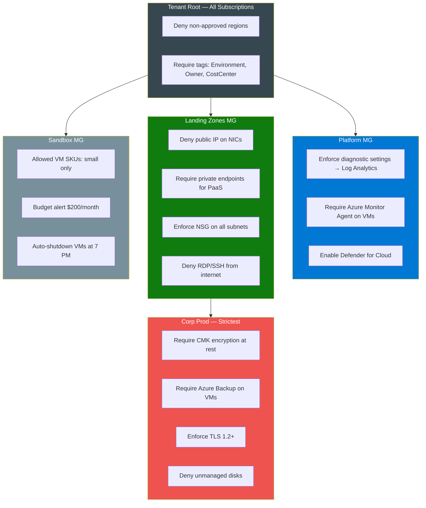

# Azure Landing Zone — Architecture & Policy Strategy

---

## Management Group Hierarchy

```
  Tenant Root Group
  └── org-root (Management Group)
      ├── Platform MG
      │   ├── Identity Subscription       ← Azure AD DS, Entra ID
      │   ├── Management Subscription     ← Log Analytics, Defender, Automation
      │   └── Connectivity Subscription   ← Hub VNet, Firewall, VPN/ExpressRoute, DNS
      ├── Landing Zones MG
      │   ├── Corp MG (private, connected to hub)
      │   │   ├── Dev Subscription(s)
      │   │   ├── QA Subscription(s)
      │   │   └── Prod Subscription(s)
      │   └── Online MG (internet-facing)
      │       └── Public Workload Subscriptions
      ├── Sandbox MG
      │   └── Sandbox Subscriptions (isolated, no hub connectivity)
      └── Decommissioned MG
          └── Subscriptions being retired
```

---

## Hub-and-Spoke Network Architecture

```
  ┌─────────────────────────────────────────────────────────────────────────┐
  │                    CONNECTIVITY SUBSCRIPTION (Hub)                       │
  │                                                                          │
  │  ┌──────────────────────────────────────────────────────────────────┐   │
  │  │  Hub VNet  10.0.0.0/16                                           │   │
  │  │                                                                  │   │
  │  │  ┌──────────────┐  ┌──────────────┐  ┌──────────────────────┐   │   │
  │  │  │ Azure        │  │ VPN Gateway  │  │  ExpressRoute        │   │   │
  │  │  │ Firewall     │  │ (on-prem)    │  │  Gateway             │   │   │
  │  │  │ Premium      │  └──────────────┘  └──────────────────────┘   │   │
  │  │  └──────┬───────┘                                               │   │
  │  │         │ (all spoke traffic routed through firewall)           │   │
  │  │  ┌──────▼───────┐                                               │   │
  │  │  │ Azure DNS    │  Private DNS Zones                            │   │
  │  │  │ Resolver     │  privatelink.*.azure.com                      │   │
  │  │  └──────────────┘                                               │   │
  │  └──────────────────────────────────────────────────────────────────┘   │
  │         │ VNet Peering          │ VNet Peering                          │
  └─────────┼───────────────────────┼──────────────────────────────────────┘
            │                       │
  ┌─────────▼──────────┐  ┌─────────▼──────────┐
  │  Corp Spoke VNet   │  │  Online Spoke VNet  │
  │  10.1.0.0/16       │  │  10.2.0.0/16        │
  │  (Dev/QA/Prod)     │  │  (Internet-facing)  │
  │  No direct internet│  │  App Gateway + WAF  │
  └────────────────────┘  └─────────────────────┘
```

---

## Subscription Design

| Subscription | Management Group | Purpose |
|---|---|---|
| Management | Platform | Log Analytics, Defender for Cloud, Automation Account |
| Identity | Platform | Azure AD DS, Entra ID Connect |
| Connectivity | Platform | Hub VNet, Azure Firewall, VPN/ER Gateway, DNS |
| Corp-Dev | Landing Zones / Corp | Dev workloads, connected to hub |
| Corp-QA | Landing Zones / Corp | QA workloads, connected to hub |
| Corp-Prod | Landing Zones / Corp | Prod workloads, connected to hub |
| Online-Prod | Landing Zones / Online | Internet-facing workloads, App Gateway + WAF |
| Sandbox | Sandbox | Experimentation, isolated, auto-budget |

---

## Azure Policy Strategy

### Policy Assignment Levels

```
  Tenant Root Group
  └── Deny non-approved regions (global)
      Require tags: Environment, Owner, CostCenter

  Platform MG
  └── Enforce diagnostic settings → Log Analytics
      Require Azure Monitor Agent on all VMs

  Landing Zones MG
  └── Deny public IP on NICs (Corp MG only)
      Require private endpoints for PaaS services
      Enforce NSG on all subnets
      Deny RDP/SSH from internet

  Corp MG (Prod)
  └── Require encryption at rest (CMK)
      Deny unmanaged disks
      Require Azure Backup on VMs
      Enforce TLS 1.2+ on App Services / Storage

  Sandbox MG
  └── Allowed VM SKUs (small only)
      Budget alert at $200/month
      Auto-shutdown VMs at 7 PM
```

---

### Built-in Policy Initiatives to Assign

| Initiative | Scope | Effect |
|---|---|---|
| Azure Security Benchmark | Root MG | Audit / DeployIfNotExists |
| NIST SP 800-53 Rev 5 | Corp MG | Audit |
| CIS Microsoft Azure Foundations | Corp MG | Audit |
| Enable Azure Monitor for VMs | Platform MG | DeployIfNotExists |
| Configure Azure Defender | Management Sub | DeployIfNotExists |
| Require tags on resource groups | Root MG | Deny |
| Allowed locations | Root MG | Deny |

---

### Custom Policy Examples

**Deny public IP on NICs (Corp workloads):**
```json
{
  "mode": "All",
  "policyRule": {
    "if": {
      "allOf": [
        { "field": "type", "equals": "Microsoft.Network/networkInterfaces" },
        { "count": { "field": "Microsoft.Network/networkInterfaces/ipConfigurations[*].publicIpAddress.id" }, "greater": 0 }
      ]
    },
    "then": { "effect": "Deny" }
  }
}
```

**Require specific tags on all resources:**
```json
{
  "mode": "Indexed",
  "policyRule": {
    "if": {
      "anyOf": [
        { "field": "tags['Environment']", "exists": "false" },
        { "field": "tags['Owner']", "exists": "false" },
        { "field": "tags['CostCenter']", "exists": "false" }
      ]
    },
    "then": { "effect": "Deny" }
  }
}
```

**Enforce private endpoints for Storage Accounts:**
```json
{
  "mode": "Indexed",
  "policyRule": {
    "if": {
      "allOf": [
        { "field": "type", "equals": "Microsoft.Storage/storageAccounts" },
        { "field": "Microsoft.Storage/storageAccounts/publicNetworkAccess", "notEquals": "Disabled" }
      ]
    },
    "then": { "effect": "Deny" }
  }
}
```

---

## Terraform Implementation Structure

```
  terraform/live/azure/global/landing-zone/
  ├── plan.md                          ← this file
  ├── management-groups/
  │   ├── main.tf                      # MG hierarchy
  │   └── outputs.tf
  ├── subscriptions/
  │   ├── main.tf                      # Subscription creation / association
  │   └── variables.tf
  ├── policies/
  │   ├── initiatives.tf               # Built-in initiative assignments
  │   ├── custom-policies.tf           # Custom policy definitions
  │   ├── assignments.tf               # Policy assignments per MG
  │   └── exemptions.tf                # Policy exemptions
  ├── networking/
  │   ├── hub-vnet.tf                  # Hub VNet, subnets, firewall
  │   ├── dns.tf                       # Private DNS zones + resolver
  │   ├── vpn-gateway.tf               # VPN / ExpressRoute gateway
  │   └── peering.tf                   # Hub-spoke peering
  ├── monitoring/
  │   ├── log-analytics.tf             # Central Log Analytics workspace
  │   ├── defender.tf                  # Defender for Cloud plans
  │   └── diagnostics.tf               # Diagnostic settings policy
  ├── identity/
  │   └── entra.tf                     # Entra ID / Azure AD DS config
  └── vars/
      ├── dev.tfvars
      └── prod.tfvars
```

---

## Recommendations

1. **Start with Management Groups** — define the hierarchy before any subscriptions
2. **Assign Region Deny policy at Root MG first** — prevents resource sprawl immediately
3. **Hub VNet before spokes** — deploy Connectivity subscription and peer spokes to it
4. **Use DeployIfNotExists policies** for monitoring — auto-remediate non-compliant resources
5. **Defender for Cloud on all subscriptions** — enable at Management subscription level via policy
6. **Private DNS zones in Connectivity subscription** — centralize all `privatelink.*.azure.com` zones
7. **Tag policy at Root MG** — enforce Environment, Owner, CostCenter on everything
8. **Sandbox isolation** — no VNet peering to hub, budget caps, auto-shutdown

---

## Mermaid Diagrams

### Management Group Hierarchy



---

### Hub-and-Spoke Network



---

### Policy Assignment Layers



---

### Landing Zone Provisioning Flow

```mermaid
flowchart LR
    Request[Subscription\nRequest] --> MG[Assign to\nManagement Group]
    MG --> Policies[Policies\nAuto-Applied]
    Policies --> Hub[Peer to\nHub VNet]
    Hub --> DNS2[Register\nPrivate DNS]
    DNS2 --> Monitor[Enroll in\nLog Analytics]
    Monitor --> Defender[Enable\nDefender Plans]
    Defender --> Tags[Apply\nDefault Tags]
    Tags --> Ready([Subscription\nReady ✅])

    style Request fill:#37474f,color:#fff
    style Ready fill:#107c10,color:#fff
    style Policies fill:#0078d4,color:#fff
    style Hub fill:#0078d4,color:#fff
    style Defender fill:#ef5350,color:#fff
```


