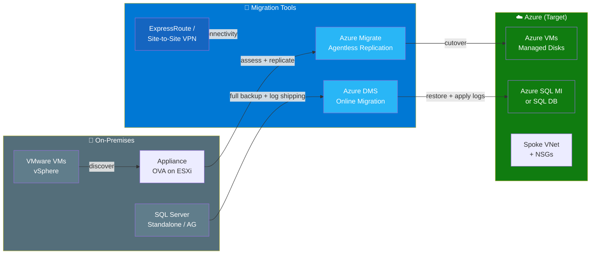
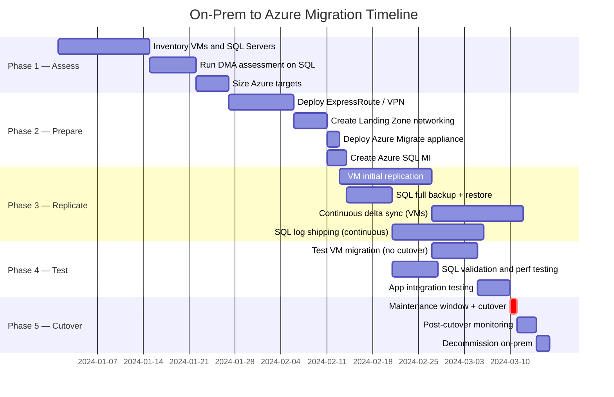
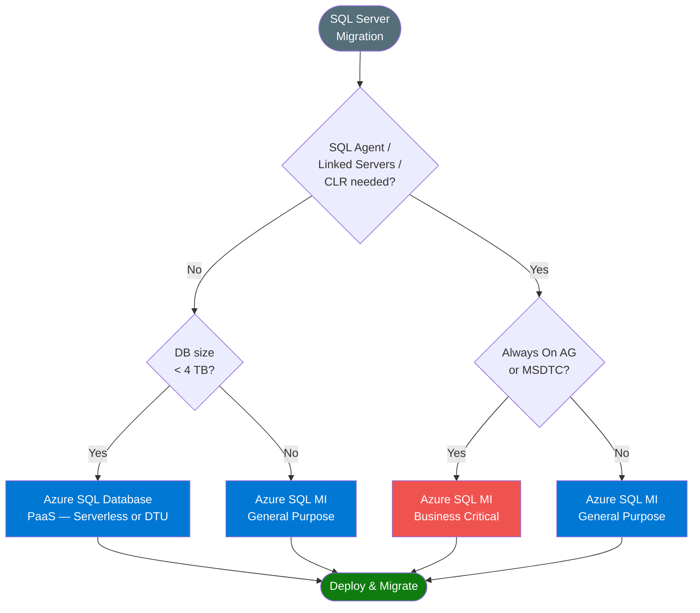
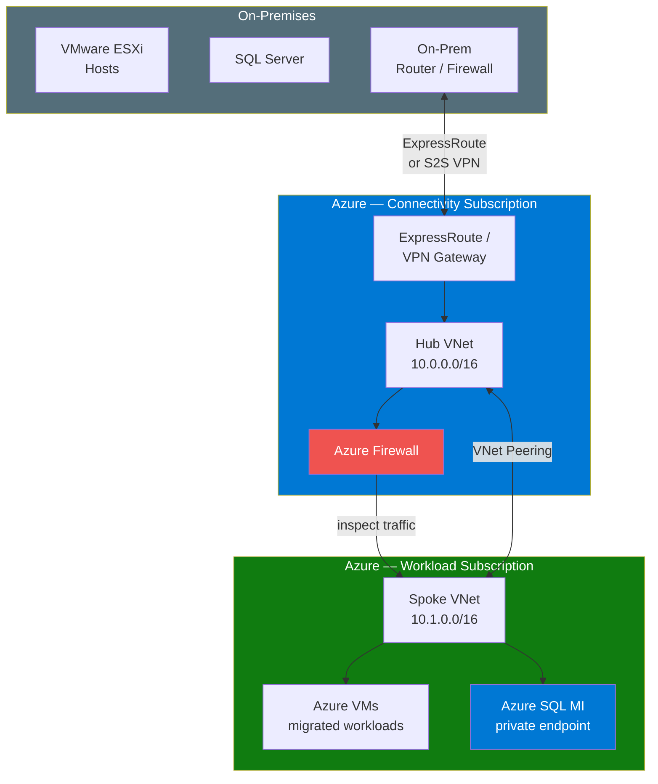
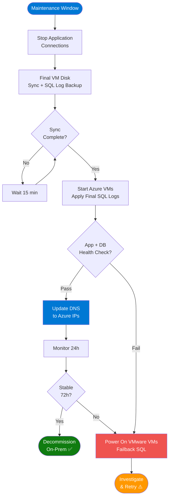

# On-Premises VMware & MS SQL Server → Azure Migration Plan

End-to-end migration plan covering:
- **VMware VMs → Azure VMs** via Azure Migrate (agentless replication)
- **On-Prem SQL Server → Azure SQL / Azure SQL Managed Instance** via Azure DMS

---

## Architecture Overview

```
  On-Premises                                          Azure (Target)
  ──────────────────────────────────────────────────────────────────────

  ┌──────────────────────┐                    ┌──────────────────────────┐
  │  VMware vSphere      │                    │  Landing Zone            │
  │  ├─ vCenter          │                    │  ├─ Hub VNet             │
  │  ├─ ESXi Hosts       │  ─── Replicate ──► │  ├─ Spoke VNet          │
  │  └─ VMs (any OS)     │                    │  └─ Azure VMs            │
  └──────────────────────┘                    └──────────────────────────┘

  ┌──────────────────────┐                    ┌──────────────────────────┐
  │  SQL Server          │                    │  Azure SQL MI            │
  │  (Standalone /       │  ─── DMS ────────► │  or Azure SQL DB         │
  │   Always On AG)      │                    │  (fully managed)         │
  └──────────────────────┘                    └──────────────────────────┘

            │                                              │
            └──────── ExpressRoute / Site-to-Site VPN ─────┘
                         (required throughout migration)
```

---

## Migration Phases

```
  Phase 1          Phase 2          Phase 3          Phase 4          Phase 5
  ──────────       ──────────       ──────────       ──────────       ──────────
  ASSESS      ──►  PREPARE     ──►  REPLICATE   ──►  TEST        ──►  CUTOVER
  2–4 weeks        1–2 weeks        2–4 weeks        1–2 weeks        Hours

  • Inventory      • Azure          • Deploy         • Test VMs       • Stop VMs
    VMware VMs       Migrate          appliance        in Azure         on-prem
  • Inventory        setup          • Agentless      • Validate       • Final sync
    SQL Servers    • Landing          VM replication   apps            • Update DNS
  • Dependency       Zone           • DMS full       • SQL perf       • Cutover SQL
    mapping          networking       load + CDC       testing        • Decommission
  • Size Azure     • ExpressRoute   • Delta sync     • Rollback
    targets          / VPN            (continuous)     test
```

---

## Part 1 — VMware VMs → Azure VMs

### How Azure Migrate Works with VMware

```
  ┌─────────────────────────────────────────────────────────────────────┐
  │                  AZURE MIGRATE — AGENTLESS REPLICATION               │
  └─────────────────────────────────────────────────────────────────────┘

  On-Premises vSphere                      Azure
  ──────────────────────────────────────────────────────────────────────

  ┌──────────────────────┐                 ┌──────────────────────────┐
  │  Azure Migrate       │                 │  Azure Migrate Project   │
  │  Appliance (OVA)     │────────────────►│  (Discovery + Assess)    │
  │  Deployed on ESXi    │  HTTPS 443      └──────────────────────────┘
  └──────────────────────┘
           │                               ┌──────────────────────────┐
           │  vSphere snapshot-based       │  Replication Storage     │
           │  disk replication             │  Account (staging)       │
           ▼                               │                          │
  ┌──────────────────────┐                 │  ┌──────────────────────┐│
  │  Source VMware VMs   │────────────────►│  │  Managed Disks       ││
  │  (no agent needed)   │                 │  │  (target disks)      ││
  └──────────────────────┘                 │  └──────────────────────┘│
                                           └──────────────────────────┘
                                                      │
                                                      ▼
                                           ┌──────────────────────────┐
                                           │  Target Azure VM         │
                                           │  ├─ NIC                  │
                                           │  ├─ OS Managed Disk      │
                                           │  ├─ Data Managed Disk(s) │
                                           │  └─ NSG                  │
                                           └──────────────────────────┘
```

### VMware → Azure VM Sizing

```
  VMware VM         vCPU  RAM      Azure VM            Series
  ──────────────────────────────────────────────────────────────
  1 vCPU,  2 GB     1     2 GB    B1ms                 B-series (burstable)
  2 vCPU,  4 GB     2     4 GB    B2s                  B-series
  2 vCPU,  8 GB     2     8 GB    D2s_v5               D-series (general)
  4 vCPU, 16 GB     4    16 GB    D4s_v5               D-series
  8 vCPU, 32 GB     8    32 GB    D8s_v5               D-series
  4 vCPU, 32 GB     4    32 GB    E4s_v5               E-series (memory)
  8 vCPU, 64 GB     8    64 GB    E8s_v5               E-series
  4 vCPU,  8 GB     4     8 GB    F4s_v2               F-series (compute)
```

### VMware Disk → Azure Managed Disk Mapping

```
  VMware Disk Type    IOPS          Azure Managed Disk     Tier
  ──────────────────────────────────────────────────────────────
  VMDK (standard)     < 500         Standard HDD           S-series
  VMDK (SSD)          500–2300      Standard SSD           E-series
  VMDK (SSD)          2300–16000    Premium SSD            P-series
  VMDK (NVMe/SAN)     > 16000       Ultra Disk             Ultra
```

---

## Part 2 — SQL Server → Azure SQL

### Target Selection Guide

```
  On-Prem SQL Server Feature          Recommended Azure Target
  ──────────────────────────────────────────────────────────────────────
  Basic workload, no special features  Azure SQL Database (PaaS)
  SQL Agent, linked servers, CLR       Azure SQL Managed Instance (PaaS)
  Full OS control required             SQL Server on Azure VM (IaaS)
  Always On Availability Group         SQL MI Business Critical tier
  Distributed transactions (MSDTC)     SQL MI
  Custom collation / filestream        SQL Server on Azure VM
```

### SQL Server → Azure SQL MI Sizing

```
  On-Prem SQL Server    vCPU  RAM      Azure SQL MI              Tier
  ──────────────────────────────────────────────────────────────────────
  4 core,  16 GB        4    16 GB    GP 4 vCores, 20.4 GB      General Purpose
  8 core,  32 GB        8    40 GB    GP 8 vCores, 40.8 GB      General Purpose
  16 core, 64 GB       16    81 GB    GP 16 vCores, 81.6 GB     General Purpose
  8 core,  64 GB        8    40 GB    BC 8 vCores, 40.8 GB      Business Critical
  16 core, 128 GB      16    81 GB    BC 16 vCores, 81.6 GB     Business Critical
```

### DMS Migration Flow

```
  ┌─────────────────────────────────────────────────────────────────────┐
  │              AZURE DMS — ONLINE MIGRATION (near-zero downtime)       │
  └─────────────────────────────────────────────────────────────────────┘

  On-Prem SQL Server              Azure DMS               Azure SQL MI
  ──────────────────────────────────────────────────────────────────────

  ┌──────────────┐  Full backup   ┌─────────────┐  Restore  ┌──────────┐
  │  Databases   │ ─────────────► │             │ ────────► │  DBs     │
  └──────────────┘                │  Migration  │           └──────────┘
                                  │  Service    │
  ┌──────────────┐  Log backups   │  (Premium)  │  Apply    ┌──────────┐
  │  T-Log       │ ─────────────► │             │ ────────► │  Logs    │
  │  Backups     │  (continuous)  └─────────────┘           └──────────┘
  └──────────────┘
         │                             │
         │    ExpressRoute / VPN       │
         └─────────────────────────────┘

  Requirements:
  ├─ SQL Server 2005+
  ├─ Full recovery model enabled
  ├─ Backup to network share accessible by DMS
  └─ sysadmin rights on source
```

### SQL Migration Options Comparison

| Method | Downtime | Best For | Tool |
|---|---|---|---|
| Online (DMS + log shipping) | Minutes | Production, large DBs | Azure DMS Premium |
| Offline (backup/restore) | Hours | Dev/QA, small DBs | SSMS / AzCopy |
| Database Migration Assistant | Minutes | Assessment + schema | DMA |
| Log Shipping manual | Minutes | Full control | SQL Server native |

---

## Network Architecture During Migration

```
  ┌──────────────────────────────────────────────────────────────────────┐
  │                    HYBRID CONNECTIVITY                                │
  └──────────────────────────────────────────────────────────────────────┘

  On-Premises                                      Azure
  ─────────────────────────────────────────────────────────────────────

  ┌──────────────────┐                        ┌──────────────────────┐
  │  VMware vSphere  │                        │  Hub VNet            │
  │  SQL Servers     │                        │  10.0.0.0/16         │
  │                  │                        │                      │
  │  ┌────────────┐  │   ExpressRoute         │  ┌────────────────┐  │
  │  │ On-prem    │◄─┼────────────────────────┼─►│ ER / VPN GW    │  │
  │  │ Router /   │  │   (recommended)        │  └────────────────┘  │
  │  │ Firewall   │  │   or Site-to-Site VPN  │                      │
  │  └────────────┘  │                        │  ┌────────────────┐  │
  │                  │                        │  │ Azure Firewall │  │
  │  ┌────────────┐  │                        │  └────────────────┘  │
  │  │ Azure      │  │                        │                      │
  │  │ Migrate    │  │                        │  ┌────────────────┐  │
  │  │ Appliance  │  │                        │  │ Spoke VNet     │  │
  │  └────────────┘  │                        │  │ Azure VMs      │  │
  └──────────────────┘                        │  │ Azure SQL MI   │  │
                                              │  └────────────────┘  │
                                              └──────────────────────┘

  Bandwidth recommendation:
  ├─ ExpressRoute 1 Gbps  : large environments (> 10 TB data)
  └─ Site-to-Site VPN     : smaller environments (< 10 TB)
```

---

## Cutover Sequence

```
  T-48h                T-1h                 T=0 (Cutover)         T+24h
  ──────────────────────────────────────────────────────────────────────
  • Final delta        • Maintenance        • Stop VMware VMs     • Monitor
    sync check           window start       • Final disk sync       Azure VMs
  • Validate           • Drain app          • Start Azure VMs     • Validate
    Azure VMs            connections        • SQL: stop log         SQL perf
  • Pre-warm           • SQL: final           shipping            • Update
    Azure VMs            log backup         • Update DNS            monitoring
  • Reduce DNS         • Verify sync          (TTL 60s)           • Keep VMs
    TTL to 60s           complete           • Smoke test            off on-prem
                                            • Confirm health        (72h hold)
```

---

## Rollback Plan

```
  If issues detected within 72h of cutover:

  VMware VMs:
  1. Power on VMware VMs (kept powered off, not deleted)
  2. Revert DNS to on-prem IP addresses
  3. Notify stakeholders

  SQL Server:
  1. Resume log shipping to on-prem (if still configured)
  2. Failback to on-prem SQL Server
  3. Update connection strings

  ⚠️  Do NOT decommission on-prem VMs or SQL Servers until 72h stable
```

---

## Terraform Implementation Structure

```
  terraform/live/azure/onprem-to-azure/
  ├── plan.md                          ← this file
  ├── networking/
  │   ├── hub-vnet.tf                  # Hub VNet, subnets, firewall
  │   ├── spoke-vnet.tf                # Spoke VNet for migrated workloads
  │   ├── expressroute.tf              # ER circuit + gateway
  │   └── dns.tf                       # Private DNS zones
  ├── migrate/
  │   ├── migrate-project.tf           # Azure Migrate project
  │   └── recovery-vault.tf            # Recovery Services Vault
  ├── compute/
  │   └── vms.tf                       # Target Azure VMs (post-migration)
  ├── database/
  │   ├── sql-mi.tf                    # Azure SQL Managed Instance
  │   ├── dms.tf                       # Azure DMS instance + project
  │   └── private-endpoint.tf          # Private endpoint for SQL MI
  ├── variables.tf
  ├── outputs.tf
  └── vars/
      ├── dev.tfvars
      └── prod.tfvars
```

---

## Pre-Migration Checklist

### VMware
- [ ] Inventory all VMs: vCPU, RAM, disk sizes, OS, applications
- [ ] Map inter-VM dependencies (use Azure Migrate dependency analysis)
- [ ] Identify VMs with unsupported features (physical RDM disks, passthrough)
- [ ] Deploy Azure Migrate appliance OVA on vSphere
- [ ] Run discovery (24–48h for full inventory)
- [ ] Review Azure Migrate sizing recommendations
- [ ] Establish ExpressRoute or Site-to-Site VPN
- [ ] Create target resource groups, VNets, NSGs

### SQL Server
- [ ] Inventory all SQL instances, databases, sizes, versions, editions
- [ ] Run Database Migration Assistant (DMA) assessment
- [ ] Identify blockers: linked servers, CLR, MSDTC, custom collations
- [ ] Choose target: SQL DB vs SQL MI vs SQL on VM
- [ ] Enable Full Recovery Model on all databases
- [ ] Configure backup to network share accessible by DMS
- [ ] Create Azure SQL MI with private endpoint
- [ ] Create Azure DMS Premium instance
- [ ] Verify network connectivity: DMS → on-prem SQL (port 1433)

### Post-Migration
- [ ] Validate all applications for 72h
- [ ] Set up Azure Monitor + Log Analytics alerts
- [ ] Configure Azure Backup for VMs and SQL MI
- [ ] Enable Defender for Cloud on subscription
- [ ] Decommission on-prem VMs and SQL Servers
- [ ] Remove ExpressRoute / VPN (if no longer needed)
- [ ] Update CMDB and documentation

---

## Mermaid Diagrams

### End-to-End Migration Flow



---

### Migration Phases Timeline



---

### SQL Target Selection



---

### Network Architecture



---

### Cutover Decision Flow


