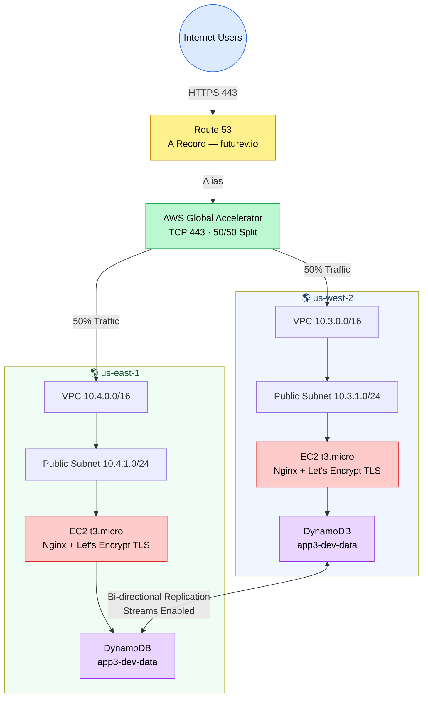

# App3 — AWS Architecture Diagram

> Multi-region active-active deployment using AWS Global Accelerator, Route 53, and DynamoDB Global Tables.

---

## High-Level Architecture (Mermaid)



---

## Detailed Architecture (ASCII)

```
                         ┌─────────────────────────────────┐
                         │          Internet Users          │
                         └────────────────┬────────────────┘
                                          │ HTTPS (443)
                                          ▼
                         ┌────────────────────────────────┐
                         │           Route 53             │
                         │         (A Record)             │
                         │       futurev.io               │
                         │    Zone: Z3LLP0B81D4CRA        │
                         └────────────────┬───────────────┘
                                          │ Alias record
                                          ▼
                         ┌────────────────────────────────┐
                         │      AWS Global Accelerator    │
                         │   Static Anycast IPs           │
                         │   Protocol: TCP  Port: 443     │
                         │   Health Check: TCP 443 / 30s  │
                         └────────┬──────────────┬────────┘
                   50% traffic    │              │    50% traffic
                  ┌───────────────┘              └───────────────┐
                  ▼                                              ▼
   ┌──────────────────────────┐              ┌──────────────────────────┐
   │        us-west-2         │              │        us-east-1         │
   │  ┌────────────────────┐  │              │  ┌────────────────────┐  │
   │  │  VPC 10.3.0.0/16   │  │              │  │  VPC 10.4.0.0/16   │  │
   │  │  ┌──────────────┐  │  │              │  │  ┌──────────────┐  │  │
   │  │  │Public Subnet │  │  │              │  │  │Public Subnet │  │  │
   │  │  │10.3.1.0/24   │  │  │              │  │  │10.4.1.0/24   │  │  │
   │  │  │  us-west-2a  │  │  │              │  │  │  us-east-1a  │  │  │
   │  │  │ ┌──────────┐ │  │  │              │  │  │ ┌──────────┐ │  │  │
   │  │  │ │   EC2    │ │  │  │              │  │  │ │   EC2    │ │  │  │
   │  │  │ │  Nginx   │ │  │  │              │  │  │ │  Nginx   │ │  │  │
   │  │  │ │  t3.micro│ │  │  │              │  │  │ │  t3.micro│ │  │  │
   │  │  │ └──────────┘ │  │  │              │  │  │ └──────────┘ │  │  │
   │  │  └──────────────┘  │  │              │  │  └──────────────┘  │  │
   │  └────────────────────┘  │              │  └────────────────────┘  │
   │                          │              │                          │
   │  ┌────────────────────┐  │              │  ┌────────────────────┐  │
   │  │ DynamoDB (Primary) │◄─┼──────────────┼─►│ DynamoDB (Replica) │  │
   │  │   app3-dev-data    │  │ Bi-directional  │   app3-dev-data    │  │
   │  │  Streams: NEW_OLD  │  │  replication │  │  Streams: NEW_OLD  │  │
   │  │  Billing: PAY_REQ  │  │   < 1s lag   │  │  Billing: PAY_REQ  │  │
   │  └────────────────────┘  │              │  └────────────────────┘  │
   └──────────────────────────┘              └──────────────────────────┘
```

---

## Request Flow

```
┌──────────────┐     ┌──────────────┐     ┌────────────────────────┐
│ Internet User│────▶│  Route 53    │────▶│ AWS Global Accelerator │
│              │ DNS │ futurev.io   │Alias│  TCP 443 · 50/50 split │
└──────────────┘     └──────────────┘     └───────────┬────────────┘
                                                      │
                              ┌───────────────────────┴───────────────────────┐
                              │                                               │
                              ▼                                               ▼
                    ┌──────────────────┐                          ┌──────────────────┐
                    │   us-west-2      │                          │   us-east-1      │
                    │  ┌────────────┐  │                          │  ┌────────────┐  │
                    │  │ EC2 (Nginx)│  │                          │  │ EC2 (Nginx)│  │
                    │  │ TLS 1.2/1.3│  │                          │  │ TLS 1.2/1.3│  │
                    │  └─────┬──────┘  │                          │  └─────┬──────┘  │
                    │        │         │                          │        │         │
                    │  ┌─────┴──────┐  │                          │  ┌─────┴──────┐  │
                    │  │DynamoDB    │  │◄──── Bi-directional ────►│  │DynamoDB    │  │
                    │  │app3-dev-data│  │      Replication         │  │app3-dev-data│  │
                    │  └────────────┘  │                          │  └────────────┘  │
                    └──────────────────┘                          └──────────────────┘
```

---

## Service Summary

### Route 53
| Property       | Value                       |
|----------------|-----------------------------|
| Domain         | futurev.io                  |
| Record Type    | A (Alias)                   |
| Hosted Zone ID | Z3LLP0B81D4CRA              |
| Target         | Global Accelerator DNS name |
| Health Eval    | Enabled                     |

### AWS Global Accelerator
| Property             | Value                          |
|----------------------|--------------------------------|
| IP Type              | IPv4 (static anycast)          |
| Protocol             | TCP                            |
| Port                 | 443                            |
| Traffic Split        | 50% west / 50% east            |
| Health Check         | TCP port 443, every 30 seconds |
| Client IP Preserve   | Enabled                        |
| Failover             | Automatic                      |

### VPC — us-west-2
| Property       | Value           |
|----------------|-----------------|
| CIDR           | 10.3.0.0/16     |
| Public Subnet  | 10.3.1.0/24     |
| AZ             | us-west-2a      |
| Internet GW    | Yes             |
| NAT Gateway    | No              |

### VPC — us-east-1
| Property       | Value           |
|----------------|-----------------|
| CIDR           | 10.4.0.0/16     |
| Public Subnet  | 10.4.1.0/24     |
| AZ             | us-east-1a      |
| Internet GW    | Yes             |
| NAT Gateway    | No              |

### EC2 Instances (both regions)
| Property        | Value                      |
|-----------------|----------------------------|
| Instance Type   | t3.micro                   |
| OS              | Amazon Linux 2023          |
| Web Server      | Nginx                      |
| SSL             | Let's Encrypt (auto-renew) |
| Port 443        | HTTPS (TLS 1.2 / 1.3)      |
| IMDSv2          | Required                   |
| EBS Encryption  | Enabled                    |
| SSH             | Disabled                   |
| IAM Role        | Route53 + DynamoDB access  |

### DynamoDB Global Table
| Property            | Value                        |
|---------------------|------------------------------|
| Table Name          | app3-{env}-data              |
| Primary Key         | id (String)                  |
| Billing Mode        | PAY_PER_REQUEST              |
| Primary Region      | us-west-2                    |
| Replica Region      | us-east-1                    |
| Streams             | Enabled (NEW_AND_OLD_IMAGES) |
| Replication         | Bi-directional, < 1s lag     |
| Conflict Resolution | Last-writer-wins             |
| PITR                | Disabled (dev)               |

---

## Security Groups

```
┌─────────────────────────────────────────┐
│           EC2 Security Group            │
│                                         │
│  Inbound:                               │
│    HTTP  80  ← 0.0.0.0/0               │
│    HTTPS 443 ← 0.0.0.0/0               │
│                                         │
│  Outbound:                              │
│    All traffic → 0.0.0.0/0             │
│                                         │
│  SSH: BLOCKED (no access)               │
└─────────────────────────────────────────┘
```

---

## IAM Roles

```
EC2 Instance Role
├── Route53: ChangeResourceRecordSets  (Let's Encrypt DNS-01 challenge)
├── Route53: ListHostedZones
└── DynamoDB: Read/Write on app3-*-data table

GitHub Actions Role (OIDC)
└── Full Terraform deployment permissions (no static credentials)
```

---

## Estimated Monthly Cost (dev)

| Service              | Cost         |
|----------------------|--------------|
| Global Accelerator   | ~$18/month   |
| EC2 (2x t3.micro)    | ~$15/month   |
| DynamoDB (2 regions) | ~$0.65/month |
| Route 53 queries     | ~$0.50/month |
| **Total**            | **~$34–40/month** |

---

## Sources

- `terraform/provider/aws/stacks/app3/main.tf` — Multi-region infrastructure with Global Accelerator
- `terraform/provider/aws/stacks/app3/variables.tf` — Configuration variables
- `terraform/provider/aws/stacks/app3/outputs.tf` — Infrastructure outputs
- `terraform/provider/aws/stacks/app3/user_data.sh` — Nginx + Let's Encrypt installation script
- `terraform/provider/aws/stacks/app3/README.md` — Architecture documentation
