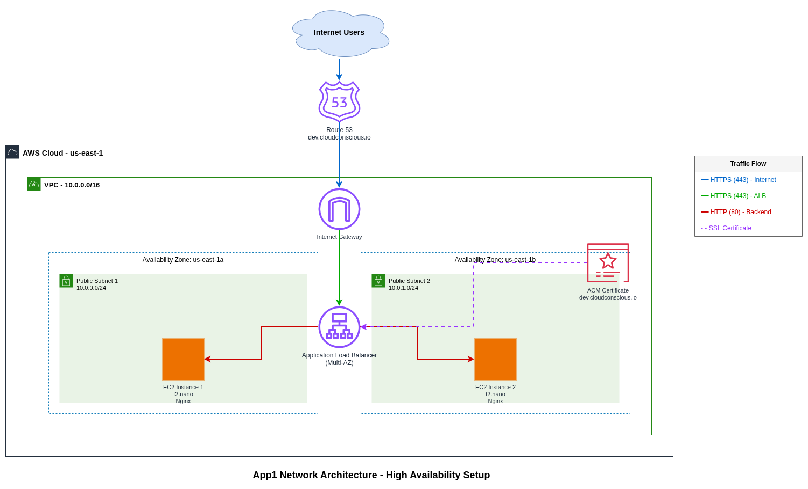

# App1 - EC2 Web Application Stack

High-availability web application infrastructure using EC2 instances behind an Application Load Balancer with SSL/TLS termination.

## Architecture



## Overview

App1 is a production-ready web hosting stack that deploys Nginx web servers across multiple availability zones with automatic SSL certificate management and load balancing.

### Key Features

- **High Availability**: Multi-AZ deployment with 2 EC2 instances
- **SSL/TLS**: Automatic certificate provisioning via AWS Certificate Manager
- **Load Balancing**: Application Load Balancer with health checks
- **Auto-Scaling Ready**: Infrastructure supports easy scaling
- **Security**: Security groups with least-privilege access
- **Cost Optimized**: Instance scheduler for dev/qa environments

## Infrastructure Components

### Networking
- **VPC**: 10.0.0.0/16 CIDR block
- **Public Subnets**: 2 subnets across us-east-1a and us-east-1b
- **Internet Gateway**: Direct internet connectivity
- **Route53**: DNS management for cloudconscious.io

### Compute
- **EC2 Instances**: Amazon Linux 2023 with Nginx
- **Instance Types**: 
  - Dev: t2.nano (2 instances)
  - QA: t2.micro (2 instances)
  - Prod: t3.medium (3 instances)

### Load Balancing & SSL
- **Application Load Balancer**: Multi-AZ with HTTP/HTTPS listeners
- **ACM Certificate**: Managed SSL/TLS certificates
- **HTTP to HTTPS Redirect**: Automatic secure redirect

### Security
- **ALB Security Group**: Allows 80 (HTTP) and 443 (HTTPS) from internet
- **EC2 Security Group**: Allows 80 (HTTP) from ALB only
- **IAM Roles**: EC2 instance profiles with Route53 and DynamoDB access

## Deployment

### Prerequisites

- AWS CLI configured
- Terraform >= 1.0
- Valid Route53 hosted zone

### Environment Variables

Each environment has its own tfvars file in `vars/`:

**Dev** (`vars/dev.tfvars`):
```hcl
environment     = "dev"
project_name    = "myapp-dev"
instance_type   = "t2.nano"
instance_count  = 2
domain_name     = "dev.cloudconscious.io"
```

**QA** (`vars/qa.tfvars`):
```hcl
environment     = "qa"
project_name    = "myapp-qa"
instance_type   = "t2.micro"
instance_count  = 2
domain_name     = "qa.cloudconscious.io"
```

**Prod** (`vars/prod.tfvars`):
```hcl
environment     = "prod"
project_name    = "myapp-prod"
instance_type   = "t3.medium"
instance_count  = 3
domain_name     = "cloudconscious.io"
```

### Deploy Infrastructure

```bash
# Initialize Terraform
terraform init

# Plan deployment
terraform plan -var-file="vars/dev.tfvars"

# Apply changes
terraform apply -var-file="vars/dev.tfvars"

# Destroy infrastructure
terraform destroy -var-file="vars/dev.tfvars"
```

### GitHub Actions Deployment

Automated deployment via GitHub Actions workflow:

```bash
# Trigger via GitHub UI
Actions → Terraform App1 → Run workflow
- Select environment (dev/qa/prod)
- Select action (plan/apply/destroy)
```

## Application

### Web Server

Nginx serves static content from `/usr/share/nginx/html/`:
- **Homepage**: `index.html` (CloudConscious landing page)
- **Resume**: `resume.html`

User data script (`user_data.sh`) automatically:
1. Updates system packages
2. Installs Nginx and Git
3. Downloads HTML content from GitHub
4. Starts and enables Nginx service

### Access URLs

- **Dev**: https://dev.cloudconscious.io
- **QA**: https://qa.cloudconscious.io
- **Prod**: https://cloudconscious.io

## Monitoring & Health Checks

### ALB Health Checks
- **Protocol**: HTTP
- **Path**: `/`
- **Interval**: 30 seconds
- **Healthy Threshold**: 2 consecutive successes
- **Unhealthy Threshold**: 2 consecutive failures

### Target Health Status

Check target health:
```bash
aws elbv2 describe-target-health \
  --target-group-arn <target-group-arn> \
  --region us-east-1
```

## Cost Optimization

### Instance Scheduler

Dev and QA environments include EC2 scheduler to reduce costs:
- **Start**: 8 AM EST (Monday-Friday)
- **Stop**: 6 PM EST (Monday-Friday)
- **Weekend**: Instances stopped

Estimated savings: ~60% reduction in compute costs for non-prod environments.

## Security Best Practices

1. **Network Isolation**: EC2 instances only accept traffic from ALB
2. **SSL/TLS**: All traffic encrypted in transit
3. **IMDSv2**: Instance metadata service v2 enforced
4. **No SSH Keys**: SSH access disabled by default (can be enabled per environment)
5. **Least Privilege IAM**: Minimal permissions for EC2 instance roles

## Troubleshooting

### Certificate Validation Pending

If HTTPS is not working, check certificate status:
```bash
aws acm list-certificates --region us-east-1
aws acm describe-certificate --certificate-arn <arn> --region us-east-1
```

Ensure Route53 validation records are created.

### Target Unhealthy

Check EC2 instance:
```bash
# View instance console output
aws ec2 get-console-output --instance-id <instance-id>

# Check security group rules
aws ec2 describe-security-groups --group-ids <sg-id>
```

Verify Nginx is running on port 80.

### ALB Not Responding

Check ALB status:
```bash
aws elbv2 describe-load-balancers --region us-east-1
aws elbv2 describe-listeners --load-balancer-arn <arn>
```

## Outputs

After deployment, Terraform outputs:

- `vpc_id`: VPC identifier
- `alb_dns_name`: Load balancer DNS name
- `alb_url`: Full HTTPS URL
- `instance_ids`: List of EC2 instance IDs
- `elastic_ip`: Elastic IP for direct instance access

## Module Dependencies

- `../../modules/vpc`: VPC with public/private subnets
- `../../modules/ec2`: EC2 instances with security groups

## Files

```
.
├── main.tf              # Main infrastructure configuration
├── variables.tf         # Input variables
├── outputs.tf           # Output values
├── versions.tf          # Provider versions
├── backend.tf           # S3 backend configuration
├── scheduler.tf         # EC2 instance scheduler
├── user_data.sh         # EC2 bootstrap script
├── vars/
│   ├── dev.tfvars      # Dev environment variables
│   ├── qa.tfvars       # QA environment variables
│   └── prod.tfvars     # Prod environment variables
├── html/
│   ├── cloudconscious.html  # Homepage
│   └── resume.html          # Resume page
├── schedule/            # Scheduler Lambda function
├── diagrams/
│   ├── network-diagram.drawio      # Architecture diagram (editable)
│   └── network-diagram.drawio.png  # Architecture diagram (image)
└── README.md           # This file
```

## Contributing

1. Create feature branch
2. Make changes
3. Test with `terraform plan`
4. Submit pull request
5. Review and merge

## License

Internal use only.

## Support

For issues or questions, contact the DevOps team or open a GitHub issue.
