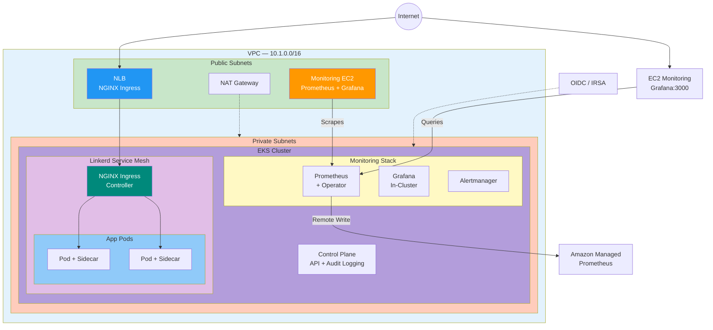

# App2 — EKS with Linkerd Service Mesh & Monitoring

Production-grade EKS cluster with Linkerd service mesh, NGINX Ingress, Prometheus monitoring, and Grafana dashboards.

---

## Architecture Overview



---

## Directory Structure

```
app2/
├── docs/
│   ├── BACKEND.md              # Backend state configuration guide
│   ├── IMPLEMENT.md            # Implementation plan
│   └── MONITORING.md           # Monitoring setup and management
├── helm/
│   └── app-chart/
│       ├── Chart.yaml          # Helm chart metadata
│       ├── values.yaml         # Default values
│       ├── values-dev.yaml     # Dev environment overrides
│       ├── values-qa.yaml      # QA environment overrides
│       ├── values-prod.yaml    # Prod environment overrides
│       ├── templates/
│       │   ├── deployment.yaml
│       │   ├── service.yaml
│       │   ├── ingress.yaml
│       │   ├── serviceaccount.yaml
│       │   ├── configmap.yaml
│       │   ├── hpa.yaml
│       │   ├── pdb.yaml
│       │   └── networkpolicy.yaml
│       └── README.md
├── vars/
│   ├── dev.tfvars              # Dev environment variables
│   ├── qa.tfvars               # QA environment variables
│   └── prod.tfvars             # Prod environment variables
├── backend.tf                  # S3 backend configuration
├── versions.tf                 # Terraform and provider versions
├── providers.tf                # AWS, Kubernetes, Helm providers
├── variables.tf                # Input variables
├── outputs.tf                  # Output values
├── main.tf                     # VPC and EKS modules
├── linkerd.tf                  # Linkerd service mesh
├── ingress.tf                  # NGINX Ingress Controller
├── prometheus.tf               # Prometheus monitoring stack
├── app.tf                      # Application Helm deployment
├── monitoring-ec2.tf           # EC2 monitoring instance
├── monitoring-userdata.sh      # EC2 user data script
└── README.md                   # This file
```

---

## Key Features

### Infrastructure
- ✅ **EKS Cluster** in private subnets with NAT Gateway
- ✅ **IRSA** (IAM Roles for Service Accounts) via OIDC
- ✅ **Control Plane Logging** (api, audit, authenticator)
- ✅ **Public & Private Subnets** for NLB and nodes
- ✅ **IMDSv2** enforced, encrypted EBS volumes

### Service Mesh
- ✅ **Linkerd** with automatic mTLS between pods
- ✅ **Trust Anchor CA** and Issuer certificates
- ✅ **Sidecar Injection** for all application pods

### Ingress
- ✅ **NGINX Ingress Controller** on AWS NLB
- ✅ **Linkerd Integration** with sidecar injection
- ✅ **Default IngressClass** configuration

### Application
- ✅ **Production Helm Chart** with:
  - ServiceAccount with IRSA support
  - Deployment with security context (non-root)
  - Service (ClusterIP)
  - Ingress with TLS support
  - ConfigMap for environment variables
  - HPA (Horizontal Pod Autoscaler)
  - PDB (Pod Disruption Budget)
  - NetworkPolicy
  - Liveness/Readiness probes
- ✅ **nginx-unprivileged** image for security
- ✅ **Environment-specific** values (dev/qa/prod)

### Monitoring
- ✅ **Prometheus Operator** with ServiceMonitors
- ✅ **In-Cluster Grafana** with Linkerd sidecar
- ✅ **Amazon Managed Prometheus** for long-term storage
- ✅ **EC2 Monitoring Instance** with:
  - Grafana (port 3000) - Public access
  - Prometheus (port 9090) - Public access
  - Docker-based deployment
  - Pre-configured EKS dashboards
  - Real-time metrics from EKS cluster
- ✅ **Alertmanager** for alerting
- ✅ **Node Exporter** for node metrics
- ✅ **Kube State Metrics** for cluster state

---

## Quick Start

### Prerequisites
- AWS CLI configured
- kubectl installed
- Terraform >= 1.0

### Deploy

```bash
# Navigate to app2 directory
cd terraform/stacks/app2

# Initialize Terraform
terraform init

# Plan deployment
terraform plan -var-file="vars/dev.tfvars"

# Deploy
terraform apply -var-file="vars/dev.tfvars"

# Get kubeconfig
aws eks update-kubeconfig --name myapp2-dev --region us-east-1

# Verify deployment
kubectl get nodes
kubectl get pods -A
```

### Access Monitoring

```bash
# Get monitoring URLs
terraform output monitoring_grafana_url
terraform output monitoring_dashboard_url

# Get credentials
terraform output monitoring_credentials

# Access Grafana
# Open browser to: http://<ELASTIC_IP>:3000
# Username: admin
# Password: admin123
```

---

## Environment Variables

| Variable | Description | Default |
|----------|-------------|---------|
| `project_name` | Project name for resources | - |
| `environment` | Environment (dev/qa/prod) | - |
| `aws_region` | AWS region | us-east-1 |
| `vpc_cidr` | VPC CIDR block | 10.1.0.0/16 |
| `public_subnet_cidrs` | Public subnet CIDRs | [] |
| `private_subnet_cidrs` | Private subnet CIDRs | [] |
| `instance_type` | EKS node instance type | t3.medium |
| `desired_size` | Desired number of nodes | 2 |
| `min_size` | Minimum number of nodes | 1 |
| `max_size` | Maximum number of nodes | 3 |
| `admin_arns` | IAM ARNs for cluster admin | [] |

---

## Outputs

| Output | Description |
|--------|-------------|
| `cluster_endpoint` | EKS cluster API endpoint |
| `cluster_name` | EKS cluster name |
| `cluster_security_group_id` | Cluster security group ID |
| `node_group_id` | EKS node group ID |
| `oidc_provider_arn` | OIDC provider ARN for IRSA |
| `vpc_id` | VPC ID |
| `monitoring_grafana_url` | Grafana web UI URL |
| `monitoring_prometheus_url` | Prometheus web UI URL |
| `monitoring_dashboard_url` | Direct link to EKS dashboard |
| `monitoring_credentials` | Grafana login credentials |
| `eks_prometheus_endpoint` | EKS Prometheus LoadBalancer |

---

## Monitoring Stack

### Architecture
- **In-Cluster Prometheus**: Scrapes all pods, nodes, and services
- **Amazon Managed Prometheus**: Long-term metric storage
- **EC2 Grafana**: Public-facing dashboards
- **LoadBalancer**: Exposes Prometheus for external access

### Available Dashboards
1. **EKS Cluster Overview** - CPU, memory, network, pod metrics
2. **Linkerd Service Mesh** - mTLS, request rates, latencies
3. **NGINX Ingress** - Request rates, response times
4. **Node Metrics** - System-level metrics

### Management
See [docs/MONITORING.md](docs/MONITORING.md) for detailed monitoring setup and management.

---

## Security

- **Network**: Private subnets for EKS nodes, public for NLB
- **Encryption**: KMS for EBS, TLS for ingress, mTLS for service mesh
- **IAM**: IRSA for pod-level permissions, least-privilege roles
- **Compute**: IMDSv2 enforced, non-root containers
- **Mesh**: Linkerd automatic mTLS between all pods

---

## Troubleshooting

### Pods not starting
```bash
kubectl describe pod <pod-name> -n <namespace>
kubectl logs <pod-name> -n <namespace>
```

### Linkerd issues
```bash
linkerd check
linkerd viz dashboard
```

### Monitoring not working
```bash
# Check Prometheus targets
kubectl port-forward -n monitoring svc/prometheus-kube-prometheus-prometheus 9090:9090
# Open http://localhost:9090/targets

# Check Grafana data source
# Go to Configuration → Data Sources → Test
```

---

## Cleanup

```bash
# Destroy infrastructure
terraform destroy -var-file="vars/dev.tfvars"

# Clean up local state
rm -rf .terraform terraform.tfstate*
```

---

## Documentation

- [Backend Configuration](docs/BACKEND.md)
- [Monitoring Setup](docs/MONITORING.md)
- [Implementation Plan](docs/IMPLEMENT.md)
- [Helm Chart README](helm/app-chart/README.md)

---

## CI/CD

GitHub Actions workflow: `.github/workflows/terraform-app2.yml`

**Triggers:**
- Manual dispatch
- Pull requests
- Push to master

**Actions:**
- plan: Show changes
- apply: Deploy infrastructure
- destroy: Tear down resources

**Security:**
- Trivy infrastructure scanning
- OIDC authentication (no static credentials)
- S3 backend with DynamoDB locking
