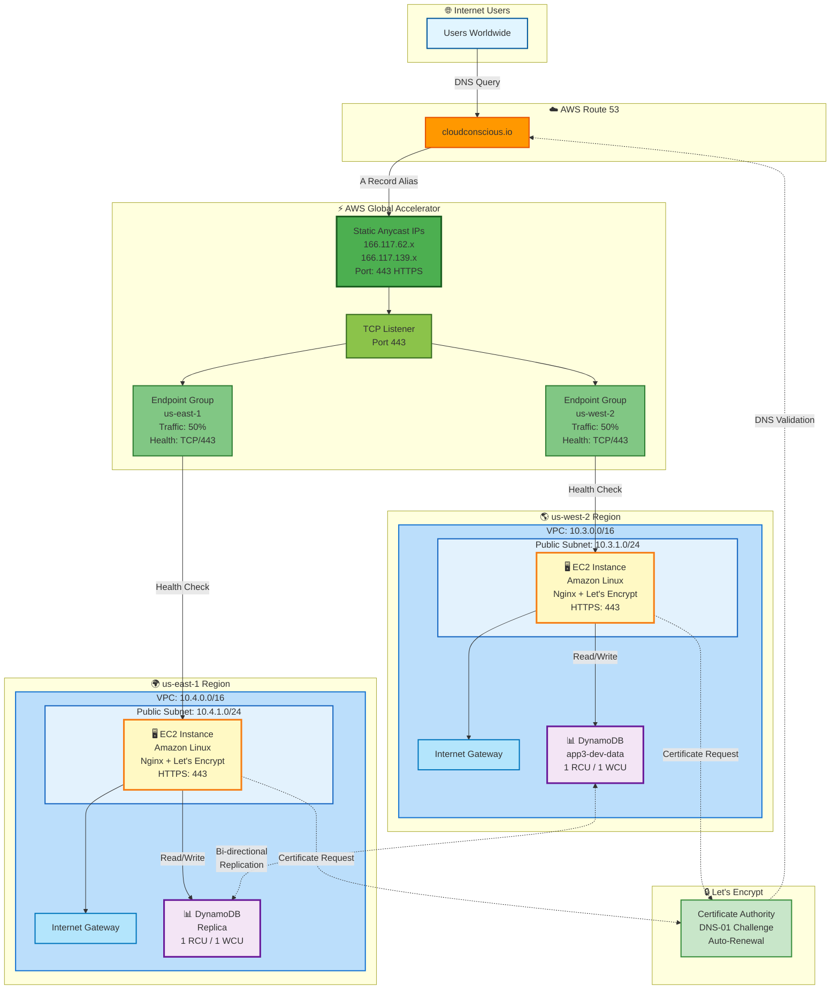

# App3 - Cross-Region Active-Active Architecture

Multi-region active-active deployment using AWS Global Accelerator, Route 53, and DynamoDB Global Tables for high availability, low latency global traffic distribution, and cross-region data replication with Let's Encrypt SSL certificates.

## Architecture

### Network Diagram



### ASCII Diagram

```
                    ┌─────────────────┐
                    │   Route 53      │
                    │ cloudconscious  │
                    │      .io        │
                    └────────┬────────┘
                             │
                    ┌────────▼────────┐
                    │     Global      │
                    │   Accelerator   │
                    │   HTTPS (443)   │
                    └────┬──────┬─────┘
                         │      │
              ┌──────────┘      └──────────┐
              │                            │
    ┌─────────▼─────────┐        ┌────────▼────────┐
    │   us-west-2       │        │   us-east-1     │
    │   VPC 10.3.0.0/16 │        │   VPC 10.4.0.0/16│
    │                   │        │                 │
    │  ┌─────────────┐  │        │  ┌─────────────┐│
    │  │ EC2 + Nginx │  │        │  │ EC2 + Nginx ││
    │  │ Amazon Linux│  │        │  │ Amazon Linux││
    │  │ HTTPS (443) │  │        │  │ HTTPS (443) ││
    │  └─────────────┘  │        │  └─────────────┘│
    └───────────────────┘        └─────────────────┘
```

## Components

### Infrastructure
- **2 VPCs**: One in us-west-2 (10.3.0.0/16), one in us-east-1 (10.4.0.0/16)
- **2 EC2 Instances**: Amazon Linux with Nginx and Let's Encrypt SSL in each region
- **AWS Global Accelerator**: Provides static anycast IPs and intelligent traffic routing on port 443
- **Route 53**: DNS management with existing hosted zone (cloudconscious.io)
- **DynamoDB Global Tables**: Cross-region replicated database with sub-second latency
- **Let's Encrypt SSL**: Automated certificate provisioning and renewal via Route53 DNS challenge
- **IAM Roles**: EC2 instances have Route53 and DynamoDB permissions

### Traffic Distribution
- **Active-Active**: Both regions serve traffic simultaneously (50/50 split)
- **Health Checks**: TCP health checks on port 443 every 30 seconds
- **Automatic Failover**: Unhealthy endpoints removed from rotation
- **HTTPS Only**: All HTTP traffic redirected to HTTPS
- **Data Replication**: DynamoDB replicates data bi-directionally between regions

## DynamoDB Global Tables

### Configuration
- **Table Name**: app3-dev-data
- **Primary Key**: id (String)
- **Billing Mode**: PROVISIONED (low-cost for dev)
- **Capacity**: 1 RCU / 1 WCU per region
- **Replication**: us-west-2 ↔ us-east-1
- **Streams**: Enabled (NEW_AND_OLD_IMAGES)
- **Point-in-Time Recovery**: Disabled (dev environment)

### Features
- **Multi-Region Writes**: Write to either region, data replicates automatically
- **Local Reads**: Low-latency reads from local region
- **Sub-Second Replication**: Typically < 1 second between regions
- **Conflict Resolution**: Last-writer-wins (automatic)
- **Strong Consistency**: Available within each region

### Cost Optimization
- Provisioned capacity (1 RCU/1 WCU) costs ~$0.65/month
- Pay-per-request would cost ~$2.50/month minimum
- For production, consider auto-scaling or on-demand billing

### Usage Example
```bash
# Write to us-west-2
aws dynamodb put-item \
  --table-name app3-dev-data \
  --item '{"id": {"S": "test-1"}, "data": {"S": "Hello from us-west-2"}}' \
  --region us-west-2

# Read from us-east-1 (replicated automatically)
aws dynamodb get-item \
  --table-name app3-dev-data \
  --key '{"id": {"S": "test-1"}}' \
  --region us-east-1
```

## SSL/TLS Configuration

### Let's Encrypt Certificates
- **Certificate Authority**: Let's Encrypt (trusted by all browsers)
- **Validation Method**: DNS-01 challenge via Route53
- **Auto-Renewal**: Certificates renew automatically every 12 hours (90-day validity)
- **Protocols**: TLS 1.2 and 1.3
- **Ciphers**: HIGH security cipher suites
- **Email**: vegatros@gmail.com (renewal notifications)

### How It Works
1. Instance launches with nginx on port 80
2. Certbot requests certificate from Let's Encrypt
3. Creates DNS TXT record in Route53 for validation
4. Let's Encrypt validates domain ownership
5. Certificate installed at `/etc/letsencrypt/live/cloudconscious.io/`
6. Nginx configured with SSL and HTTP redirect
7. Cron job runs twice daily to check for renewal

## Deployment

### Prerequisites
1. AWS account with appropriate permissions
2. S3 bucket for Terraform state: `terraform-state-925185632967`
3. Existing Route 53 hosted zone: cloudconscious.io (Z3LLP0B81D4CRA)
4. Valid AMI IDs for both regions
5. IAM permissions for EC2 to manage Route53 records

### Local Deployment

```bash
cd terraform/stacks/app3

# Initialize
terraform init

# Plan
terraform plan -var-file="dev.tfvars"

# Apply
terraform apply -var-file="dev.tfvars"
```

### GitHub Actions Deployment

Trigger via workflow dispatch:
1. Go to Actions → Terraform App3
2. Select environment (dev/qa/prod)
3. Select action (plan/apply/destroy)
4. Run workflow

**Workflow naming convention**: `app3-{environment}-{action}-{commit-message}`

## Configuration

### Environment Variables (dev.tfvars)

```hcl
environment  = "dev"

# us-west-2
vpc_cidr_west            = "10.3.0.0/16"
public_subnet_cidrs_west = ["10.3.1.0/24"]
availability_zones_west  = ["us-west-2a"]
ami_id_west              = "ami-075b5421f670d735c"

# us-east-1
vpc_cidr_east            = "10.4.0.0/16"
public_subnet_cidrs_east = ["10.4.1.0/24"]
availability_zones_east  = ["us-east-1a"]
ami_id_east              = "ami-0f3caa1cf4417e51b"

instance_type = "t3.micro"
```

## Outputs

After deployment:
- `global_accelerator_dns`: Global Accelerator DNS name
- `global_accelerator_ips`: Static anycast IP addresses (2 IPs)
- `domain_name`: cloudconscious.io
- `ec2_west_public_ip`: Direct EC2 IP in us-west-2
- `ec2_east_public_ip`: Direct EC2 IP in us-east-1
- `dynamodb_table_name`: DynamoDB global table name
- `dynamodb_table_arn`: DynamoDB table ARN
- `dynamodb_stream_arn`: DynamoDB stream ARN

## Testing

```bash
# Test via Global Accelerator (HTTPS)
curl https://afd3ea9b16c5b1fb9.awsglobalaccelerator.com

# Test via domain
curl https://cloudconscious.io

# Test individual regions (HTTPS)
curl https://<ec2_west_public_ip>
curl https://<ec2_east_public_ip>

# Verify HTTP redirect
curl -I http://cloudconscious.io
# Should return: HTTP/1.1 301 Moved Permanently

# Check SSL certificate
openssl s_client -connect cloudconscious.io:443 -servername cloudconscious.io
```

Each response shows the region and instance ID serving the request.

## Security Features

### Network Security
- Security groups allow only HTTP (80) and HTTPS (443)
- No SSH access by default
- VPCs isolated per region
- IMDSv2 required (enforced)
- EBS encryption enabled

### SSL/TLS Security
- Let's Encrypt trusted certificates (no browser warnings)
- TLS 1.2 and 1.3 only
- Strong cipher suites (HIGH:!aNULL:!MD5)
- Server-preferred cipher order
- Automatic certificate renewal
- HTTP to HTTPS redirect (301)

### IAM Security
- EC2 instances use IAM roles (no credentials in code)
- Least privilege access to Route53 and DynamoDB
- GitHub Actions uses OIDC (no long-lived credentials)

### Health Checks
- Protocol: TCP (port 443)
- Interval: 30 seconds
- Threshold: 3 consecutive checks
- Client IP preservation enabled

## Cost Optimization

- **Global Accelerator**: ~$0.025/hour + data transfer fees (~$18/month fixed)
- **EC2 t3.micro**: ~$0.0104/hour per instance (~$15/month for 2)
- **DynamoDB**: ~$0.65/month (1 RCU/1 WCU provisioned in 2 regions)
- **Route 53**: Queries only (hosted zone managed separately)
- **Let's Encrypt**: Free SSL certificates
- **Data Transfer**: Variable based on usage
- **Estimated monthly cost**: ~$35-40 for dev environment

## Monitoring & Observability

### CloudWatch Metrics
- EC2 instance metrics (CPU, network, disk)
- Global Accelerator flow logs
- VPC flow logs (enabled, 7-day retention)

### Health Monitoring
- Global Accelerator endpoint health status
- TCP connectivity checks every 30 seconds
- Automatic traffic routing to healthy endpoints only

### Certificate Monitoring
- Let's Encrypt renewal logs: `/var/log/letsencrypt/`
- Nginx logs: `/var/log/nginx/`
- User data execution: `/var/log/user-data.log`
- Certificate expiration: 90 days (auto-renews at 30 days)

## Troubleshooting

### Endpoints showing unhealthy
- Check if port 443 is listening: `nc -zv <instance-ip> 443`
- Verify nginx is running: `systemctl status nginx`
- Check nginx logs: `tail -f /var/log/nginx/error.log`
- Verify security groups allow port 443
- Check certbot logs: `tail -f /var/log/letsencrypt/letsencrypt.log`

### HTTPS not working
- Check SSL certificate: `openssl s_client -connect <instance-ip>:443`
- Verify certificate files exist: `ls -la /etc/letsencrypt/live/cloudconscious.io/`
- Check nginx SSL configuration: `nginx -t`
- Review user data log: `tail -f /var/log/user-data.log`

### Certificate not renewing
- Check cron job: `cat /etc/cron.d/certbot-renew`
- Test renewal: `certbot renew --dry-run`
- Verify IAM role has Route53 permissions
- Check certbot logs for errors

### HTTP not redirecting to HTTPS
- Test redirect: `curl -I http://<instance-ip>`
- Check nginx configuration for redirect rule
- Verify port 80 is open in security group

### DNS not resolving
- Verify Route 53 record points to Global Accelerator
- Check hosted zone ID is correct (Z3LLP0B81D4CRA)
- Test DNS: `dig cloudconscious.io`

## Files

- `main.tf` - Multi-region infrastructure with Global Accelerator
- `variables.tf` - Configuration variables
- `outputs.tf` - Infrastructure outputs
- `dev.tfvars` - Dev environment configuration
- `backend.tf` - S3 state backend
- `user_data.sh` - Nginx + Let's Encrypt installation script
- `README.md` - This file
- `diagrams.md` - Architecture diagrams and service details

## CI/CD Pipeline

### GitHub Actions Workflow
- **Trigger**: Manual dispatch, PR, or push to master
- **Steps**: Init → Format → Validate → Trivy Scan → Plan → Apply/Destroy
- **Security**: OIDC authentication, no static credentials
- **Scanning**: Trivy for infrastructure security
- **Naming**: `app3-{env}-{action}-{commit-message}`

### Security Scanning
- Trivy scans Terraform configurations
- Results uploaded to GitHub Security tab
- Soft fail mode (doesn't block deployment)

## High Availability

### Active-Active Configuration
- Both regions serve traffic simultaneously
- 50/50 traffic distribution
- No primary/secondary designation
- Geographic distribution for low latency

### Automatic Failover
- Health checks every 30 seconds
- Unhealthy endpoints removed automatically
- Traffic routed to healthy region only
- No manual intervention required

### Certificate Resilience
- Auto-renewal prevents expiration
- Independent certificates per instance
- Renewal failures don't affect existing certificates
- Email notifications for renewal issues

## Maintenance

### Certificate Renewal
Certificates renew automatically. Manual renewal if needed:
```bash
sudo certbot renew --force-renewal
sudo systemctl restart nginx
```

### Updating Nginx Configuration
```bash
sudo nano /etc/nginx/conf.d/ssl.conf
sudo nginx -t
sudo systemctl restart nginx
```

### Checking Certificate Expiration
```bash
sudo certbot certificates
```

## Documentation

- See `diagrams.md` for detailed architecture diagrams
- See GitHub Actions workflow for CI/CD pipeline details
- See Terraform outputs for deployed resource information
- Let's Encrypt documentation: https://letsencrypt.org/docs/
