# App3 - Architecture Diagrams & Service Summary

## Color Diagram (Mermaid Flowchart)

```mermaid
flowchart LR
    Users(["🌐 Internet Users"]):::users

    R53[/"🔖 Route 53\ncloudconscious.io"\]:::dns

    GA[/"⚡ Global Accelerator\n166.117.62.x · 166.117.139.x"\]:::accelerator

    subgraph WEST["🌎  us-west-2"]
        direction TB
        VPC_W[["VPC\n10.3.0.0/16"]]:::vpc
        SUB_W["Public Subnet\n10.3.1.0/24\nus-west-2a"]:::subnet
        EC2_W[/"🖥 EC2 t3.micro\nNginx + Let's Encrypt"\]:::ec2
        DDB_W[("🗄 DynamoDB\nprimary")]:::dynamo
        VPC_W --> SUB_W --> EC2_W --> DDB_W
    end

    subgraph EAST["🌍  us-east-1"]
        direction TB
        VPC_E[["VPC\n10.4.0.0/16"]]:::vpc
        SUB_E["Public Subnet\n10.4.1.0/24\nus-east-1a"]:::subnet
        EC2_E[/"🖥 EC2 t3.micro\nNginx + Let's Encrypt"\]:::ec2
        DDB_E[("🗄 DynamoDB\nreplica")]:::dynamo
        VPC_E --> SUB_E --> EC2_E --> DDB_E
    end

    Users -->|"HTTPS"| R53
    R53 -->|"Alias record"| GA
    GA -->|"50% traffic"| WEST
    GA -->|"50% traffic"| EAST
    DDB_W <-->|"⟳ Bi-directional replication"| DDB_E

    classDef users       fill:#dbeafe,stroke:#2563eb,color:#1e3a5f,font-weight:bold,rx:20
    classDef dns         fill:#fef9c3,stroke:#ca8a04,color:#1a1a2e,font-weight:bold
    classDef accelerator fill:#dcfce7,stroke:#16a34a,color:#1a1a2e,font-weight:bold
    classDef vpc         fill:#e0e7ff,stroke:#4338ca,color:#1a1a2e,font-weight:bold
    classDef subnet      fill:#ede9fe,stroke:#7c3aed,color:#1a1a2e
    classDef ec2         fill:#ffe4e6,stroke:#be123c,color:#1a1a2e,font-weight:bold
    classDef dynamo      fill:#f5d0fe,stroke:#9333ea,color:#1a1a2e,font-weight:bold

    style WEST fill:#eff6ff,stroke:#2563eb,stroke-width:2px,color:#1e3a5f
    style EAST fill:#f0fdf4,stroke:#16a34a,stroke-width:2px,color:#14532d
```



---

## High-Level Architecture (ASCII)

```
                        ┌─────────────────────────────────┐
                        │          Internet Users          │
                        └────────────────┬────────────────┘
                                         │ HTTPS (443)
                                         ▼
                        ┌────────────────────────────────┐
                        │           Route 53             │
                        │      cloudconscious.io (A)     │
                        │    Zone: Z3LLP0B81D4CRA        │
                        └────────────────┬───────────────┘
                                         │ Alias record
                                         ▼
                        ┌────────────────────────────────┐
                        │      AWS Global Accelerator    │
                        │   Static IPs: 166.117.62.x     │
                        │              166.117.139.x     │
                        │   Protocol: TCP  Port: 443     │
                        └────────┬──────────────┬────────┘
                  50% traffic    │              │    50% traffic
                 ┌───────────────┘              └───────────────┐
                 ▼                                              ▼
  ┌──────────────────────────┐              ┌──────────────────────────┐
  │        us-west-2         │              │        us-east-1         │
  │  ┌────────────────────┐  │              │  ┌────────────────────┐  │
  │  │  VPC 10.3.0.0/16   │  │              │  │  VPC 10.4.0.0/16   │  │
  │  │  ┌──────────────┐  │  │              │  │  ┌──────────────┐  │  │
  │  │  │Public Subnet │  │  │              │  │  │Public Subnet │  │  │
  │  │  │10.3.1.0/24   │  │  │              │  │  │10.4.1.0/24   │  │  │
  │  │  │  us-west-2a  │  │  │              │  │  │  us-east-1a  │  │  │
  │  │  │ ┌──────────┐ │  │  │              │  │  │ ┌──────────┐ │  │  │
  │  │  │ │   EC2    │ │  │  │              │  │  │ │   EC2    │ │  │  │
  │  │  │ │ t3.micro │ │  │  │              │  │  │ │ t3.micro │ │  │  │
  │  │  │ │  Nginx   │ │  │  │              │  │  │ │  Nginx   │ │  │  │
  │  │  │ │Let'sEncr.│ │  │  │              │  │  │ │Let'sEncr.│ │  │  │
  │  │  │ └──────────┘ │  │  │              │  │  │ └──────────┘ │  │  │
  │  │  └──────────────┘  │  │              │  │  └──────────────┘  │  │
  │  └────────────────────┘  │              │  └────────────────────┘  │
  │                          │              │                          │
  │  ┌────────────────────┐  │              │  ┌────────────────────┐  │
  │  │ DynamoDB (primary) │◄─┼──────────────┼─►│ DynamoDB (replica) │  │
  │  │   app3-dev-data    │  │ Bi-directional  │   app3-dev-data    │  │
  │  │  Streams enabled   │  │  replication │  │  Streams enabled   │  │
  │  └────────────────────┘  │              │  └────────────────────┘  │
  └──────────────────────────┘              └──────────────────────────┘
```

---

## Traffic Flow

```
User Request (cloudconscious.io)
         │
         ▼
   Route 53 DNS lookup
   ─ Returns Global Accelerator anycast IP
         │
         ▼
   Global Accelerator Edge (nearest AWS PoP)
   ─ TCP connection terminates at edge
   ─ Routed over AWS backbone (not public internet)
         │
         ├── Health check: TCP 443, every 30s
         │
         ├── us-west-2 healthy? ──► Route 50% traffic to EC2 west
         │
         └── us-east-1 healthy? ──► Route 50% traffic to EC2 east

   EC2 (Nginx)
   ─ Port 80: redirect to HTTPS (301)
   ─ Port 443: serve content with Let's Encrypt cert
   ─ Response includes region + instance ID
```

---

## Service Summary

### Route 53
| Property       | Value                       |
|----------------|-----------------------------|
| Domain         | cloudconscious.io           |
| Record Type    | A (Alias)                   |
| Hosted Zone ID | Z3LLP0B81D4CRA              |
| Target         | Global Accelerator DNS name |
| Health Eval    | Enabled                     |

---

### AWS Global Accelerator
| Property           | Value                    |
|--------------------|--------------------------|
| IP Type            | IPv4 (static anycast)    |
| Static IPs         | 166.117.62.x, 166.117.139.x |
| Protocol           | TCP                      |
| Port               | 443                      |
| Traffic Split      | 50% west / 50% east      |
| Health Check       | TCP port 443, every 30s  |
| Client IP Preserve | Enabled                  |
| Failover           | Automatic                |

---

### VPC — us-west-2
| Property       | Value           |
|----------------|-----------------|
| CIDR           | 10.3.0.0/16     |
| Public Subnet  | 10.3.1.0/24     |
| AZ             | us-west-2a      |
| Internet GW    | Yes             |
| NAT Gateway    | No              |

### VPC — us-east-1
| Property       | Value           |
|----------------|-----------------|
| CIDR           | 10.4.0.0/16     |
| Public Subnet  | 10.4.1.0/24     |
| AZ             | us-east-1a      |
| Internet GW    | Yes             |
| NAT Gateway    | No              |

---

### EC2 Instances (both regions)
| Property        | Value                      |
|-----------------|----------------------------|
| Instance Type   | t3.micro                   |
| OS              | Amazon Linux 2023          |
| AMI (west)      | ami-075b5421f670d735c       |
| AMI (east)      | ami-0f3caa1cf4417e51b       |
| Web Server      | Nginx                      |
| SSL             | Let's Encrypt (auto-renew) |
| Port 80         | Redirect to HTTPS (301)    |
| Port 443        | HTTPS (TLS 1.2/1.3)        |
| IMDSv2          | Required                   |
| EBS Encryption  | Enabled                    |
| SSH             | Disabled                   |
| IAM Role        | Route53 + DynamoDB access  |

---

### DynamoDB Global Table
| Property          | Value                    |
|-------------------|--------------------------|
| Table Name        | app3-dev-data            |
| Primary Key       | id (String)              |
| Billing Mode      | PROVISIONED              |
| Read Capacity     | 1 RCU                    |
| Write Capacity    | 1 WCU                    |
| Primary Region    | us-west-2                |
| Replica Region    | us-east-1                |
| Streams           | Enabled (NEW_AND_OLD_IMAGES) |
| Replication       | Bi-directional, < 1s lag |
| Conflict Resolution | Last-writer-wins        |
| PITR              | Disabled (dev)           |

---

## Security Groups

```
┌─────────────────────────────────────────┐
│           EC2 Security Group            │
│                                         │
│  Inbound:                               │
│    HTTP  80  ← 0.0.0.0/0               │
│    HTTPS 443 ← 0.0.0.0/0               │
│                                         │
│  Outbound:                              │
│    All traffic → 0.0.0.0/0             │
│                                         │
│  SSH: BLOCKED (no access)               │
└─────────────────────────────────────────┘
```

---

## IAM Roles

```
EC2 Instance Role
├── Route53: ChangeResourceRecordSets  (Let's Encrypt DNS-01 challenge)
├── Route53: ListHostedZones
└── DynamoDB: Read/Write on app3-*-data table

GitHub Actions Role (OIDC)
└── Full Terraform deployment permissions (no static credentials)
```

---

## Estimated Monthly Cost (dev)

| Service            | Cost         |
|--------------------|--------------|
| Global Accelerator | ~$18/month   |
| EC2 (2x t3.micro)  | ~$15/month   |
| DynamoDB (2 regions)| ~$0.65/month |
| Route 53 queries   | ~$0.50/month |
| **Total**          | **~$34–40/month** |
